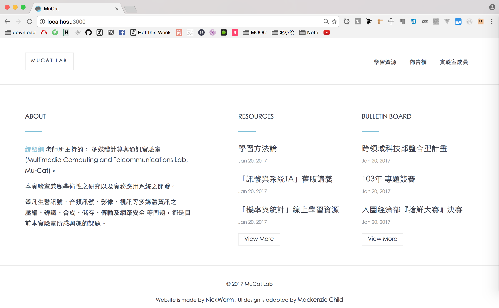

# 簡介

新的實驗室網站，剛開始開發時rails 5剛出，為了減少踩雷的點選用較穩定的`Rails 4.2.5.2`開發。

這次的專案的學習點：
- 客製化表單
  - Semantic UI：[Toggle](http://semantic-ui.com/modules/checkbox.html#toggle)、[Multiple Selection](http://semantic-ui.com/modules/dropdown.html#multiple-selection)
  - 多選下拉選單
    - 不使用`accepts_nested_attributes_for`，寫純Ruby來存入多對多的中介表
- `user.rb`用`scope`把會常用到的`SQL`包成可串接的methods，來做資料篩選
- paperclip AJAX上傳圖片
- 第三方API：OmniAuth實作臉書登入
- `text_area`用Markdown render
- 客制devise
  - 改掉登入、註冊頁面的預設路由
  - 改掉註冊後跳轉頁面

專案學習點的筆記與抓蟲，會在[GitHub wiki](https://github.com/NickWarm/MuCat_v1/wiki)條列要去哪看筆記。

# wiki結構

開發筆記都記錄在專案的[wiki](./wiki/)資料夾裡面

```
wiki
  ├── Copy_Writer          # 實驗室網站的各種文案
  ├── Dev_Notes            # 開發紀錄
  ├── features             # 開發feature的筆記
  ├── icons                # 實驗室網站的icon的候選名單
  ├── img                  # 筆記會用到的圖片
  ├── MuCat_v1_UI          # 第一版的UI
  ├── UI_note              # UI筆記
  └── userstory_versions   # 使用者故事
```

放在GitHub上的是開發版的，註冊與登入帳號的路由
- 註冊：`http://localhost:3000/lab515/sign_up`
- 登入：`http://localhost:3000/lab515/sign_in`

春節後回實驗室佈署，會把路由改掉。

畫面如下


