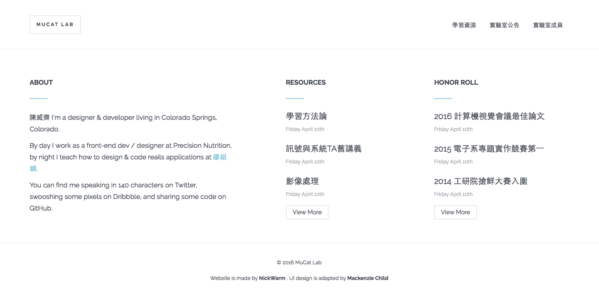

# 情境
定案版的使用者情境

>實驗室成員可以透過臉書帳號登入與註冊
>1. 在首頁有登入連結
>2. 註冊頁面是在「特殊網址」的頁面，註冊完後會跳轉到個人資訊的頁面，來編輯個人資料
>3. 註冊方式：由老師寄信給實驗室成員註冊網址，信中註明不能讓該網址外流


# 思索與探討

最初的情境：

>實驗室成員可以透過臉書帳號登入與註冊
>
>已註冊的實驗室成員，可以在首頁點一個隱藏anchor link來登入
>
>實驗室新進來的成員要進入「特定的頁面」才能註冊


實驗室的網站原始設計：



最初想在「Website is made by NickWarm , UI design is adapted by Mackenzie Child」底下加一串字

這串字的顏色設得跟背景色一樣，必須反白才看得到

後來想到，chrome有[dark reader](https://chrome.google.com/webstore/detail/dark-reader/eimadpbcbfnmbkopoojfekhnkhdbieeh)這擴充工具，如果有人用dark reader來瀏覽實驗室網站，那麼立刻破功

後來又想到，只要把實驗室網站的登入文字設成「透明」就好了，這樣無論是一般正常瀏覽，還是dark reader瀏覽，都看不到登入anchor的文字，要反白才看得到

在[CSS3 opacity property](http://www.w3schools.com/cssref/css3_pr_opacity.asp)測試這想法後，發現無法用CSS設定`opacity: 0;`，這樣會完全看不到文字，反白後也看不到它，只會看到一串空白底，這想法失敗了。

最後還是決定直接用icon，有以下兩個可以比較
- [Font Awesome Icons](http://fontawesome.io/icons/)，搜尋「user」
- [User Types - Icon | Semantic UI](http://semantic-ui.com/elements/icon.html#user-types)

個人偏好用，semantic_ui的student icon `<i class="student icon"></i>` 作為實驗室成員的登入連結

不打算跳到另一個頁面來登入，決定用[semantic_ui的modal](http://semantic-ui.com/modules/modal.html)來AJAX出登入頁面

結論的情境：
- 登入連結在footbar
- show 出登入連結的anchor
- 使用modal

---

# 實作

## 前台畫面

首先，要申請facebook開發者帳號，才能實作登入系統

主要參考
- [Rails Screencast #1 - Criando autenticação com o Facebook! (Devise + Omniauth)](https://youtu.be/BeJpFQHm4A8?t=132)
  - 影片開始處已經略掉前面廢話，這篇有教你如何撈到FB的大頭貼

參考
- [Rails Screencast #1 - Criando autenticação com o Facebook! (Devise + Omniauth)，請見5:18](https://youtu.be/BeJpFQHm4A8?t=318)
  - [image_tag - rails API](http://api.rubyonrails.org/classes/ActionView/Helpers/AssetTagHelper.html#method-i-image_tag)
- [Auth Hash - omniauth-facebook FitHub](https://github.com/mkdynamic/omniauth-facebook#auth-hash)

會在footer加入這段code
```
<p>
  Hello, <%= current_user.name %>
  <% if current_user.image.present? %>
    <%= image_tag(current_user.image, size: "40") %>
  <% end %>
</p>
```

fix footer

from

```
<footer id="main_footer">
  <p class="copyright">&copy; 2016 MuCat Lab</p>
  <br>
  <p class="copyright">Website is made by <a href="#">NickWarm</a> ,
    UI design is adapted by <a href="#">Mackenzie Child</a></p>
</footer>
```

to

```
<footer id="main_footer">
  ...
  ...
  <% if !user_signed_in? %>
    <p>If your are MuCat Lab member, please login <a id="login" href="#"><i class="student icon"></i></a> </p>
  <% end %>

  <% if user_signed_in? %>
    <p>
      Welcome back, <%= current_user.name %>
      <% if current_user.image.present? %>
        <%= image_tag(current_user.image, size: "40") %>
      <% end %>
    </p>
  <% end %>

</footer>
```

然後用content_for來寫modal的AJAX

footer應該要用partial來寫

由於使用omniauth-facebook撈出的`current_user.name`是臉書帳號的名字，為了避免老師看不懂臉書ID上的名字與本人誰是誰

所以要設計，用臉書來註冊後，跳轉到User表單，填寫
- 中文名字：`CN_name:string`
- 英文名字：`ENG_name:string`
- 個人簡介：`profile:text`，使用markdown
- 論文著作：``paper:text``，**允許留白**

除了論文著作可以空白之外，其他都要用User model validate必填。

## 臉書開發者金鑰

大多數的影片教學都教，會讓開發者金鑰流出的寫法，於是參考下面這些文章
- [Rails 新手村 - Facebook 自動登入功能 « sdlong's Blog](http://sdlong.logdown.com/posts/207194-rails-newbie-3)
  - [Rails 4 + SettingsLogic + Googl 製作短網址功能 « 赫謙小天地](http://hechien.logdown.com/posts/2014/03/08/rails-4-settingslogic-googl-production-short-url-functionality)
  - [Settingslogic插件 | Ruby迷](http://rubyer.me/blog/551/)
  - [xdite/auto-facebook - GitHub](https://github.com/xdite/auto-facebook)
- [Rails 新手村 - FB會員登入API--PLga « 阿嘎筆記](http://paulchia.logdown.com/posts/365026)
- [Rails 新手村 - google sign_in api----PLGa « 阿嘎筆記](http://paulchia.logdown.com/posts/370630)

add
```
gem 'omniauth-facebook'
gem 'settingslogic'      # 管理金鑰
```
to `Gemfile`，and then `bundle install`

add to `app/models/settings.rb`

```
class Settings < Settingslogic
  source "#{Rails.root}/config/application.yml"
  namespace Rails.env
end
```
