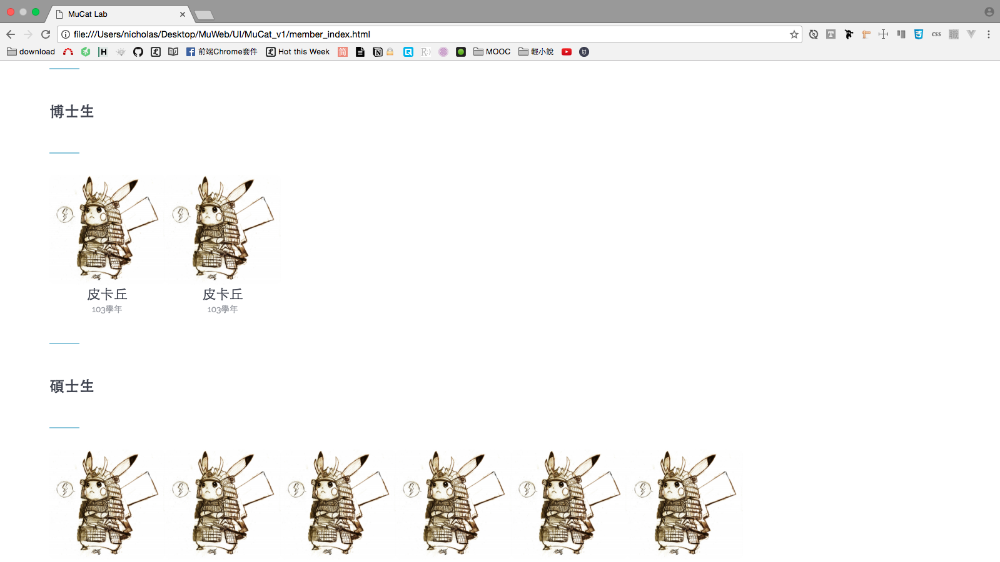
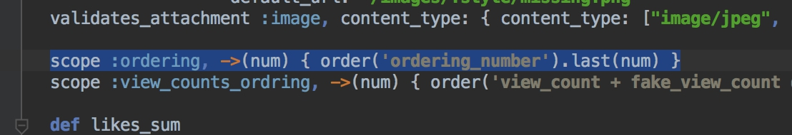
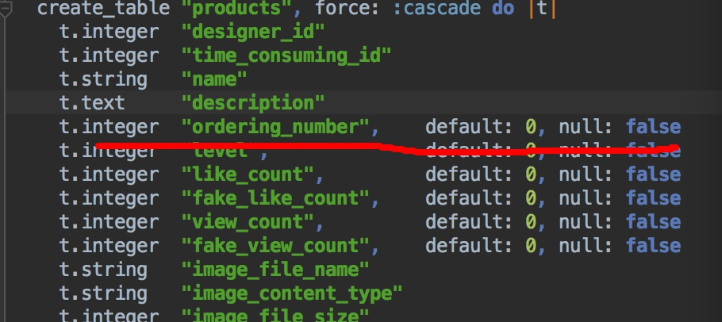

# 實驗室成員的index page
身份不同，在不同的階層

# 情境

依照
- **身份不同**，依序排列：博士生、碩士生、專題生
- **是否畢業**，決定是否直接顯示在頁面上：畢業生



# 原始構想

通常我們是用each去撈資料庫的東西

現在我在Member model的schema定義了一個`status:string`

功能是，判斷學生的身份是 **博士生？研究生？大學生？畢業生？**

這樣的話，我的index與controller要怎麼寫啊

# LuI的解法

[LuI的GitHub](https://github.com/lustan3216)

## 方法.1

另開一個表
- 以後可能會擴充也好擴充
- 新開一個model
- 優點：容易擴充

這樣變成這個status改成status_id型態是integer
然後用id來排序也可以

## 方法.2

LuI平常都用這方法





在schema裡 **Member model** 的table再給一個欄位，專門做排序的

然後在第一個用scope 寫一個專門排序的function

### ref：scope

#### 影片
- [Custom scopes in model files in a Rails application - YouTube](https://www.youtube.com/watch?v=OHS4OXPMRfc)
- [007: Scopes, Counter Cache & Filtering - YouTube](https://www.youtube.com/watch?v=e3eXuvBQums)
- [29.- Curso Ruby on Rails 4 desde cero - Scopes - YouTube](https://www.youtube.com/watch?v=Ms3BPSmVla4)

#### 文章
- [Ruby on Rails - Scopes - Leon's Blogging](http://mgleon08.github.io/blog/2015/12/20/ruby-on-rails-scopes/)
- [Ruby on Rails 實戰聖經 | ActiveRecord Query Interface - 資料表操作](https://ihower.tw/rails/activerecord-query.html)
- [14 作用域 - Active Record 查詢 — Ruby on Rails 指南](http://rails.ruby.tw/active_record_querying.html#%E4%BD%9C%E7%94%A8%E5%9F%9F)
- [Scope 和一些查詢方法select distinct « Brian 's Blog](http://brian-p-pan-blog.logdown.com/posts/189093-rails-scope-and-methods-of-some-query-select-distinct) (這篇看不懂，暫時略過)

# v2 使用scope的寫法

## v2-2

Member model
- 個人照片、姓名、入學學年、論文(or專題)題目、自我介紹、學位(**博士生？研究生？大學生？**)、身份 (**在校生？畢業生？**)
- `name:string year:integer paper:string profile:text academic_degree:string has_graduated:boolean`
- academic_degree，學位
  - 博士生，**doctor**
  - 研究生，**master**
  - 大學生，**college**
- has_graduated，身份
  - 預設`false`，表示在學生
  - 若為`true` ，表示畢業生

`member.rb`

```
class Member < ActiveRecord::Base
   scope :doctor,        -> { where(:academic_degree => 'doctor') }
   scope :master,        -> { where(:academic_degree => 'master') }
   scope :college,       -> { where(:academic_degree => 'college') }
   scope :has_graduated, ->(status) { where("has_graduated", status) }
end
```

定義好後controller如下

`member_controller`

```
<!-- 在學生頁面 -->
def index
  @member_doctor  = Member.doctor.has_graduated(false)
  @member_master  = Member.master.has_graduated(false)
  @member_college = Member.college.has_graduated(false)
end

<!-- 畢業生頁面 -->
def graduate
  @member_doctor  = Member.doctor.has_graduated(true)
  @member_master  = Member.master.has_graduated(true)
  @member_college = Member.college.has_graduated(true)
end
```

## v2-1

Member model
- 個人照片、姓名、入學學年、論文(or專題)題目、自我介紹、學位(**博士生？研究生？大學生？**)、身份 (**在校生？畢業生？**)
- `name:string year:integer paper:string profile:text academic_degree:string has_graduated:boolean`
- academic_degree，學位
  - 博士生，**doctor**
  - 研究生，**master**
  - 大學生，**college**
- has_graduated，身份
  - 預設`false`，表示在學生
  - 若為`true` ，表示畢業生

`member.rb`

```
class Member < ActiveRecord::Base
   scope :doctor,     -> { where(:academic_degree => 'doctor') }
   scope :master,     -> { where(:academic_degree => 'master') }
   scope :college,    -> { where(:academic_degree => 'college') }
   scope :student,    -> { where(has_graduated: false) }
   scope :graduation, -> { where(has_graduated: true) }
end
```

定義好後controller如下

`member_controller`

```
<!-- 在學生頁面 -->
def index
  @member_doctor  = Member.doctor.student
  @member_master  = Member.master.student
  @member_college = Member.college.student
end

<!-- 畢業生頁面 -->
def graduate
  @member_doctor  = Member.doctor.graduation
  @member_master  = Member.master.graduation
  @member_college = Member.college.graduation
end
```

>畢業生英文：graduate。參考自[畢業生的英文翻譯,畢業生英文怎麼說,畢業生的英文例句 - WebSaru漢英字典](http://tw.websaru.com/%E7%95%A2%E6%A5%AD%E7%94%9F.html)

# v1 reference FUSAKIGG

>參考
>- [FUSAKIGG/app/controllers/users_controller.rb](https://github.com/lustan3216/FUSAKIGG/blob/master/app/controllers/users_controller.rb)
>- [Ruby on Rails Case/Switch. How to match against object? - Stack Overflow](http://stackoverflow.com/questions/3170037/ruby-on-rails-case-switch-how-to-match-against-object)


Member model的定義
- 入學學籍:integer、姓名:string、論文題目:string、自我介紹:text、身份狀態:string
- `year:integer name:string paper:string introduction:text status:string`

身份狀態：**博士生？研究生？大學生？畢業生？**
- 博士生：`"doctor"`
- 研究生：`"master"`
- 大學生：`"college"`
- 畢業生：`"graduate"`

`member controller `

```
def index
  @members = Member.all

  @doctors =
  case member.status
    when "doctor"

    when "master"

    when "college"

    when "graduate"

end
```

>參考
>- [Step.12 類別的下拉選單 · NickWarm/jccart Wiki](https://github.com/NickWarm/jccart/wiki/Step.12--%E9%A1%9E%E5%88%A5%E7%9A%84%E4%B8%8B%E6%8B%89%E9%81%B8%E5%96%AE)
>  - n+1 query 那段
>- [rails API | includes(\*args)](http://api.rubyonrails.org/classes/ActiveRecord/QueryMethods.html#method-i-includes)
>- [Rails使用 include 和 join 避免 N+1 query | Motion Express](http://motion-express.com/blog/20141028-rails-include-join-avoid-n-1-query)
>- [Ruby on Rails - 用 Include 和 Join 避免 N+1 Query - Leon's Blogging](http://mgleon08.github.io/blog/2016/01/10/ruby-on-rails-include-join-avoid-n-1-query/)
>- [Ruby on Rails 實戰聖經 | ActiveRecord - 資料表關聯](https://ihower.tw/rails/activerecord-relationships.html)

用`include`的方法不對，`include`必須是關聯才能用，不過以上筆記，可以加到RailsFun的jccart裡去

# v0

#### 實驗室成員
- 已畢業與未畢業
  - 點進去實驗室成員，**只會看到在學成員**，橫排階層依序為
    - 博士生
    - 研究生
    - 專題生
  - 已經畢業的學生，給一個 **View More** 連結
    - 所以 **Member model** 要再`add_column`一個欄位 **畢業:boolean**
    - `graduation:boolean`

> rails model的boolean可以參考ihower的[Ruby on Rails 實戰聖經 | Active Record - 資料庫遷移(Migration)](https://ihower.tw/rails/migrations.html)這篇文章
>
>對於model裡用boolean，可以參考如意的[FUSAKIGG 專案的schema.rb](https://github.com/lustan3216/FUSAKIGG/blob/master/db/schema.rb)，按`cmd + f`搜尋boolean
>
>最先可以看到order model有一個 **paid** 欄位用boolean，然後去[orders_controller.rb](https://github.com/lustan3216/FUSAKIGG/blob/master/app/controllers/orders_controller.rb)搜尋 **paid** ，可以看到用`if order.paid?`來做boolean判斷
