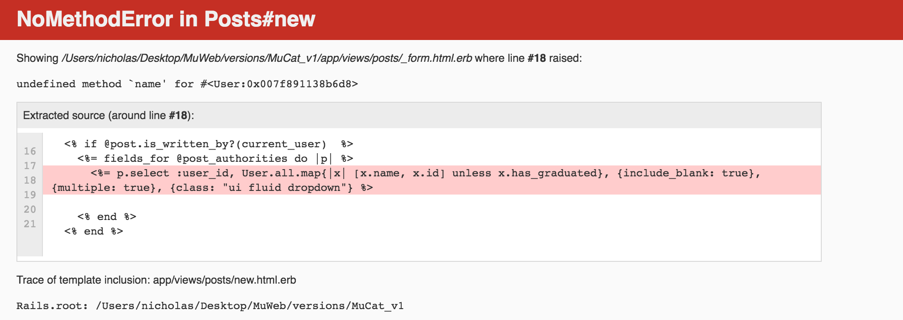
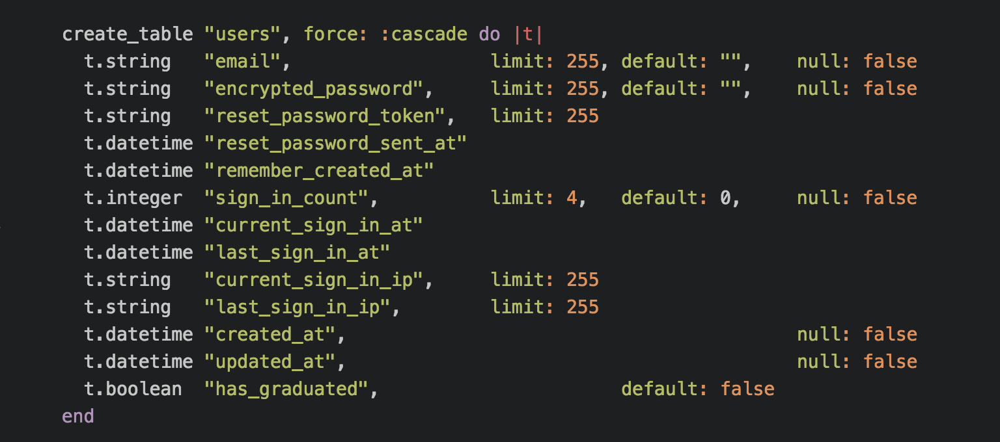
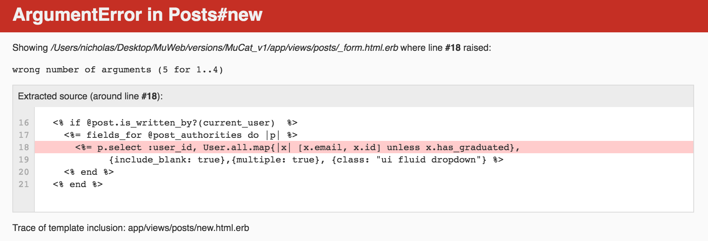
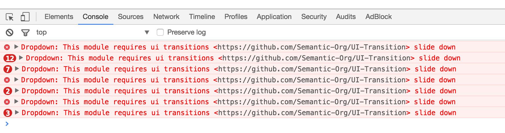
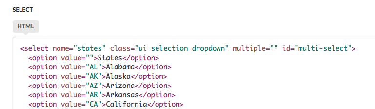
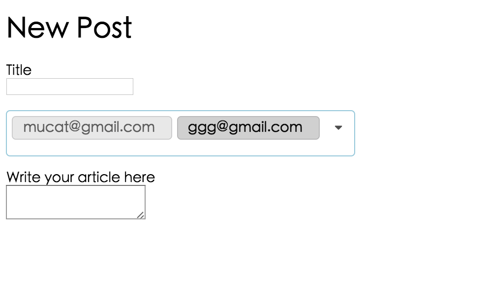
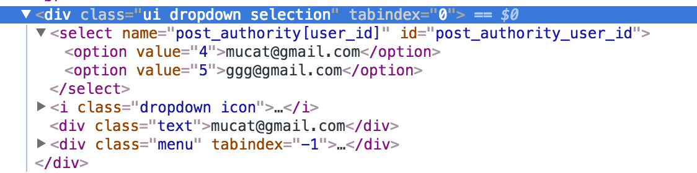
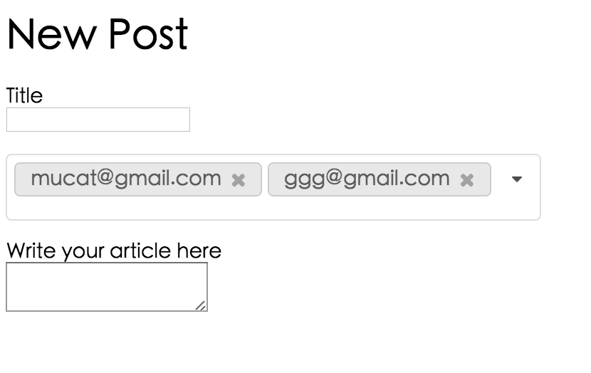

# 定義model

奇怪，在[JCcart GitHub wiki - Step.4 models](https://github.com/NickWarm/jccart/wiki/Step.4-models)時，直接寫`rails g model Item`會噴掉，但這次不會噴....，不過也沒打算用這方法，決定使用[建立shop的table](https://github.com/NickWarm/jccart/wiki/Step.3-註冊系統與產品圖片#建立shop的table)的方法來建model

學習資源的model用兩個字命名   
- [Ruby/Rails - Models Named with Two Words (Naming Convention Issues) - Stack Overflow](http://stackoverflow.com/questions/4893342/ruby-rails-models-named-with-two-words-naming-convention-issues)

model比較對照表：
- 學習資源：`learning_notes`
- 榮譽榜：`honors`
- 實驗室公告：`posts`
- 實驗室成員：`users`
- 學生的論文：`papers`
- 教授的著作：`professor_works`

# 實驗室公告

實驗室公告的功能實作，請參考[MuWeb/features/professor_assigned](../../features/professor_assigned/)這個資料夾所寫的筆記，以下實作的緣由紀錄於[controller_design.md](../../features/professor_assigned/controller_design.md)

我的需求：

>傳統A發了一篇文章，只有A有權限編輯
>
>我現在想要A發一篇文章，可以給特定的B或C或D來編輯A的文章，其他人不可以編輯

做法：

>用一個多選下拉選單，來指派實驗室成員，這個選單只會出現還在學校的實驗室成員，已經畢業的實驗室成員就不會出現在選單裡面。

為了這需求，我設計了多對多model

>一個user身為author會有多個post，一個post透過post_authority可能會有多個editor

```
User

post_authority   中介表

Post
```

表單的樣子會是
```
title

多選下拉選單：決定哪些人可以編輯，最後選好的人會被存到中介表 post_authority 裡面去

content

submit，送出表單
```

## 建立實驗室公告 post table

```
rails g migration create_post
```

fix `Mucat_v1/db/migrate/20161121085918_create_post.rb`


完整的code
```
class CreatePost < ActiveRecord::Migration
  def up
    create_table :posts do |t|
      t.integer  :user_id
      t.string   :title
      t.text     :content
      t.timestamps
    end
  end

  def down
    drop_table :posts
  end
end

```

然後`rake db:migrate`

## 題外話：schema亂掉後如何處理

一開始實驗室成員的model設為lab_member，後來才改成user

但是，我當初沒有用正規的寫法去drop lab_member在的schema裡的table，有先`rake db:migrate`，然後直接`rails d devise lab_member`

結果變成我的`schema.rb`裡面有`user table`也有`lab_member table`

而且如果table建錯後，我都是先`rake db:migrate`，然後直接`rails d migration`，完全沒把schema裡的東西改掉，結果我等到要建`post table`時才發現我的schema已經大亂了。

後來我是參考[ActiveRecord Command Line基本操作指令 - iT 邦幫忙](http://ithelp.ithome.com.tw/articles/10160474)這篇的解法

先把`db/migrate`資料夾裡的東西留下我要的migration，刪掉不要的，然後下指令
```
 rake db:migrate:reset
```

然後再回去看`schema.rb`就可以看到乾淨的schema了

# 建立post_authorities table 中介表

有鑒於migration與schema大亂的經驗，這份資料先備份一下
- [用Migrations指令创建修改表格 & schema](https://github.com/xingrowth/fullstack-course/wiki/用Migrations指令创建修改表格-&-schema)

建立中介表
`rails g migration create_post_authority`

定義post_authorities table

fix `db/migrate/20161121101139_create_post_authority.rb`

完整code
```
class CreatePostAuthority < ActiveRecord::Migration
  def up
    create_table :post_authorities do |t|
      t.integer :user_id
      t.integer :post_id
    end
  end

  def down
    drop_table :post_authorities
  end
end
```

然後`rake db:migrate`

# 建立model

若是下指令 `rails g model post`不只會建立`post.rb` model，也會建立一個`XXXXXXXXX_create_posts.rb` migration。由於我們剛剛已經定義好post table與post_authority table，所以不用此方法。


直接到`app/model`資料夾裡建立model

create `app/model/post.rb`
```
class Post < ActiveRecord::Base

end
```

create `app/model/post_authority.rb`
```
class PostAuthority < ActiveRecord::Base

end
```

# model之間建立關聯

fix `app/model/user.rb`

```
class User < ActiveRecord::Base
  ...

  has_many :posts
  has_many :post_authorities
  has_many :editable_posts, through: :post_authorities, source: :post
end
```

fix `app/model/post_authority.rb`

```
class PostAuthority < ActiveRecord::Base
  belongs_to :user
  belongs_to :post
end
```

fix `app/model/post.rb`

```
class Post < ActiveRecord::Base
  belongs_to :author, class_name "User", foreign_key: :user_id
  has_many :post_authorities
  has_many :editors, through: :post_authorities, source: :user
end
```

## 題外話：建立好model後要測試一下model能不能work

參考自：[JCcart wiki - Step.4 models](https://github.com/NickWarm/jccart/wiki/Step.4-models)

建立好model後，要`rails c`進入console來測試model能不能work
```
rails c
Running via Spring preloader in process 3379
Loading development environment (Rails 4.2.5.2)
[1] pry(main)> Post.count
SyntaxError: /Users/nicholas/Desktop/MuWeb/versions/MuCat_v1/app/models/post.rb:2: syntax error, unexpected tSTRING_BEG, expecting keyword_do or '{' or '('
  belongs_to :author, class_name "User", foreign_key: :user_id
                                  ^
/Users/nicholas/Desktop/MuWeb/versions/MuCat_v1/app/models/post.rb:2: syntax error, unexpected ',', expecting keyword_end
  belongs_to :author, class_name "User", foreign_key: :user_id
                                        ^
from /Users/nicholas/.rvm/gems/ruby-2.2.2/gems/activesupport-4.2.5.2/lib/active_support/dependencies.rb:457:in `load'
[2] pry(main)> User.count
   (3.0ms)  SELECT COUNT(*) FROM `users`
=> 0
[3] pry(main)> PostAuthority.count
   (0.4ms)  SELECT COUNT(*) FROM `post_authorities`
=> 0
```

結果發現Post model噴了，查一下[rails API - ActiveRecord::Associations::ClassMethods](http://api.rubyonrails.org/classes/ActiveRecord/Associations/ClassMethods.html)發現Post model這邊的`class_name "User"`寫錯了，要寫`class_name: "User"`

from

```
belongs_to :author, class_name "User", foreign_key: :user_id
```

to

```
belongs_to :author, class_name: "User", foreign_key: :user_id
```

然後再`rails c`後，每個model都下指令`ModelName.count`來測試看看，果然都能work了

# 重新定義路由的「概念」

依循不同的User story，會有不同的路由設計，在此註解`route.rb`為何如此設計
```
Rails.application.routes.draw do
                                 # 第一層：發表文章、編輯文章
  resources :learningnotes       # 學習資源
  resources :posts               # 實驗室公告
  resources :honors              # 榮譽榜
  resources :users               # 實驗室成員資料
  resources :professorworks      # 教授的著作

  devise_for :users              # 登入系統
  devise_for :managers

  get 'welcome/index'            # 首頁
  root 'welcome#index'

  namespace :dashboard do        # 實驗室成員：編輯個資、
                                 #           查看該帳號發表過什麼文章，點選文章後進入第一層觀看文章，並且編輯之
    resources :learningnotes
    resources :posts
    resources :honors
    resources :users

    namespace :admin do          # 網站管理員：上線的版本要把admin改成亂碼
      resources :users           # 刪除實驗室成員的權限
      resources :professorworks  # 教授的著作
    end
  end
end
```

# 開始設計表單

`rails g controller Posts`

接著在`app/views/post`資料夾下，create `new.html.erb`、`edit.html.erb`、`_form.html.erb`

add to `new.html.erb`

```
<h1 id="page_title">New Post</h1>

<div class="skinny_wrapper wrapper_padding">
  <%= render 'form' %>
</div>
```

add to `edit.html.erb`

```
<h1 id="page_title">Edit Post</h1>

<div class="skinny_wrapper wrapper_padding">
  <%= render 'form' %>
</div>
```

add to `_form.html.erb`

設計緣由請見[MuCat/features/professor_assigned/controller_design.md](../../features/professor_assigned/controller_design.md)

一開始最簡單的實驗室公告的表單，實驗室公告要有標題，要有內容，要有送出表單的按鈕

```
<%= form_for @post do |f| %>


  <%= f.label :title %><br>
  <%= f.text_field :title  %>

  <br>
  <br>

  <%= f.label :content, "Write your article here" %><br>
  <%= f.text_area :content %>

  <br>
  <br>

  <%= f.submit %>
<% end %>
```

### 題外話：默默發現routes先前寫錯了

原本的`routes.rb`寫成

```
Rails.application.routes.draw do
                                 # 第一層：發表文章、編輯文章
  ...
  resources :users               # 實驗室成員資料
  ...

  devise_for :users              # 登入系統
  devise_for :managers

  ...
  ...

end
```

由於實驗室公告要登入，登入後才能送出表單。基於這概念，我想去註冊新帳號時發現打網址`localhost:3000/users/sign_up`進不到使用者的登入頁面

一開始噴說沒users controller，我用`rails g controller users`建好後噴說沒show action。等到show action也建好後，打`localhost:3000/users/sign_up`果然連到show action的頁面去了。

反觀manager登入頁面`localhost:3000/managers/sign_up`可以順利進去

於是，我把`routes.rb`改成
```
Rails.application.routes.draw do
                                 # 第一層：發表文章、編輯文章
  resources :learningnotes       # 學習資源
  resources :posts               # 實驗室公告
  resources :honors              # 榮譽榜
  resources :professorworks      # 教授的著作

  devise_for :users              # 登入系統，實驗室成員資料，只能登入不能註冊
  devise_for :managers

  get 'welcome/index'            # 首頁
  root 'welcome#index'

  namespace :dashboard do        # 第二層：上線版要把dashboard改名，不能讓非實驗室成員能進入這頁面
                                 #           查看該帳號發表過什麼文章，點選文章後進入第一層觀看文章，並且編輯之
    resources :learningnotes
    resources :posts
    resources :honors
    resources :users             # 實驗室成員：編輯個資
                                 #           查看該帳號發表過什麼文章，點選文章後進入第一層觀看文章，並且編輯之

    namespace :admin do          # 第三層：上線的版本要把admin改成亂碼
      resources :managers        # 網站管理員
      resources :users           # 刪除實驗室成員的權限
      resources :professorworks  # 教授的著作
    end
  end
end

```

就能順利work了

### 題外話：改掉devise預設的「註冊」網址

由於devise預設是`localhost:3000/users/sign_up`就能註冊，但是我現在弄實驗室網站當然 **不希望任何人都可以給我註冊** 啊，後來看到devise的wiki
- [How To: Change Default Sign_up Registration Path with Custom Path · plataformatec/devise Wiki](https://github.com/plataformatec/devise/wiki/How-To:-Change-Default-Sign_up---Registration-Path-with-Custom-Path)

so, fix `config/route.rb`

```
Rails.application.routes.draw do
  devise_scope :user do
    get "/lab515/sign_up" => "devise/registrations#new", as: "new_user_registration"
  end
                                 # 第一層：發表文章、編輯文章
  ...
  ...
  devise_for :users
  ...
  ...
end
```

如此一來，我要註冊帳號，預設網址就會改成`localhost:3000/lab515/sign_up`，而devise預設的`localhost:3000/user/sign_up`就會失效了

於是`route.rb`完整的code變成

```
Rails.application.routes.draw do
  devise_scope :user do
    # 下面這行，把註冊的預設網址改成http://localhost:3000/lab515/sign_up，一樣上線版要改成不同的網址
    get "/lab515/sign_up" => "devise/registrations#new", as: "new_user_registration"
  end
                                 # 第一層：發表文章、編輯文章
  resources :learningnotes       # 學習資源
  resources :posts               # 實驗室公告
  resources :honors              # 榮譽榜
  resources :professorworks      # 教授的著作

  devise_for :users              # 登入系統，實驗室成員資料，只能登入不能註冊
  devise_for :managers

  get 'welcome/index'            # 首頁
  root 'welcome#index'

  namespace :dashboard do        # 第二層：上線版要把dashboard改名，不能讓非實驗室成員能進入這頁面
                                 #           查看該帳號發表過什麼文章，點選文章後進入第一層觀看文章，並且編輯之
    resources :learningnotes
    resources :posts
    resources :honors
    resources :users             # 實驗室成員：編輯個資
                                 #           查看該帳號發表過什麼文章，點選文章後進入第一層觀看文章，並且編輯之

    namespace :admin do          # 第三層：上線的版本要把admin改成亂碼
      resources :managers        # 網站管理員
      resources :users           # 刪除實驗室成員的權限
      resources :professorworks  # 教授的著作
    end
  end
end
```

如此一來，你再`rake routes`，就可以看到註冊的路由跑到最上面

```
nicholas at NicholasdeMacBook-Pro.local in ~/Desktop/MuCat_v1 on dev*
$ rake routes

               Prefix Verb   URI Pattern                                        Controller#Action
new_user_registration GET    /lab515/sign_up(.:format)                          devise/registrations#new
learningnotes         GET    /learningnotes(.:format)                           learningnotes#index
                      POST   /learningnotes(.:format)                           learningnotes#create
```

完成後我在註冊頁面註冊第一筆帳號
```
帳號：mucat@gmail.com
密碼：lab515
```

接著`rails c`進入console，後下指令`User.count`可以看到有一筆資料
```
[1] pry(main)> User.count
   (0.3ms)  SELECT COUNT(*) FROM `users`
=> 1
```

# 回到表單設計：「被指派的人」才能編輯文章

一開始最簡單的實驗室公告的表單，實驗室公告要有標題，要有內容，要有送出表單的按鈕

`app/views/post/_form.html.erb`的完整code

```
<%= form_for @post do |f| %>


  <%= f.label :title %><br>
  <%= f.text_field :title  %>

  <br>
  <br>

  <%= f.label :content, "Write your article here" %><br>
  <%= f.text_area :content %>

  <br>
  <br>

  <%= f.submit %>
<% end %>
```

接著，我希望能指派複數個「特定的人」能夠編輯表單。

我從User model中撈出還在學校讀書的實驗室成員，然後把它存到中介表PostAuthority model

fix `app/views/post/_form.html.erb`

```
<%= form_for @post do |f| %>


  <%= f.label :title %><br>
  <%= f.text_field :title  %>

  <br>
  <br>

  <%= f.fields_for @post_authorities do |p| %>
    <%= p.select :user_id, User.all.map{|x| [x.name, x.id] unless x.has_graduated},
                 {include_blank: true}, {multiple: true}, {class: "ui fluid dropdown"} %>
  <% end %>

  <br>
  <br>

  <%= f.label :content, "Write your article here" %><br>
  <%= f.text_area :content %>

  <br>
  <br>

  <%= f.submit %>
<% end %>
```

在此要說明一下這段code
```
<%= p.select :user_id, User.all.map{|x| [x.name, x.id] unless x.has_graduated},
             {include_blank: true}, {multiple: true}, {class: "ui fluid dropdown"} %>
```

首先，我們從User model撈出所有成員：`User.all.map{|x| [x.name, x.id]}`

但是，我希望只撈出「還在學校就讀的」實驗室成員，至於畢業的畢業生就不要了，於是我該在User加一個欄位`has_graduated:boolean`
- [用Migrations指令创建修改表格 & schema](https://github.com/xingrowth/fullstack-course/wiki/用Migrations指令创建修改表格-&-schema)

```
rails g migration AddHasGraduatedToUsers has_graduated:boolean
```

我用`has_graduated`這欄位來判斷實驗室成員畢業了沒，若為true代表畢業了，false則代表尚未畢業

希望`has_graduated`默認為false
- [ActiveRecord::Migration](http://api.rubyonrails.org/classes/ActiveRecord/Migration.html)

so, fix `db/migrate/20161122091021_add_has_graduated_to_users.rb`

```
class AddHasGraduatedToUsers < ActiveRecord::Migration
  def change
    add_column :users, :has_graduated, :boolean, default: false
  end
end
```

last, `rake db:migrate`

# 用semantic_ui美化下拉選單

透過`{multiple: true}`開啟rails的多重下拉選單的功能

在`form_for`表單裡，我們用`{class: "ui fluid dropdown"}`這些semantic_ui的class，來美化我們的多重下拉選單

這是參考自[Multiple Selection - Definition - Dropdown | Semantic UI](http://semantic-ui.com/modules/dropdown.html#multiple-selection)所採用的class，`<select name="skills" multiple="" class="ui fluid dropdown">`

於是我們來讀讀semantic_ui的官方文件
- [Definitions | Semantic UI](http://legacy.semantic-ui.com/introduction/definitions.html)
- [Form | Semantic UI](http://legacy.semantic-ui.com/collections/form.html)，搜尋fluid
- [Dropdown | Semantic UI](http://legacy.semantic-ui.com/modules/dropdown.html)

接著我要開啟多選的功能
- [Multiple Selection - Usage - Dropdown | Semantic UI](http://semantic-ui.com/modules/dropdown.html#multiple-selections)

過去，我已經在我們的專案引用了semantic_ui的JavaScript Library，現在我只要用`content_for`挖洞來寫JavaScript即可

參考自[jccart GitHub - Step.14 重頭戲：購物車的AJAX](https://github.com/NickWarm/jccart/wiki/Step.14-重頭戲：購物車的AJAX)

fix `app/views/layouts/application.html.erb`

```
<head>
  <title>MuCatV1</title>
  <%= stylesheet_link_tag    'application', media: 'all' %>
  <%= javascript_include_tag 'application' %>
  <%= csrf_meta_tags %>
  <%= yield :header %>
</head>
```

接著到`_form.html.erb`挖洞

fix `app/views/post/_form.html.erb`

```
<% content_for :header do %>
<script>
  $(".ui.fluid.dropdown").dropdown();
</script>
<% end %>

<%= form_for @post do |f| %>
  ...
  ...

  <%= f.fields_for @post_authorities do |p| %>
    <%= p.select :user_id, User.all.map{|x| [x.name, x.id] unless x.has_graduated},
                 {include_blank: true}, {multiple: true}, {class: "ui fluid dropdown"} %>
  <% end %>

  ...
  ...
<% end %>
```

# 只有author可以指派誰能夠編輯

由於這邊是partial form，所以說`new.html.erb`與`edit.html.erb`都是生出同一張表單。

我希望原作者才能指派編輯的人，我不希望被我指派的人，在`edit.html.erb`也能看到

所以我要寫一個method來判斷，現在登入的帳號「是不是作者」

fix `_form.html.erb`

```
<%= form_for @post do |f| %>


  <%= f.label :title %><br>
  <%= f.text_field :title  %>

  <br>
  <br>

  <% if @post.is_written_by?(current_user) %>
    <%= f.fields_for @post_authorities do |p| %>
      <%= p.select :user_id, User.all.map{|x| [x.name, x.id] unless x.has_graduated},
                   {include_blank: true}, {multiple: true}, {class: "ui fluid dropdown"} %>
    <% end %>
  <% end %>

  <br>
  <br>

  <%= f.label :content, "Write your article here" %><br>
  <%= f.text_area :content %>

  <br>
  <br>

  <%= f.submit %>
<% end %>
```

一篇文章`@post`透過`is_written_by?(current_user)`這method來判斷是不是作者。true就能看到指派實驗室成員的多重下拉選單，false則表單就不會看到下拉選單。

為了要讓`@post`能使用`is_written_by?(current_user)`這method，我們要去Post model定義這method

fix `app/model/post.rb`

```
class Post < ActiveRecord::Base
  belongs_to :author, class_name "User", foreign_key: :user_id
  has_many :post_authorities
  has_many :editors, through: :post_authorities, source: :user
end

### 定義在model裡的method可以在view裡使用

# 作者有權限編輯
def is_written_by?(user)
  user && user == author
end
```

# 巢狀表單：一張表單同時存不同model

再看一次`_form.html.erb`

```
<%= form_for @post do |f| %>


  <%= f.label :title %><br>
  <%= f.text_field :title  %>

  <br>
  <br>

  <% if @post.is_written_by?(current_user) %>
    <%= f.fields_for @post_authorities do |p| %>
      <%= p.select :user_id, User.all.map{|x| [x.name, x.id] unless x.has_graduated},
                   {include_blank: true}, {multiple: true}, {class: "ui fluid dropdown"} %>
    <% end %>
  <% end %>

  <br>
  <br>

  <%= f.label :content, "Write your article here" %><br>
  <%= f.text_area :content %>

  <br>
  <br>

  <%= f.submit %>
<% end %>
```

現在，我用`form_for`把`@post`這張表單送到Post model，同張表單裡我再用`fields_for`把`@post_authorities`送進中介表PostAuthority model。

同時送表單到不同的model，rails提供了`accepts_nested_attributes_for`來讓我們省掉寫controller的複雜程度。

再看一次`_form.html.erb`，這張表單是要送到Post model，Post model要接受(用`fields_for`送進PostAuthority model的)巢狀表單(`accepts_nested_attributes_for`)

so, fix `app/model/post.rb`

```
class Post < ActiveRecord::Base
  belongs_to :author, class_name "User", foreign_key: :user_id
  has_many :post_authorities
  has_many :editors, through: :post_authorities, source: :user
end

accepts_nested_attributes_for :post_authorities, allow_destroy: true

### 定義在model裡的method可以在view裡使用

# 作者有權限編輯
def is_written_by?(user)
  user && user == author
end
```

# controller與strong parameter

add to `app/controllers/posts_controller.rb`

完整的code

```
before_action :find_post, only: [:show, :edit, :update, :destroy]
before_action :authenticate_user!, except: [:index, :show]

def index
  @posts = Post.all
end

def new
  @post = current_user.posts.build
  @post_authorities = @post.post_authorities.build
end

def create
  @post = current_user.posts.build(post_params)

  if @post.save
    redirect_to @post
  else
    render 'new'
  end  
end

def show
end

def edit
end

def update
  if @post.update(post_params)
    redirect_to @post
  else
    render 'edit'
  end
end

def destroy
  @post.destroy
end

private

def find_post
  @post = Post.find(params[:id])
end

def post_params
  params.require(:post).permit(:title, :content,
                                post_authorities_attributes: [:id, :post_id, :user_id])
end
```

fix `app/model/post.rb`

```
class Post < ActiveRecord::Base
  validates :title, :content, presence: true

  belongs_to :author, class_name "User", foreign_key: :user_id
  has_many :post_authorities
  has_many :editors, through: :post_authorities, source: :user
end

accepts_nested_attributes_for :post_authorities, allow_destroy: true

### 定義在model裡的method可以在view裡使用

# 作者有權限編輯
def is_written_by?(user)
  user && user == author
end
```

現在逐步解釋

# 用build建立關聯物件

一開始建立一張新的表單時，我們會在new action裡建立送進Post model時所需要的`@post`與PostAuthority model所需的`@post_authorities`

由於我們用了`has_many`來關聯
- `user has_many posts`
- `post has_many post_authorities`

所以我們用`build`來產生新的物件
- [mackenziechild - wiki/app/controllers/articles_controller.rb](https://github.com/mackenziechild/wiki/blob/master/app/controllers/articles_controller.rb)
  - [wiki/app/models/user.rb](https://github.com/mackenziechild/wiki/blob/master/app/models/user.rb)
  - [wiki/app/models/article.rb](https://github.com/mackenziechild/wiki/blob/master/app/models/article.rb)
- [Artstore的products controller](https://github.com/growthschool/artstore/blob/week-3/app/controllers/admin/products_controller.rb)
  - [4.1 belongs_to 關聯參考手冊 - Active Record 關聯 — Ruby on Rails 指南](http://rails.ruby.tw/association_basics.html#belongs-to-關聯參考手冊)

```
class PostsController < ApplicationController
  before_action :authenticate_user!, except: [:index, :show]

  def new
    @post = current_user.posts.build
    @post_authorities = @post.post_authorities.build
  end

end
```

# 使用accepts_nested_attributes_for後

我們的巢狀表單，最外層用`form_for`包，裡面用`fields_for`包，分別送到不同的model。

在rails3的時候，還要在controller裡分別送到不同的model，像我們做多重下拉選單，還要用each來一個個放進中介表裡去。

現在用`accepts_nested_attributes_for`就不用那麼麻煩了。

我們只要處理好外層用`form_for`包的`@post`，並在在strong parameter用上`post_authorities_attributes`
- [9.2 嵌套表單](http://rails.ruby.tw/form_helpers.html#嵌套表單)
- [9.3 Controller 部分](http://rails.ruby.tw/form_helpers.html#controller-部分)

```
class PostsController < ApplicationController
  before_action :authenticate_user!, except: [:index, :show]

  def new
    @post = current_user.posts.build
    @post_authorities = @post.post_authorities.build
  end

  def create
    @post = current_user.posts.build(post_params)

    if @post.save
      redirect_to @post
    else
      render 'new'
    end
  end

  private

  def post_params
    params.require(:post).permit(:title, :content,
                                  post_authorities_attributes:[:id, :post_id, :user_id])
  end
end
```

fix `app/model/post.rb`

```
class Post < ActiveRecord::Base
  validates :title, :content, presence: true

  belongs_to :author, class_name "User", foreign_key: :user_id
  ...
end

accepts_nested_attributes_for :post_authorities, allow_destroy: true
...
```

# params

params請依序看
- [Rails當中的params是什麼？ | Motion Express](http://motion-express.com/blog/20141026-rails-params)
- [rails API - ActionController::Parameters](http://api.rubyonrails.org/classes/ActionController/Parameters.html)
- [rails API - find](http://api.rubyonrails.org/classes/ActiveRecord/FinderMethods.html#method-i-find)

```
class PostsController < ApplicationController
  before_action :find_post, only: [:show, :edit, :update, :destroy]
  before_action :authenticate_user!, except: [:index, :show]

  ...

  def create
    @post = current_user.posts.build(post_params)

    if @post.save
      redirect_to @post
    else
      render 'new'
    end
  end

  def show
  end

  def edit
  end

  def update

  end

  private

  def find_post
    @post = Post.find(params[:id])
  end

  def post_params
    params.require(:post).permit(:title, :content,
                                  post_authorities_attributes:[:id, :post_id, :user_id])
  end
end
```

# 最後update、destroy actions

```
class PostsController < ApplicationController
  before_action :find_post, only: [:show, :edit, :update, :destroy]
  before_action :authenticate_user!, except: [:index, :show]

  ...

  def update
    if @post.update(post_params)
      redirect_to @post
    else
      render 'edit'
    end
  end

  def destroy
    @post.destroy
  end

  ...
end
```

等到寫完筆記，才覺得這邊寫得有點太詳細了...

# 抓蟲趣

然後實際測試了一下，噴了



說我們的User沒有name這method，於是我去看了一下schema，的確沒有....



既然如此，我先用email來測試就好了，然後又噴了



後來實驗後發現，把`include_blank: true`與`multiple: true`放在同一個`{}`即可

fix `app/views/post/_form.html.erb`

```
<%=  content_for :header do %>
<script>
  $(".ui.fluid.dropdown").dropdown()
</script>
<% end %>

<%= form_for @post do |f| %>
  ...

  <% if @post.is_written_by?(current_user)  %>
    <%= fields_for @post_authorities do |p| %>
      <%= p.select :user_id, User.all.map{|x| [x.email, x.id] unless x.has_graduated},
                {include_blank: true, multiple: true}, {class: "ui fluid dropdown"} %>
    <% end %>
  <% end %>

  ...
<% end %>
```

但是多重下拉選單依舊無法work，開chrome的開發者工具後噴說「沒有開transition」



so, fix `MuCat_v1/vendor/assets/javascripts/semantic_ui/semantic_ui.js`
```
//= require semantic_ui/definitions/modules/transition.js
```

and fix `MuCat_v1/vendor/assets/stylesheets/semantic_ui/semantic_ui.css`
```
*= require semantic_ui/definitions/modules/transition.less`
```

不過semantic_ui的CSS一直沒出來，semantic_ui的javascript也沒效果，等讀到xdite學生的這篇文章才發現我`<script>`那邊寫錯了
- [semantic-ui引用到rails « chenyunli](http://chenyunli6-blog.logdown.com/posts/802251-semantic-ui-references-to-the-rails)

so, fix `app/views/post/_form.html.erb`

```
<%=  content_for :header do %>
<script>
  $(function(){
    $(".ui.dropdown").dropdown()
  });
</script>
<% end %>

<%= form_for @post do |f| %>
  ...

  <% if @post.is_written_by?(current_user)  %>
    <%= fields_for @post_authorities do |p| %>
      <%= p.select :user_id, User.all.map{|x| [x.email, x.id] unless x.has_graduated},
                {include_blank: true, multiple: true}, {class: "ui fluid dropdown"} %>
    <% end %>
  <% end %>

  ...
<% end %>
```

semantic_ui的CSS風格已經看到了，不過多重下拉選單依舊無法work

回去研究semantic_ui的官方範例：[Multiple Selections - Dropdown | Semantic UI](http://semantic-ui.com/modules/dropdown.html#multiple-selections)



我的核心目標還是在於，要弄出`<select name="states" class="ui selection dropdown" multiple="" id="multi-select">`中的`multiple=""`才對，後來找到這篇教學
- [ruby - How to add data attribute in Rails form select tag? - Stack Overflow](http://stackoverflow.com/questions/31993695/how-to-add-data-attribute-in-rails-form-select-tag)

so, fix `app/views/post/_form.html.erb`

```
<%=  content_for :header do %>
<script>
  $(function(){
    $(".ui.dropdown").dropdown()
  });
</script>
<% end %>

<%= form_for @post do |f| %>
  ...

  <% if @post.is_written_by?(current_user)  %>
    <%= fields_for @post_authorities do |p| %>
      <%= p.select :user_id, User.all.map{|x| [x.email, x.id] unless x.has_graduated},
                {multiple: true, include_blank:true},
                {class: "ui dropdown selection multiple", "multiple" => " " } %>
    <% end %>
  <% end %>

  ...
<% end %>
```

多重下拉選單終於順利work了！！！感動啊QAQ



不過，怎麼無法按X來取消掉啊，於是我用chrome開發工具檢查發現



有個icon anchor `<a>`，印象中我好像把它關掉了

so, fix `MuCat_v1/vendor/assets/stylesheets/semantic_ui/semantic_ui.css`

`*= require semantic_ui/definitions/elements/icon.less`

終於，一切大功告成！！！


