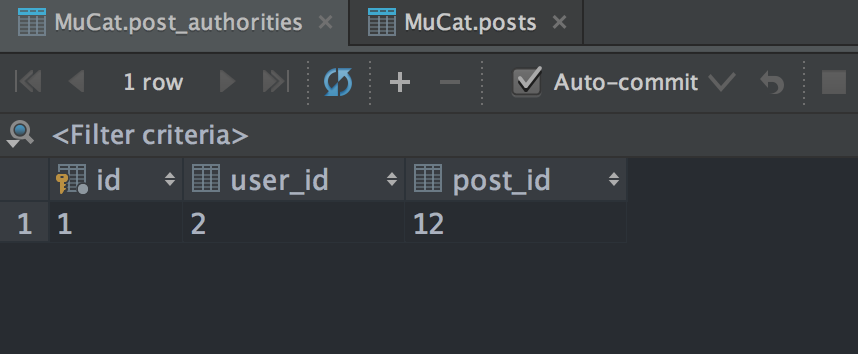
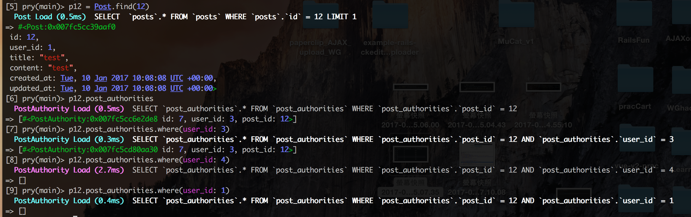
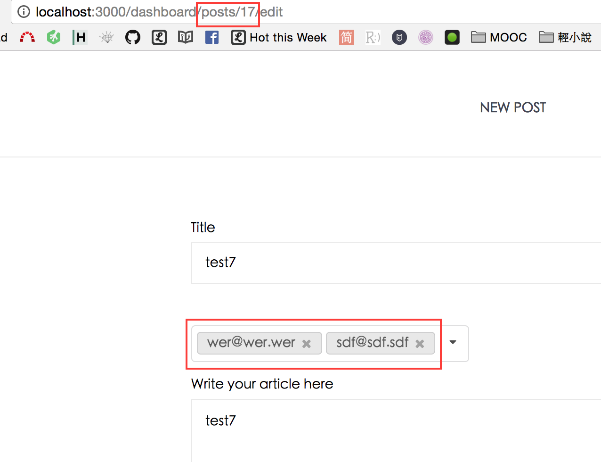
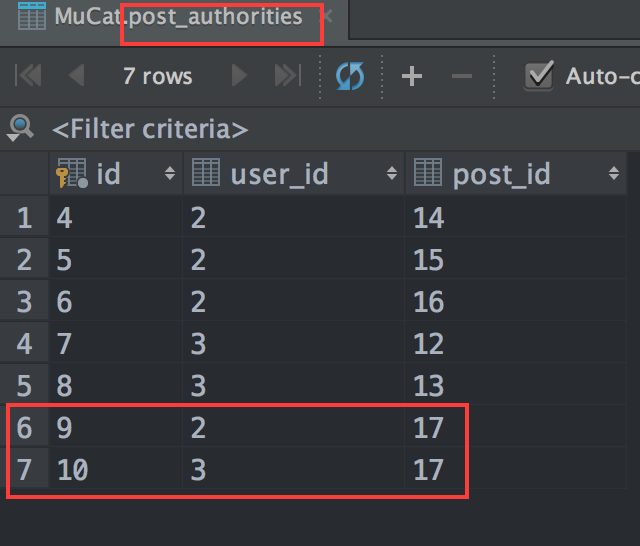
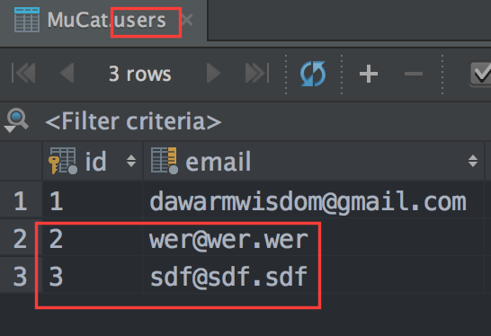

# 實驗室公告

這專案最先就實作「實驗室公告」，筆記記錄在[note_2_0.md](./note_2_0.md)。

[note_2_0.md](./note_2_0.md)完成後，就暫時擱下，去寫其他功能。寫完 **學習資源**([note_6.md](./note_6.md))後才回來修改，[note_2_0.md](./note_2_0.md)沒寫好的地方。並把修改的內容寫在本篇筆記。

修改的內容
- `new`、`edit`搬去後台
- 前台實作`show`、`view`頁面
- 驗證資料是否成功存入`Post`、`Post_Autthority` 這兩個database。([note_2_0.md](./note_2_0.md)時尚未驗證)

# 爭扎時找到的資料

用`accepts_nested_attributes_for`寫，但是中介表一直存不進去時找到的兩篇不錯的資料，雖然最後沒用到，但還是備份一下
- [comment：Nested attributes with collection_select not saving - GoRails](https://gorails.com/forum/nested-attributes-with-collection_select-not-saving#forum_post_491)
- `fields_for`用symbol的話，要怎麼寫：[comment1：How to get Rails build and fields_for to create only a new record and not include existing? - Stack Overflow](http://stackoverflow.com/a/14885040)

# 解掉無法存入中介表的bug

先描述問題。我希望做出的功能是「開放文章編輯權限，指定特定的人有權利編輯特定文章」

一開始我用了下面這樣的多對多結構

```
user

post_authority  #中介表

post
```

然後我在post的`new`頁面實作多選下拉選單。

最初記錄在[note_2_0.md](./note_2_0.md)的寫法，是打算用`accepts_nested_attributes_for`把`user_id`與`post_id`存入中介表，但不知為何一直都不能work。

最後是回去翻[Tutorial: Multi Select Drop Down with Ruby on Rails - YouTube](https://www.youtube.com/watch?v=ZNrNGTe2Zqk&feature=youtu.be&t=540)，看到其中一位[留言](https://www.youtube.com/watch?v=ZNrNGTe2Zqk&lc=z12vjzrzptecgdcas04cj3npzr3mxhboqpw0k)有提供這影片的方法用rails4.2實踐
- [followMultiSelectDropDown - GitHub](https://github.com/payne/followMultiSelectDropDown)

接下來的筆記，記錄我成功實踐的過程

我們先來看一下`app/views/dashboard/posts/new.html.erb`裡「多選下拉選單」原始的寫法

```
<%= p.select  :user_id, User.all.map{|x| [x.email, x.id] unless x.has_graduated},
          {multiple: true, include_blank:true},
          {class: "ui dropdown selection multiple", "multiple" => " " } %>
```

整個表單的結構長這個樣子

```
<%= form_for @post, url: dashboard_posts_path, method: :post do |f| %>

  <%= fields_for @post_authorities, url: dashboard_posts_path, method: :post  do |p| %>
    <%= p.label "所有實驗室成員" %>
    <%= p.select  :user_id, User.all.map{|x| [x.email, x.id] unless x.has_graduated},
              {multiple: true, include_blank:true},
              {class: "ui dropdown selection multiple", "multiple" => " " } %>
  <% end %>

  <%= f.submit %>
<% end %>
```

一開始我是打算用[select](http://api.rubyonrails.org/classes/ActionView/Helpers/FormOptionsHelper.html#method-i-select)來實作多選下拉選單的，一來過去做下拉選單就習慣用`select`，二來如同上面的code所示，我的功能有個需求，需要判斷撈出的人 **是還沒畢業的**，還在學校就讀的學生，而不是把畢業的也撈進來

而`post.rb`最初是長下面這個樣子的，打算透過`accepts_nested_attributes_for`來存入中介表。

```
class Post < ActiveRecord::Base
  validates :title, :content, presence: true

  belongs_to :author, class_name: "User", foreign_key: :user_id

  has_many :post_authorities                                    # post 與 user 的中介表
  has_many :editors, through: :post_authorities, source: :user  # 多對多

  accepts_nested_attributes_for :post_authorities, allow_destroy: true

  ### 定義在model裡的method可以在view裡使用

  # 作者有權限編輯
  def is_written_by?(user)
    user && user == author
  end
end
```

但是，因為不明原因，一直有bug存不進中介表。

# 開始換寫法

後來參考這篇，不再採用`accepts_nested_attributes_for`與`select`的寫法
- [followMultiSelectDropDown - GitHub](https://github.com/payne/followMultiSelectDropDown)

## 註解掉`accepts_nested_attributes_for`不使用它

fix `app/models/post.rb`

```
class Post < ActiveRecord::Base
  validates :title, :content, presence: true

  belongs_to :author, class_name: "User", foreign_key: :user_id

  has_many :post_authorities                                    # post 與 user 的中介表
  has_many :editors, through: :post_authorities, source: :user  # 多對多

  # accepts_nested_attributes_for :post_authorities, allow_destroy: true   

  ### 定義在model裡的method可以在view裡使用

  # 作者有權限編輯
  def is_written_by?(user)
    user && user == author
  end
end
```

## 修改表單，下拉選單改用`collection_select`寫

fix `app/views/dashboard/posts/new.html.erb`

砍掉`select`寫法的多重下拉選單，改用`collection_select`，這邊的code先撈全部User資料，後面會解釋我需要的「只撈還在學校的學生」這功能要怎麼寫

```
<%= collection_select :editors, :id, User.all, :id, :email,
                      {multiple: true, include_blank:true},
                      {class: "ui dropdown selection multiple", "multiple" => " " } %>
```

接著去後台的`posts_controller`

fix `app/controllers/dashboard/posts_controller.rb`

```
def create
  @post = current_user.posts.build(post_params)

  # 把user_id、post_id存入中介表
  params[:editors][:id].each do |editor|
    if !editor.empty?
      @post.post_authorities.build(:user_id => editor)
    end
  end

  if @post.save
    redirect_to @post
  else
    render 'new'
  end
end
```


這邊有趣的是`params[:editors][:id]`，我們先來看一下剛剛上面`collection_select`的寫法會生出什麼樣的html


可以看到`<select>`裡面的屬性是`name="editors[id][]"`

所以才會看到我們在`posts_controller`的`create action`寫`params[:editors][:id]`接著再用`each`去把它存進中介表裡去

```
params[:editors][:id].each do |editor|
  if !editor.empty?
    @post.post_authorities.build(:user_id => editor)
  end
end
```

然後就能work，順利存入中介表。




## 為何這寫法，下拉選單用`select`寫會不恰當

基本上，是可以用`select`寫，但是對我來說，他的寫法會變得很不直覺，但我們現在照樣實作一次給你看，看過知道就好，個人其實不太喜歡這樣寫。

fix `posts/new.html.erb` 改回`select`寫法的多重下拉選單

```
<%= p.select  :user_id, User.all.map{|x| [x.email, x.id] unless x.has_graduated},
          {multiple: true, include_blank:true},
          {class: "ui dropdown selection multiple", "multiple" => " " } %>
```


如上圖所示，我們可以看到用`select`所生出的`<select>`裡面的屬性是`name="post_authority[user_id][]"`，所以接著，我們要去改`posts_controller`裡`create action`存入中介表的那段code

fix `app/controllers/dashboard/posts_controller.rb`

```
params[:post_authority][:user_id].each do |post_authority|
  if !post_authority.empty?
    @post.post_authorities.build(:user_id => post_authority)
  end
end
```

由於我們用`select`所生出的屬性是`name="post_authority[user_id][]"`，所以在`posts_controller`就要用`params[:post_authority][:user_id]`對我來說這樣寫並不是很直觀，時間久了我會看不懂這段code在幹麻

讓我們來比較一下`collection_select`與`select`在controller的寫法

>`collection_select`

```
params[:editors][:id].each do |editor|
  if !editor.empty?
    @post.post_authorities.build(:user_id => editor)
  end
end
```

vs

>`select`

```
params[:post_authority][:user_id].each do |post_authority|
  if !post_authority.empty?
    @post.post_authorities.build(:user_id => post_authority)
  end
end
```

兩個寫法兩兩比較，我個人比較喜歡`collection_select`所生出的params，我可以清楚地知道我要存進中介表的是editor的`user_id`。

反觀用`select`所生出的params就沒那麼親切易讀了。

# 撈出在校學生的解法

其實很簡單，先前我已經在`user.rb`用scope做了判斷是否畢業的method，拿來用就好了

`model/user.rb`

```
scope :has_graduated, ->(status) { where( has_graduated: status) }
```

然後再`posts_controller`加入`@users_still_in_college = User.all.has_graduated(false)`這行。

fix `app/controllers/dashboard/posts_controller.rb`

```
def new
  @post = current_user.posts.build
  @post_authorities = @post.post_authorities.build
  @users_still_in_college = User.all.has_graduated(false)
end

def create
  @post = current_user.posts.build(post_params)
  @users_still_in_college = User.all.has_graduated(false)

  # 把user_id、post_id存入中介表
  params[:editors][:id].each do |editor|
    if !editor.empty?
      @post.post_authorities.build(:user_id => editor)
    end
  end


  if @post.save
    redirect_to @post
  else
    render 'new'
  end
end
```

接著讓`collection_select`撈資料時直接撈`@users_still_in_college`即可

fix `app/views/dashboard/posts/new.html.erb`

```
<%= collection_select :editors, :id, @users_still_in_college, :id, :email,
                      {multiple: true, include_blank:true},
                      {class: "ui dropdown selection multiple", "multiple" => " " } %>
```

實測後，順利可以work。

# edit頁面與edit、update actions

進度：
- 準備寫edit、update action
- 準備寫「進入edit頁面的button」
- 實測「指定特定人能夠進入編輯頁面」
- 準備寫，進入edit頁面後「下拉選單的default value 顯示上次選取的人」

現在來寫edit post時，所需要的`edit action`與`update action`

這邊直接上code

fix `app/controllers/dashboard/posts_controller.rb`

```
def edit
  @post_authorities = @post.post_authorities.build
  @users_still_in_college = User.all.has_graduated(false)
end

def update


  if @post.update(post_params)

    @post.editors = []
    params[:editors][:id].each do |editor|
      if !editor.empty?
        @post.editors << User.find(editor)
      end
    end

    redirect_to @post
  else
    render 'edit'
  end
end
```

有些post，最初發表時並沒有指派人，事後進入`edit`頁面下拉選單的`fields_for`要用，所以有必要在`edit action`建立`@post_authorities`

post的`edit` 頁面的下拉選單

```
<%= fields_for @post_authorities, url: dashboard_post_path, method: :patch do |p| %>
  <%= collection_select :editors, :id, @users_still_in_college, :id, :email,
                        {multiple: true, include_blank:true, :selected => @post.editors.map(&:id)},
                        {class: "ui dropdown selection multiple", "multiple" => " " } %>

<% end %>
```

接著存資料時，因為`collection_select`生出的資料是`params[:editors][:id]`，所以`update action`寫

```
@post.editors = []
params[:editors][:id].each do |editor|
  if !editor.empty?
    @post.editors << User.find(editor)
  end
end
```

這邊可以用`@post.editors`來存入中介表`post_authorities`，是因為最初，我在`post.rb`裡定義的多對多關聯

```
has_many :editors, through: :post_authorities, source: :user  # 多對多
```

筆記完成。

# 指定特定人能夠進入編輯頁面

- 準備寫edit、update action -> **done**
- 準備寫「進入edit頁面的button」
- 實測「指定特定人能夠進入編輯頁面」
- 準備寫，進入edit頁面後「下拉選單的default value 顯示上次選取的人」

這邊卡了超久Bug。

最初是構想在`post.rb`定義

```
# 授權的人能夠編輯
def is_authorized_to_edit_by?(user)
  post_authorities.where(user_id: user.id)
end
```
然後在post的`show`頁面寫

```
<% if  @post.is_authorized_to_edit_by?(current_user)  %>
  <%= link_to "授權編輯Edit", edit_dashboard_post_path, class: "view_more" %>
<% end %>
```

但是這樣寫，只要任何帳號登入，就會在post的`show`頁面一直看到`授權編輯Edit` button

最後是我是用`rails c`進入console



首先用`p12 = Post.find(12)`來撈出`id = 12`的post

接著對`p12.post_authorities`用`where(user_id: user.id)`條件，去查看不同的`user.id`會丟出什麼東西出來

一開始我先用`p12.post_authorities`，知道這會吐出`user_id: 3`

```
[6] pry(main)> p12.post_authorities
  PostAuthority Load (0.5ms)  SELECT `post_authorities`.* FROM `post_authorities` WHERE `post_authorities`.`post_id` = 12
=> [#<PostAuthority:0x007fc5cc6e2de8 id: 7, user_id: 3, post_id: 12>]
```

接著我用`pry(main)> p12.post_authorities.where(user_id: 3)`如預期，可以得到上面那串

接著我用`pry(main)> p12.post_authorities.where(user_id: 1)`，也如預期，會噴出空陣列

```
[8] pry(main)> p12.post_authorities.where(user_id: 4)
  PostAuthority Load (2.7ms)  SELECT `post_authorities`.* FROM `post_authorities` WHERE `post_authorities`.`post_id` = 12 AND `post_authorities`.`user_id` = 4
=> []
```

後來我想到，既然他吐`[]`出來，我只要在`post_authorities.where(user_id: user.id)`後面加上`present?`就可以驗證`@post.post_authorities.where(user_id: user.id)`裡是否有`user_id`相匹配的資料

so fix `app/models/post.rb`

```
def is_authorized_to_edit_by?(user)
  post_authorities.where(user_id: user.id).present?
end
```

如此一來，`post`的show頁面

```
<% if  @post.is_authorized_to_edit_by?(current_user)  %>
  <%= link_to "授權編輯Edit", edit_dashboard_post_path, class: "view_more" %>
<% end %>
```

就能讓「被指派的人」進入edit頁面了。


# edit頁面的「下拉選單」：顯示上次選的人

進度：
- 準備寫edit、update action   -> **done**
- 準備寫「進入edit頁面的button」-> **done**
- 實測「指定特定人能夠進入編輯頁面」-> **done**
- 準備寫，進入edit頁面後「下拉選單的default value 顯示上次選取的人」

一開始在`edit`頁面下拉選單的寫法

`app/views/dashboard/posts/edit.html.erb`

```
<%= collection_select :editors, :id, @users_still_in_college, :id, :email,
                      {multiple: true, include_blank:true},
                      {class: "ui dropdown selection multiple", "multiple" => " " } %>
```

後來發現這樣寫無法撈到先前選取的資料，後來我參考這篇的留言
- [collection_select (ActionView::Helpers::FormOptionsHelper) - APIdock](http://apidock.com/rails/ActionView/Helpers/FormOptionsHelper/collection_select)，搜尋「nachocab」

改寫成下面這寫法

fix `app/views/dashboard/posts/edit.html.erb`

```
<%= collection_select :editors, :id, @users_still_in_college, :id, :email,
                      {multiple: true, include_blank:true, :selected => @post.editors.map(&:id)},
                      {class: "ui dropdown selection multiple", "multiple" => " " } %>
```

然後就能work了

`id = 17`的post，成功撈出上次選的人



可以在中介表中看到，對`post_id = 17`的文章，擁有編輯權限的是`user_id =2`與`user_id = 3`這兩個人



成功從database撈出上次選的人的`email`資訊



在此要解釋一下，為何撈上次選的人時，我可以直接從`@post.editors`去撈。

這是因為最初在定義`post.rb`的多對多關聯時，我是寫

```
has_many :editors, through: :post_authorities, source: :user  # 多對多
```

為了讓語意更清楚，我這邊用`editors`來表示「可以這篇文章編輯的人」，所以我要撈中介表的資料時就能直接寫`@post.editors`。

筆記完成。

進度：
- 準備寫edit、update action    -> **done**
- 準備寫「進入edit頁面的button」 -> **done**
- 實測「指定特定人能夠進入編輯頁面」-> **done**
- 準備寫，進入edit頁面後「下拉選單的default value 顯示上次選取的人」-> **done**
