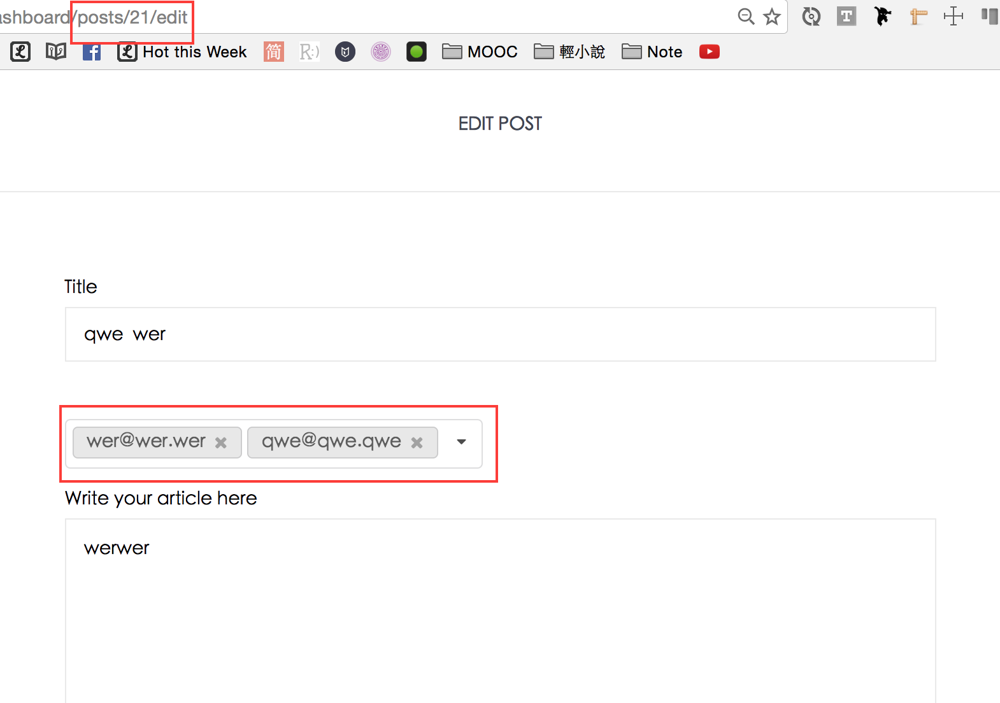
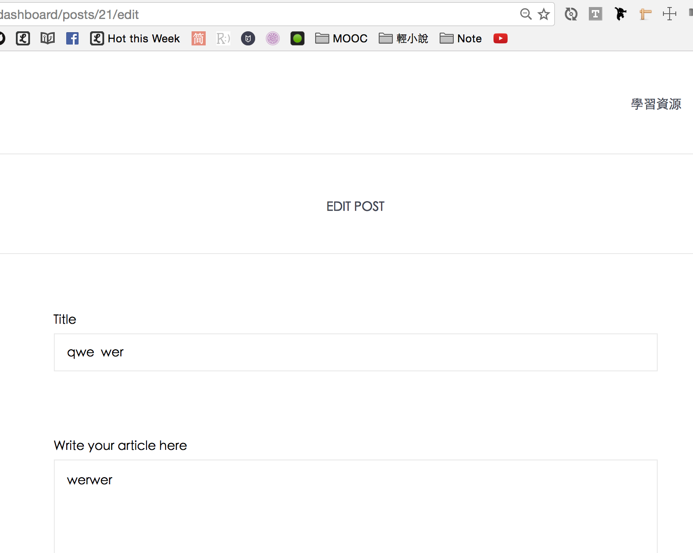
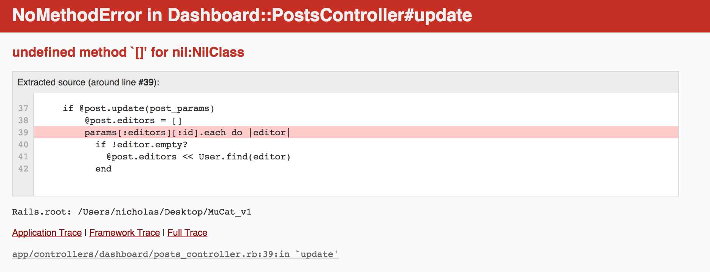

# 抓蟲趣：被授權編輯的人按下update button後噴錯

先說一下情境：

在過去，我用`<% if @post.is_written_by?(current_user)  %>`來判斷，這篇文章是不是原作者發的，如果是原作者對這篇文章編輯，才會有 **指派編輯者** 的下拉選單。

使用這段code

```
<% if @post.is_written_by?(current_user)  %>
  <%= fields_for @post_authorities do |p| %>
    <%= p.select :user_id, User.all.map{|x| [x.email, x.id] unless x.has_graduated},
              {multiple: true, include_blank:true},
              {class: "ui dropdown selection multiple", "multiple" => " " } %>
  <% end %>
<% end %>
```

實測：

編輯一篇`post_id`為 **21** 的文，並指派`wer@wer.wer`與`qwe@qwe.qwe`可以編輯這篇文章




被指派的人，透過`<% if @post.is_written_by?(current_user)  %>`進入編輯頁面後，可以成功讓「指派編輯者的下拉選單」消失。



但是按下 **update button** 後，就會噴錯



後來用chrome工具查看才想起，因為我是用`<%= %>`來render `ruby code`，再加上我透過`<% if @post.is_written_by?(current_user)  %>`這個判斷式來判斷現在登入的帳號是不是原始作者。

於是，非原作者的帳號登入進入該篇post的edit頁面，就根本不會render出下拉選單，**打從一開始就不存在**，但是posts controller的`update action`又需要`params[:editors][:id]`，這個下拉選單的`<input name="editors[id][]" type="hidden" value="">`，所以理所當然會噴錯。

## 解法

先後測過不同解法，最後我是想到可以寫個簡單的`if else`判斷式，來實作。首先先把下拉選單用div包起來

```
<div>
  <%= fields_for @post_authorities, url: dashboard_post_path, method: :patch do |p| %>
  <%= p.label :editors %><br>
  <%= collection_select :editors, :id, @users_still_in_college, :id, :email,
                        {multiple: true, include_blank:true, :selected => @post.editors.map(&:id)},
                        {class: "ui dropdown selection multiple", "multiple" => " " } %>
  <% end %>
</div>
```

無論是不是作者都用`<%= %>`render下拉選單，但是如果是被指派編輯的人，下拉選單就用`<div style = "display:none" >`隱藏起來
- [隱藏 HTML 元件 ( Element ) 方式 - 設定屬性](http://www.arthurtoday.com/2010/01/html-element.html)

於是下拉選單的code改寫成

```
<% if @post.is_written_by?(current_user)  %>

  <div>
    <%= fields_for @post_authorities, url: dashboard_post_path, method: :patch do |p| %>
    <%= p.label :editors %><br>
    <%= collection_select :editors, :id, @users_still_in_college, :id, :email,
                          {multiple: true, include_blank:true, :selected => @post.editors.map(&:id)},
                          {class: "ui dropdown selection multiple", "multiple" => " " } %>
    <% end %>
  </div>

<% else %>

  <div style = "display:none" >
    <%= fields_for @post_authorities, url: dashboard_post_path, method: :patch do |p| %>
    <%= collection_select :editors, :id, @users_still_in_college, :id, :email,
                          {multiple: true, include_blank:true, :selected => @post.editors.map(&:id)},
                          {class: "ui dropdown selection multiple", "multiple" => " " } %>
    <% end %>
  </div>

<% end %>
```

OK，解掉蟲，順利work。
