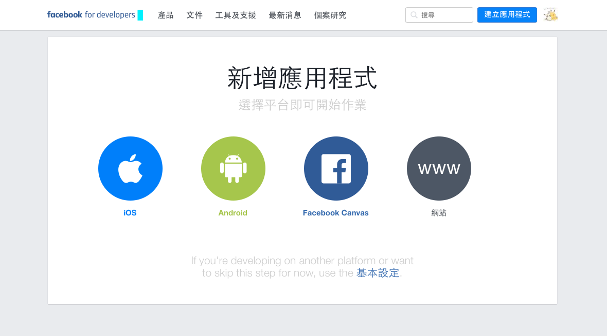
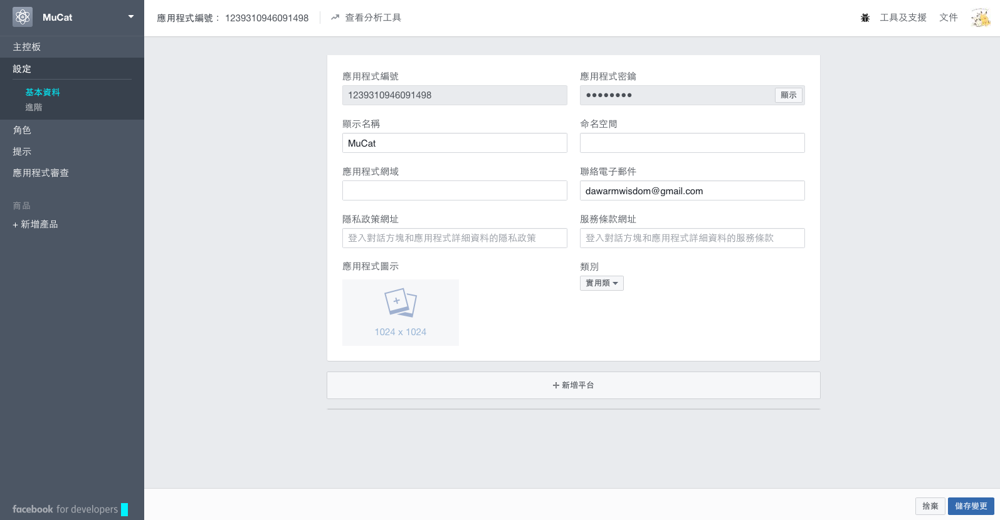
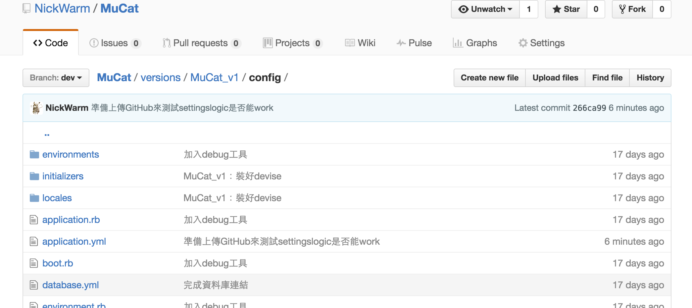
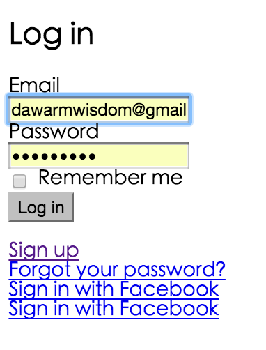
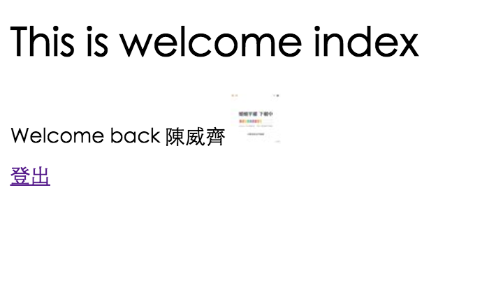

# 實驗室成員註冊、登入、編輯個人資訊

情境：

>實驗室成員可以透過臉書帳號登入與註冊
>1. 在首頁有登入連結
>2. 註冊頁面是在「特殊網址」的頁面，註冊完後會跳轉到個人資訊的頁面，來編輯個人資料
>3. 註冊方式：由老師寄信給實驗室成員註冊網址，信中註明不能讓該網址外流

詳情請參考[implement_login.md](../../features/login_OmniAuth/implement_login.md)

# 申請Facebook developer

一開始先進入[facebook for developer](https://developers.facebook.com)，然後點選右上角的 **登入**，然後沒註冊過的就會先要你註冊

接著按右上角的 **建立應用程式**



點選應用程式密鑰顯示，輸入你的臉書密碼取得密鑰



然後應用程式網域那邊，由於我現在是用`localhost:3000`來開發，參考sdlong體系的寫法沒找到website給我填寫
- [Facebook 自動登入功能 « sdlong's Blog](http://sdlong.logdown.com/posts/207194-rails-newbie-3)
- [Rails 新手村 - FB會員登入API--PLga « 阿嘎筆記](http://paulchia.logdown.com/posts/365026)

後來我參考這篇
- [如何申請建立 Facebook APP ID 應用程式ID ？ - 香腸炒魷魚](https://sofree.cc/apply-facebook-app-id/)

進到我的MuCat專案後：設定 -> 基本資料 -> 新增平台 -> 網站，接著在網站網址輸入`http://localhost:3000/`，(注意尾端要有「/」)，然後按右下角的「儲存變更」

OK，完成FB developer端的設定。

# 用settingslogic來保存密碼

add
```
gem 'omniauth-facebook'
gem 'settingslogic'      # 管理金鑰
```
to `Gemfile`，and then `bundle install`

~~然後專案裡多了一個`Gemfile.lock`檔~~

create `app/models/settings.rb`

```
class Settings < Settingslogic
  source "#{Rails.root}/config/application.yml"
  namespace Rails.env
end
```

and then create `config/application.yml`

```
defaults: &defaults
  app_name: "demotest"
  facebook_app_id: "自己申請的key"
  facebook_secret: "自己申請的key"

development:
  <<: *defaults
  domain: "http:/localhost:3000" # 必須要跟 facebook 上的 website 網址一樣，但是尾端不放『/』

test:
  <<: *defaults

production:
  <<: *defaults
```

and then fix `MuCat_v1/.gitignore`

```
...
...

# Ignore all logfiles and tempfiles.
/log/*
!/log/.keep
/tmp

# Ignore application.yml
/config/application.yml
```

如此一來，git 就不會把這個檔案放進版本管理裡面

來測試一下能不能work，所以來把該專案上傳到GitHub，恩......fail



經過測試後，我知道原因了，因為我最初的構想是在MuWeb這專案有不同版本的實驗室網站，後來發現這樣無法用settingslogic

>如何在MAC使用`tree`指令，請見[mac tree命令 - 破男孩 - 博客园](http://www.cnblogs.com/ayseeing/p/4097066.html)
>
>我個人習慣下`tree -d`，這樣比較不會有太多資訊

最後決定把資料夾結構改變，這專案就不再更動了，開一個新專案，然後把MuCat_v1的東西複製過去  ->  成功

上傳到GitHub的專案，可以看到`config`資料夾裡沒有`application.yml`這個檔案

## 插曲

先前測試時，在GitHub開了一個專案也叫MuCat_v1，然後把它砍掉

接著把重新弄好的專案一樣命名為MuCat_v1，然後要用`git remote add github git@github.com:NickWarm/MuCat_v1.git`時，就一直失敗

最後是看到這篇[Removing a remote - User Documentation](https://help.github.com/articles/removing-a-remote/)，我先在此專案下指令`git remote -v`

```
nicholas at NicholasdeMacBook-Pro.local in ~/Desktop/mucat_v1 on dev
$ git remote -v
github	git@github.com:NickWarm/MuCat.git (fetch)
github	git@github.com:NickWarm/MuCat.git (push)
```

然後再下指令`git remote rm github`，之後再下一次`git remote -v`就可以看到remote已經空了

```
nicholas at NicholasdeMacBook-Pro.local in ~/Desktop/mucat_v1 on dev
$ git remote -v
```

於是我就可以成功`git remote add github git@github.com:NickWarm/MuCat_v1.git`，然後再`git push github dev`了

# 修正FB developer ID、密碼的儲存方式

一開始以為只能用settingslogic才不會暴露你的FB developer的ID、密碼，後來臨摹ALPHA camp體系的login寫法發現，只要寫在yml檔，然後在`.gitignore`裡設定好，讓該檔案不會存到git裡去即可

create `config/facebook.yml` and `config/facebook.yml.example`

```
development:

  facebook_app_id: "申請facebook app 拿到的 app ID"

  facebook_secret: "申請facebook app 拿到的 app secret"

```

```
development:

  facebook_app_id: "申請facebook app 拿到的 app ID"

  facebook_secret: "申請facebook app 拿到的 app secret"

```

fix `config/initializers/devise.rb`
- ref：[FUSAKIGG/config/initializers/devise.rb](https://github.com/lustan3216/FUSAKIGG/blob/master/config/initializers/devise.rb)

```
fb_config = Rails.application.config_for(:facebook)
config.omniauth :facebook, fb_config["facebook_app_id"], fb_config["facebook_secret"],
                :scope => 'public_profile, email', :info_fields => 'email, name'
```

and then add to `.gitignore`
```
# Ignore facebook app config
/config/facebook.yml
```

接著刪除原本sdlong體系settingslogic的設定

edit `.gitignore`, and then delete

```
# Ignore application.yml
/config/application.yml
```

and then delete `config/application.yml`

and then delete `app/models/settings.rb`

edit `Gemfile` , 註解掉
```
gem 'settingslogic'      # 管理金鑰
```
and then `bundle install`

delete `Gemfile.lock`

## 修正使用者情境

原本的想法
- 登入按鈕所有人都看得到
- 但是只有實驗室成員能登入

但是這樣很不合邏輯，看得到登入頁面卻無法註冊

修正後的使用者情境
- 登入註冊頁面不公開
- 後台與登入頁面寫入`robots.txt`

# footbar情境

登入後要在footbar顯示「歡迎回來」

由於還沒把先前設計的UI套過來，先把footbar會用到的code寫在這邊

```
<footer id="main_footer">
  ...
  ...


  <% if user_signed_in? %>
    <p>
      Welcome back, <%= current_user.name %>
      <% if current_user.fb_image.present? %>
        <%= image_tag(current_user.fb_image, size: "40") %>
      <% end %>
    </p>
  <% end %>

</footer>
```

# 實作臉書登入、註冊頁面

## 路由設定

在[Note_2.md](./Note_2.md)我們已經設定過route，必須要打網址「localhost:3000/lab515/sign_up」才能進入devise的登入頁面
- 進到[Note_2.md](./Note_2.md)，搜尋「localhost:3000/lab515/sign_up」，即可看到如何設定路由

`config/routes.rb`

```
Rails.application.routes.draw do
  devise_scope :user do
    # 下面這行，把註冊的預設網址改成http://localhost:3000/lab515/sign_up，一樣上線版要改成不同的網址
    get "/lab515/sign_up" => "devise/registrations#new", as: "new_user_registration"
    get "/lab515/sign_in" => "devise/sessions#new"
  end
```

現在我把登入與註冊都設定成要走`localhost:3000/lab515/`，但是經測試，devise原始的`localhost:3000/users/sign_up`與`localhost:3000/users/sign_in`依舊能work，恩.....我不希望他們能work

後來參考Mackenzie Child的[blog_course_demo/config/routes.rb](https://github.com/mackenziechild/blog_course_demo/blob/master/config/routes.rb)

add to `config/routes.rb`

```
Rails.application.routes.draw do
  devise_scope :user do
    # 下面這行，把註冊的預設網址改成http://localhost:3000/lab515/sign_up，一樣上線版要改成不同的網址
    get "/lab515/sign_up" => "devise/registrations#new", as: "new_user_registration"
    get "/lab515/sign_in" => "devise/sessions#new"
  end

  get '*path' => redirect('/')

  ...
  ...
end
```

上面這寫法雖然能work，但是最初我不懂這是怎麼寫的

後來讀到這兩篇才懂`get '*path' => redirect('/')`這用法在寫什麼。傳統網站，如果輸入錯誤網址會噴404，這寫法讓我們再輸入錯誤網址時，轉到(`redirect`)特定頁面，這邊我是把它轉到首頁(`redirect('/')`)
- [Rails: redirect all unknown routes to root_url - Stack Overflow](http://stackoverflow.com/questions/4132039/rails-redirect-all-unknown-routes-to-root-url)
  - 注意看這[回覆](http://stackoverflow.com/questions/4132039/rails-redirect-all-unknown-routes-to-root-url#comment45482037_4135022)，我也是讀到這邊才知道自己寫錯了，上面的寫法會把後面的路由設定給擋掉  
  - [3.12 Redirection - Rails Routing from the Outside In — Ruby on Rails Guides](http://guides.rubyonrails.org/routing.html#redirection)

so, fix `config/routes.rb`

```
Rails.application.routes.draw do
  devise_scope :user do
    # 下面這行，把註冊的預設網址改成http://localhost:3000/lab515/sign_up，一樣上線版要改成不同的網址
    get "/lab515/sign_up" => "devise/registrations#new", as: "new_user_registration"
    get "/lab515/sign_in" => "devise/sessions#new"
  end

  ...
  ...   
  ...

  get '*path' => redirect('/')
end
```

再來是我原先的目標：「關掉devise的原始路由設定」

我後來是結合兩個我會的方法，寫出這個需求
- [How To: Change Default Sign_up Registration Path with Custom Path - devise Wiki](https://github.com/plataformatec/devise/wiki/How-To:-Change-Default-Sign_up---Registration-Path-with-Custom-Path)
- [3.12 Redirection - Rails Routing from the Outside In — Ruby on Rails Guides](http://guides.rubyonrails.org/routing.html#redirection)

so, edit `config/routes.rb`, add

```
Rails.application.routes.draw do
  devise_scope :user do
    # 下面這行，把註冊的預設網址改成http://localhost:3000/lab515/sign_up，一樣上線版要改成不同的網址
    get "/lab515/sign_up" => "devise/registrations#new", as: "new_user_registration"
    get "/lab515/sign_in" => "devise/sessions#new"

    get "/users/sign_up"  => redirect('/')   # 關掉devise原始路由設定
    get "/users/sign_in"  => redirect('/')
  end

  ...
  ...   
  ...

  get '*path' => redirect('/')
end
```

階段性任務完成。

## 修改登入與註冊頁面

首先`rails g devise:views`，來生成devise的頁面
- [JCcart wiki - Step.6 登入頁面](https://github.com/NickWarm/jccart/wiki/Step.6-登入頁面)

如果我們想改掉devise的登入註冊頁面的UI，他們分別在
- 註冊：`app/views/devise/registrations/new.html.erb`
- 登入：`app/views/devise/sessions/new.html.erb`

>情境：可以用臉書登入，也能用臉書註冊帳戶

### 臉書登入連結

fix `app/views/devise/sessions/new.html.erb`, add

```
<%= link_to "Sign in with Facebook", user_facebook_omniauth_authorize_path %>
```

如果這時重整頁面一定會噴，因為我們這邊都還沒寫臉書登入的設定

有在[implement_login.md](../features/login_OmniAuth/implement_login.md)討論過登入系統與digging過devise的運作機制，現在實作我個人是採用ALPHA Camp的寫法

參考
- [Devise « HEROGWP's Blog](http://herogwp.logdown.com/posts/2016/10/21/devise)
- [Rails Screencast #1 - Criando autenticação com o Facebook! (Devise + Omniauth) - YouTube，觀看8:35](https://youtu.be/BeJpFQHm4A8?t=515)

首先，在User model加入兩個欄位：`fb_uid:string`、`fb_token:string`，並且讓`fub_uid`可以用WHERE來搜索到
- [JCcart - Step.3 註冊系統與產品圖片](https://github.com/NickWarm/jccart/wiki/Step.3-註冊系統與產品圖片)

`rails g migration AddOmniauthToUsers`

and then edit `db/migrate/20161203140645_add_omniauth_to_users.rb`

```
class AddOmniauthToUsers < ActiveRecord::Migration
  def change
    #新增facebook api回傳的資料, uid token 一定要有欄位紀錄

    add_column :users, :fb_uid, :string
    add_column :users, :fb_token, :string
    add_column :users, :fb_image, :string

    add_index :users, :fb_uid
  end
end
```

and then `rake db:migrate`

默默發現忘記加`provider`, so

```
rails g migration AddProviderToUsers provider:string
rake db:migrate
```

由於剛剛已經在 `config/initializers/devise.rb`設定好臉書登入，所以這邊就不用設定了。

接著在`user.rb`設定臉書登入

fix `app/models/user.rb`

```
class User < ActiveRecord::Base
  # Include default devise modules. Others available are:
  # :confirmable, :lockable, :timeoutable and :omniauthable
  devise :database_authenticatable, :registerable,
         :recoverable, :rememberable, :trackable, :validatable,
         :omniauthable, :omniauth_providers => [:facebook]
  ...
  ...
end
```

## 在route中加入OmniAuth的設定

在route中加入OmniAuth的設定，讓我們能使用omniauth_callback

參考[Rails Screencast #1 - Criando autenticação com o Facebook! (Devise + Omniauth) - YouTube，看12，請看12:26](https://youtu.be/BeJpFQHm4A8?t=746)

fix `config/route.rb`, from

```
devise_for :users              # 登入系統，實驗室成員資料，只能登入不能註冊
```

to

```
devise_for :users, :controllers => { omniauth_callbacks: "users/omniauth_callbacks" }
                               # 登入系統，實驗室成員資料，只能登入不能註冊
```

## 定義callback controller

and then create `app/controllers/users/omniauth_callbacks_controller.rb`

```
class Users::OmniauthCallbacksController < Devise::OmniauthCallbacksController
  def facebook
    @user = User.from_omniauth(request.env["omniauth.auth"])
  end

  def failure
    redirect_to root_path
  end
end
```

到這一步時，我們可以重整`localhost:3000/lab515/sign_in`，就能看到臉書登入的連結，但這畫面怪怪的XD



後來去查看`app/views/devise/sessions/new.html.erb`，發現有一行
```
<%= render "devise/shared/links" %>
```

這行對應到`app/views/devise_links.html.erb`這partial

不過由於我們之後要自己定義登入頁面的UI，所以可以把devise內建的link給註解掉或砍掉

edit `app/views/devise/sessions/new.html.erb` and delete `<%= render "devise/shared/links" %>`


## self.from_omniauth method

由於我們在callback controller用到`User.from_omniauth()`，於是我們要去User model定義`self.from_omniauth` method

so fix `app/models/user.rb` and create `from_omniauth method`

```
class User < ActiveRecord::Base
  ...
  has_many :editable_posts, through: :post_authorities, source: :post

  def self.from_omniauth(auth)

  end
end
```

若是不懂為何要用`self`，請閱讀[implement_login.md](wiki/features/login_OmniAuth/implement_login.md)，搜尋「為何要用`self`」


### Case 1: Find existing user by facebook uid

fix `app/models/user.rb`

```
class User < ActiveRecord::Base
  ...
  has_many :editable_posts, through: :post_authorities, source: :post

  def self.from_omniauth(auth)

    # Case 1: Find existing user by facebook uid
    user = User.find_by_fb_uid( auth.uid )
    if user
       user.fb_token = auth.credentials.token

       user.save!
      return user
    end

  end
end
```

若不懂`find_by_fb_uid`怎麼來的，請見[rails Guide - 15 动态查询方法](http://guides.ruby-china.org/active_record_querying.html#动态查询方法)

由於我們在User model裡定義了`fb_uid:string`這欄位，所以我們有`find_by_fb_uid`這method可以找相符合的`fb_uid`，於是我們去查找`auth.uid`
- [Auth Hash - omniauth-facebook](https://github.com/mkdynamic/omniauth-facebook#auth-hash)

如果找到與Auth Hash相匹配的uid，就從User model中撈出該user的資料，然後user的`fb_token`欄位存成Auth Hash擁有資格(credentials)的token，然後儲存(`user.save!`)
- [Auth Hash - omniauth-facebook](https://github.com/mkdynamic/omniauth-facebook#auth-hash)
- [Auth Hash Schema](https://github.com/omniauth/omniauth/wiki/Auth-Hash-Schema#schema-10-and-later)

### Case 2: Find existing user by email

keep coding `app/models/user.rb`

```
class User < ActiveRecord::Base
  ...
  has_many :editable_posts, through: :post_authorities, source: :post

  def self.from_omniauth(auth)

    # Case 1: Find existing user by facebook uid
    user = User.find_by_fb_uid( auth.uid )
    if user
       ...
       ...
    end

    # Case 2: Find existing user by email
    existing_user = User.find_by_email( auth.info.email )
    if existing_user
      existing_user.fb_uid = auth.uid
      existing_user.fb_token = auth.credentials.token

      existing_user.save!
      return existing_user
    end

  end
end
```

**case 1** 是用`fb_uid`找有沒有相匹配的user，**case 2** 是用`email`找。後面其餘的都一樣就不解釋了。

### Case 3: Create new password

keep coding `app/models/user.rb`

```
class User < ActiveRecord::Base
  ...
  has_many :editable_posts, through: :post_authorities, source: :post

  def self.from_omniauth(auth)

    # Case 1: Find existing user by facebook uid
    user = User.find_by_fb_uid( auth.uid )
    if user
       ...
       ...
    end

    # Case 2: Find existing user by email
    existing_user = User.find_by_email( auth.info.email )
    if existing_user
      ...
      ...
    end

    # Case 3: Create new password
    user = User.new
    user.fb_uid = auth.uid
    user.fb_token = auth.credentials.token
    user.email = auth.info.email
    user.password = Devise.friendly_token[0,20]

    user.save!
    return user

  end
end
```

如果用`fb_uid`或`email`都找不到資料，那麼就創建一筆新資料

透過`Devise.friendly_token`隨機產生一組密碼
- [How To: Automatically generate password for users (simpler registration) - devise wiki](https://github.com/plataformatec/devise/wiki/How-To:-Automatically-generate-password-for-users-(simpler-registration))

相同的寫法請見[Facebook example - devise wiki](https://github.com/plataformatec/devise/wiki/OmniAuth:-Overview#facebook-example)，請搜尋「user.password = Devise.friendly_token[0,20]」

PS:

這邊有個奇怪的小插曲，參考以下兩個專案
- [rails-exercise-ac8/app/models/user.rb](https://github.com/ihower/rails-exercise-ac8/blob/master/app/models/user.rb)，搜尋「user.password」
  - [rails-exercise-ac8/db/schema.rb](https://github.com/ihower/rails-exercise-ac8/blob/master/db/schema.rb)，搜尋「password」
- [FUSAKIGG/app/models/user.rb](https://github.com/lustan3216/FUSAKIGG/blob/master/app/models/user.rb)，搜尋「user.password」
  - [FUSAKIGG/db/schema.rb](https://github.com/lustan3216/FUSAKIGG/blob/master/db/schema.rb)搜尋「password」

都有`user.password`的寫法，可是我們去`schema.rb`的User model卻沒看到`password`這欄位，只看到`encrypted_password`.....?

估狗後發現，的確有人也是這寫法，預估schema的user model也沒password欄位吧
- [Change devise user password in rails console](http://blog.cloud-mes.com/2013/01/23/change-devise-user-password-in-rails-console/)

恩....這時只能先忽略不管它了XD

## 繼續回到callback controller

由於我們會在callback controller用到`self.from_omniauth` method，我們也把用臉書登入時的三個情境給定義好了，現在我們回到callback controller的進度

`app/controllers/users/omniauth_callbacks_controller.rb`

```
class Users::OmniauthCallbacksController < Devise::OmniauthCallbacksController
  def facebook
    @user = User.from_omniauth(request.env["omniauth.auth"])
  end

  def failure
    redirect_to root_path
  end
end
```

接下來其實就跟[Facebook example - devise wiki](https://github.com/plataformatec/devise/wiki/OmniAuth:-Overview#facebook-example)的寫法一樣

and then keep coding `app/controllers/users/omniauth_callbacks_controller.rb`, add

```
class Users::OmniauthCallbacksController < Devise::OmniauthCallbacksController
  def facebook
    @user = User.from_omniauth(request.env["omniauth.auth"])

    if @user.persisted?
      sign_in_and_redirect @user, event: :authentication  # 這邊是可以客制的
      set_flash_message(:notice, :success, kind: "Facebook") if is_navigational_format?
    else
      session["devise.facebook_data"] = request.env["omniauth.auth"]
      redirect_to new_user_registration_url
    end
  end

  def failure
    redirect_to root_path
  end
end
```

先問user是否存在(persisted?)，存在的話就登入然後轉到當下瀏覽的頁面(`sign_in_and_redirect @user`)
- [rails API - persisted?](http://api.rubyonrails.org/classes/ActiveRecord/Persistence.html#method-i-persisted-3F)
- [Rails Screencast #1 - Criando autenticação com o Facebook! (Devise + Omniauth)，請看5:20](https://youtu.be/BeJpFQHm4A8?t=320)，一開始在`index.html.erb`定義「Hello....」
- [Rails Screencast #1 - Criando autenticação com o Facebook! (Devise + Omniauth)，請看19:02](https://youtu.be/BeJpFQHm4A8?t=1142)，實作後用臉書帳號登入，進到`index.html.erb`
- [redirect back to current page after oauth signin? - devise wiki](https://github.com/plataformatec/devise/wiki/How-To:-redirect-to-a-specific-page-on-successful-sign-in#redirect-back-to-current-page-after-oauth-signin)
  - 官方API有寫，用`sign_in_and_redirect @user`讓你登入後回到當下瀏覽的頁面

`event: :authentication`這是[ Warden callbacks](http://stackoverflow.com/a/13389324)，可用可不用。
- [after_authentication - warden Wiki](https://github.com/hassox/warden/wiki/Callbacks#after_authentication)
- PS：目前看到的範例都有在用，但老實說，沒有去定義Warden callback的話，我覺得實在沒必要寫這行code
- Warden是個[驗證機制](https://github.com/hassox/warden/wiki/Overview)，[與rails整合的實作](https://github.com/hassox/warden/wiki/Rails-Integration)就是devise


# 抓蟲趣

為了測試臉書登入是否成功，我在`app/views/welcome/index.html.erb`加上

```
<% if user_signed_in? %>    # 登入
  <p>
    Welcome back, <%= current_user.fb_name %>
    <% if current_user.fb_image.present? %>
      <%= image_tag(current_user.fb_image, size: "40") %>
    <% end %>
  </p>
<% end %>

<% if current_user %>        # 登出
  <%= link_to('登出', destroy_user_session_path, :method => :delete) %>
<% end %>
```

然後臉書登入，結果圖片、臉書暱稱出不來

在這過程中我發現先前根本沒在schema裡加上需要的欄位`fb_name`

```
rails g migration AddFbNameToUsers fb_name:string
rails g migration add_image_to_user image

rake db:migrate
```

後來發現是我在`user.rb`的`self.from_omniauth` method根本沒定義要去撈這些資料....
- [Rails Screencast #1 - Criando autenticação com o Facebook! (Devise + Omniauth) - YouTube，觀看18:00](https://youtu.be/BeJpFQHm4A8?t=1080)

so fix `app/models/user.rb`, and add

```
def self.from_omniauth(auth)

  # Case 1: Find existing user by facebook uid
    ...
    ...
  end

  # Case 2: Find existing user by email
  existing_user = User.find_by_email( auth.info.email )
  if existing_user
    existing_user.fb_uid = auth.uid
    existing_user.fb_token = auth.credentials.token
    existing_user.fb_name = auth.info.name
    existing_user.fb_image = auth.info.image

    existing_user.save!
    return existing_user
  end

  # Case 3: Create new password
  user = User.new
  user.fb_uid = auth.uid
  user.fb_token = auth.credentials.token
  user.email = auth.info.email
  user.password = Devise.friendly_token[0,20]
  user.fb_name = auth.info.name
  user.fb_image = auth.info.image

  user.save!
  return user
end
```

在這過程中，我有進到`rails c`測試用臉書登入後，User model裡的資料。參考
- [Ruby on Rails 實戰聖經 | 手工打造 CRUD 應用程式](https://ihower.tw/rails/basic.html)

```
rails c

User.count     # 查看User model有幾筆資料
u = User.last  # 撈出最後一筆資料
p = User.first # 撈出第一筆資料
u.destroy      # 刪除最後一筆資料
```

會需要刪除資料是因為，在這過程中，我曾經還沒在`self.from_omniauth`定義好`fb_image`就先用臉書登入過，然後發現我就算設定好`fb_image`、`fb_name`，原本存在User model中的那筆臉書登入帳號，他不會自動更新，換句話說那筆資料的`fb_image`、`fb_name`都會一直是`nil`無論我重複登入多少次，所以我必須把這筆資料砍掉，然後再重新登入建立資料，然後就能work了



儘管fb相關的其實該有的都有了
- `fb_uid`
- `fb_token`
- `fb_name`
- `fb_image`

# 重新整理schema

但是schema又亂掉，需要再重整一次

so fix `db/migrate/20161203140645_add_omniauth_to_users.rb`

```
class AddOmniauthToUsers < ActiveRecord::Migration
  def change
    #新增facebook api回傳的資料, uid token 一定要有欄位紀錄

    add_column :users, :fb_uid, :string
    add_column :users, :fb_token, :string
    add_column :users, :fb_image, :string
    add_column :users, :fb_name, :string

    add_index :users, :fb_uid
  end
end
```

and then delete `db/migrate/20161204141050_add_fb_name_to_users.rb`

也有實驗室網站個人大頭照的`image`，schema裡的只差 **中文名字**、**英文名字**

so

```
rails g migration AddNamesToUsers taiwan_name:string english_name:string
rake db:migrate
```


由於打算用paperclip實作實驗室大頭照上傳
- [JCcart wiki - Step.3 註冊系統與產品圖片 - 產品圖片：paperclip](https://github.com/NickWarm/jccart/wiki/Step.3-註冊系統與產品圖片#產品圖片paperclip)
- [JCcart wiki - Step.11 加上圖片](https://github.com/NickWarm/jccart/wiki/Step.11-加上圖片)

所以我們不需要`db/migrate/20161204135728_add_image_to_user.rb`

so delete `db/migrate/20161204135728_add_image_to_user.rb`

然後`rake db:migrate:reset`就可以重整好schema
