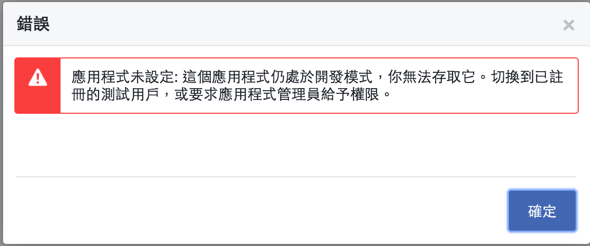
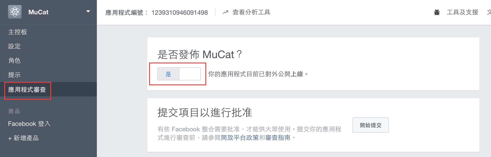

# 抓蟲趣

已經用信箱註冊的帳號，用相同信箱的臉書帳號來登入

透過我在`user.rb`寫的這段code，就能成功實踐這功能

```
def self.from_omniauth(auth)

  # Case 1: Find existing user by facebook uid
  ...

  # Case 2: Find existing user by email
  existing_user = User.find_by_email( auth.info.email )
  if existing_user
    existing_user.fb_uid = auth.uid
    existing_user.fb_token = auth.credentials.token
    existing_user.fb_name = auth.info.name
    existing_user.fb_image = auth.info.image

    existing_user.save!
    return existing_user
  end

  # Case 3: Create new password
  ...

  return user
end
```

但是實測時發現，這無法work。



後來是跑去Facebook developer改設定，才成功work。


