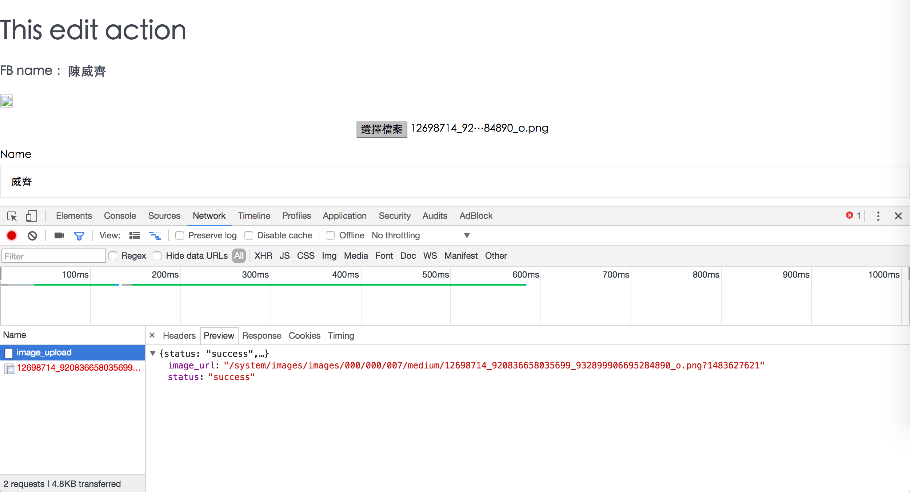
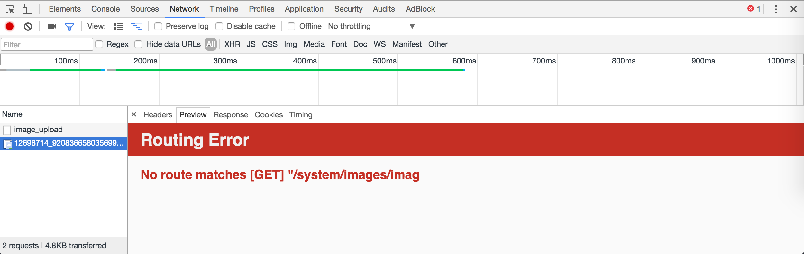
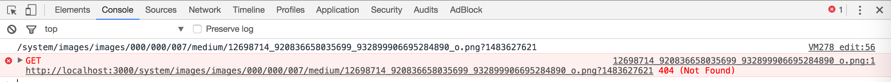
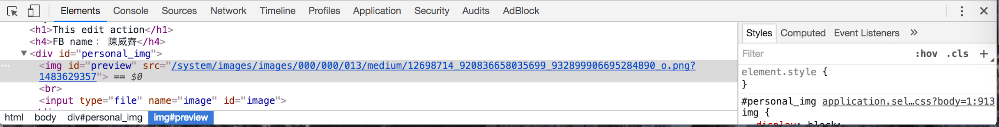
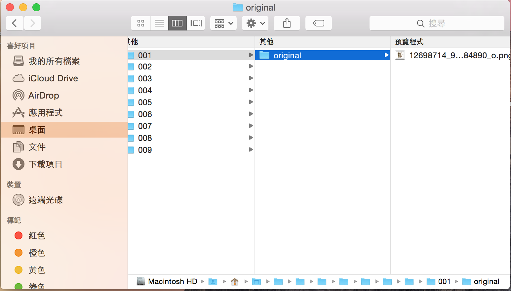
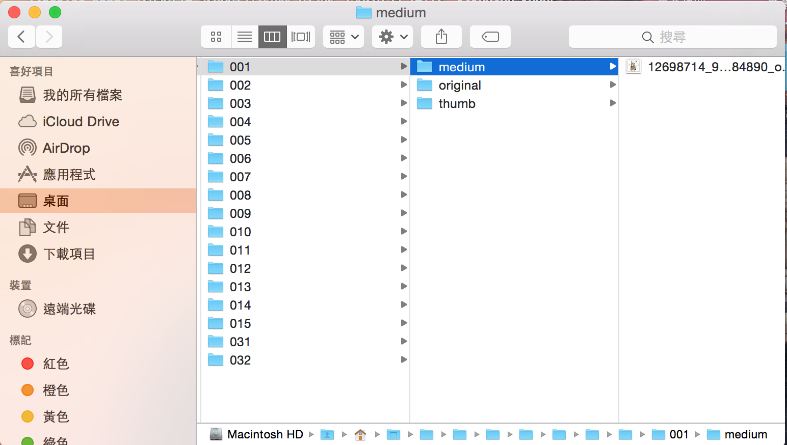
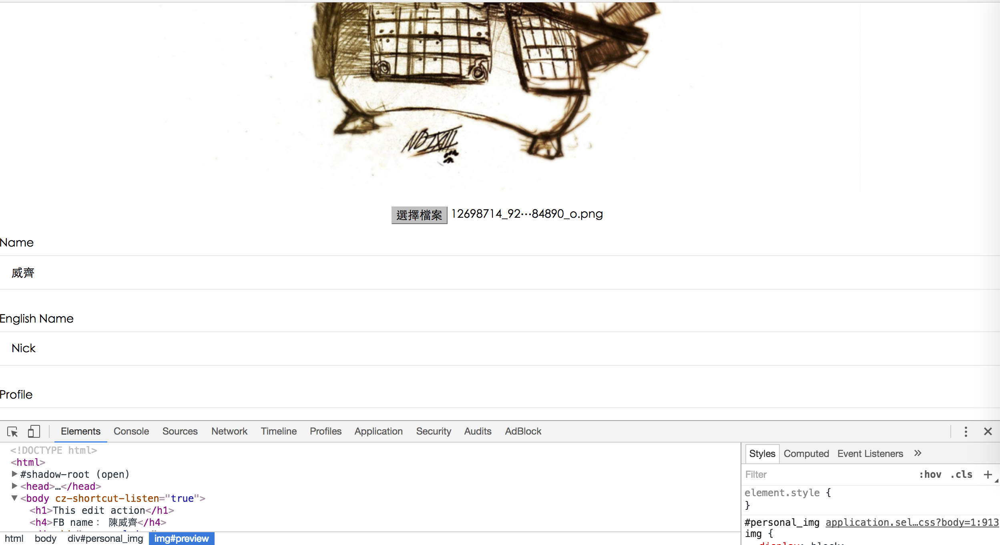
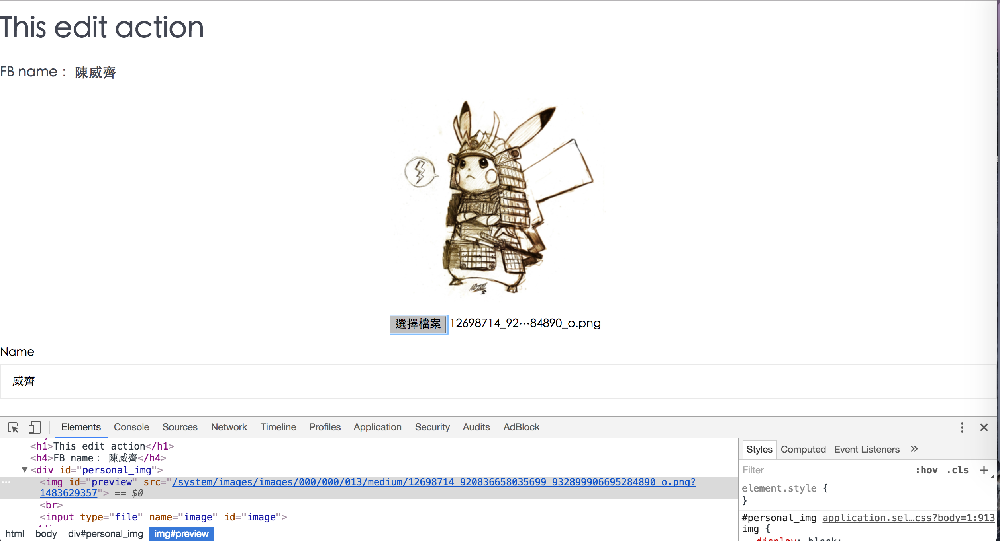

# paperclip AJAX upload

## 情境

我們會有很多user

user(也許會)上傳不同照片

所以我開一個獨立的image model

改成用一對多

# 移除舊的寫法

我用`rake db:migrate:down VERSION=20161207040316`把先前在user schema的`cover`欄位給移除掉。
- [4.4 執行特定的遷移 - Active Record 遷移 — Ruby on Rails 指南](http://rails.ruby.tw/active_record_migrations.html#執行特定的遷移)

and then delete `db/migrate/20161207040316_add_user_cover.rb`

# 一對多設定

## image.rb

由於打算把上傳的照片開出獨立的`image.rb` model，所以必須修改一些地方

`rails g model image`

edit `app/models/image.rb`

```
class Image < ActiveRecord::Base
  belongs_to :user

  has_attached_file :image,
    style: {
      original: "1024x1024>",
      medium: "300x300>",
      icon: "150x150#"
    },
    default_url: '/images/missing3.png'
  # has_attached_file :image, styles: { medium: "300x300>", thumb: "100x100>" }
  validates_attachment_content_type :image, content_type: /\Aimage\/.*\z/
end
```

### 抓蟲趣

先說結論：應該寫`styles`我卻寫成`style`

so fix `app/models/image.rb`

```
class Image < ActiveRecord::Base
  belongs_to :user

  has_attached_file :image,
    styles: {
      ...
    },
    ...
  ...
end
```

#### 抓蟲經過

一開始成功ajax upload




但是撈圖失敗






後來我檢查圖片的路徑



才發現我根本沒生出該有的`medium`、`icon`資料夾



正常情況



於是我修改`api_controller.rb`改成`:image_url => @image.image.url`，就能成功撈出原圖



後來發現，是`image.rb`裡paperclip的設定那邊，應該寫`styles`卻寫錯寫成`style`的緣故，解掉bug後，就能成功撈出medium的圖片了



## user.rb

由於我們砍掉了`schema.rb`中user model的`cover`欄位，把上傳照片獨立到`image.rb`中

so fix `app/models/user.rb`

```
class User < ActiveRecord::Base
  # Include default devise modules. Others available are:
  # :confirmable, :lockable, :timeoutable and :omniauthable
  devise :database_authenticatable, :registerable,
         :recoverable, :rememberable, :trackable, :validatable,
         :omniauthable, :omniauth_providers => [:facebook]

  has_many :posts
  has_many :post_authorities
  has_many :editable_posts, through: :post_authorities, source: :post

  has_many :images

  def self.from_omniauth(auth)
    ...
  end
end
```


# 開始寫 paperclip AJAX upload

接著參考我過去寫過的筆記來一步步設定
- [臨摹Rails 4 Paperclip Ajax image upload - wiki](https://github.com/NickWarm/paperclip_AJAX_upload_WG/wiki/臨摹Rails-4---Paperclip--Ajax-image-upload)

## 設定AJAX upload的路由

fix `config/routes.rb` add `put 'api/image_upload' => 'api#image_upload', as: :image_upload`

```
Rails.application.routes.draw do
  ...
  ...


  namespace :dashboard do        # 第二層：~~上線版要把dashboard改名，不能讓非實驗室成員能進入這頁面~~，
                                 #          其實只要before_action :authenticate_user!即可
                                 #          查看該帳號發表過什麼文章，點選文章後進入第一層觀看文章，並且編輯之
    ...
    ...                             

    resources :users             # 實驗室成員：編輯個資
                                 #           查看該帳號發表過什麼文章，點選文章後進入第一層觀看文章，並且編輯之

    put 'api/image_upload' => 'api#image_upload', as: :image_upload
                                 # AJAX 上傳個人大頭照圖片


    namespace :admin do          # 第三層：上線的版本要把admin改成亂碼
      ...
    end
  end

  # get '*path' => redirect('/')   #錯誤的路由，都會被導到首頁
end

```

## 建立api controller

create `app/controllers/dashboard/api_controller.rb`

```
class Dashboard::ApiController < Dashboard::DashboardController
  def image_upload
    @image = Image.create(img_params)

    if @image
      render :json => {:status => 'success', :image_url => @image.image.url(:medium)}
    else
      render :json => {:status => 'fail'}
    end
  end


  private

  def img_params
      params.require(:image).permit(:image)
  end
end
```

api controller的寫法與我先前的筆記一樣
- [paperclip_AJAX_upload_WG wiki - 臨摹 - 設定controller](https://github.com/NickWarm/paperclip_AJAX_upload_WG/wiki/臨摹Rails-4---Paperclip--Ajax-image-upload#設定controller)

這邊要特別注意的是這一段

```
class Dashboard::ApiController < Dashboard::DashboardController
end
```
因為`api_controller.rb`是在`app/controllers/dashboard`這一層，詳情請見
- [jcart wiki - Step.5 後台的controller](https://github.com/NickWarm/jccart/wiki/Step.5-後台的controller#dashboard_controller)

## 寫AJAX upload的javascript code

edit `app/views/dashboard/users/edit.html.erb`

一樣參考我過去的筆記
- [paperclip_AJAX_upload_WG wiki - 臨摹 - AJAX upload](https://github.com/NickWarm/paperclip_AJAX_upload_WG/wiki/臨摹Rails-4---Paperclip--Ajax-image-upload#ajax-upload)
- [paperclip_AJAX_upload_WG wiki - 臨摹 - 抓蟲趣](https://github.com/NickWarm/paperclip_AJAX_upload_WG/wiki/臨摹Rails-4---Paperclip--Ajax-image-upload#抓蟲趣)


這邊有一個要注意的小地方，由於這邊我是用`content_for`來包我的`<script>`，所以應該寫成

```
<%= content_for :header do %>
  <script>
  $(function(){
    // AJAX upload的code...
  })
  </script>
<% end %>
```

>ps：我有測試過，若是用`content_for`，最外層不用`$(function(){})`包的話，javascript code會無法work，原因不明，之後再研究


關鍵code

```
...

<div id="personal_img">
  

  <br>

  <%= file_field_tag :image %>
</div>

...

<%= content_for :header do %>
  <script>
  $(function(){
    $('#image').change(function(){
      var formData = new FormData(),
          $input = $(this);
      formData.append('image[image]', $input[0].files[0]);
      $.ajax({
        url: '<%= dashboard_image_upload_path %>',
        data: formData,
        type: 'PUT',
        cache:false,
        contentType: false,
        processData: false
      }).done(function(result){
          console.log(result.image_url);
          $('#preview').attr('src', result.image_url );
      });
    })
  })
  </script>
<% end %>
```

### 注意的小細節

在這邊的`$.ajax({ ... })`裡面的`url`是用`'<%= dashboard_image_upload_path %>'`，這是因為先前路由設定時把`image_upload`寫在`dashboard`裡面

`routes.rb`

```
namespace :dashboard do                                       

  resources :users             # 實驗室成員：編輯個資

  put 'api/image_upload' => 'api#image_upload', as: :image_upload
                               # AJAX 上傳個人大頭照圖片
  ...                             
end
```

由於`image_upload`寫在`dashboard`裡面，我們可以用`rake routes`來查看`image_upload`的prefix

```
                Prefix Verb     URI Pattern                                        Controller#Action
dashboard_image_upload PUT      /dashboard/api/image_upload(.:format)              dashboard/api#image_upload
```

所以才必須把`url`改成`'<%= dashboard_image_upload_path %>'`

# 在後台用paperclip AJAX upload的寫法

## dashboard/api_controller.rb

首先要修改`app/controllers/dashboard/api_controller.rb`

最重要的是這一行`@image = current_user.images.create(img_params)`

由於我已經讓`user`與`image`關聯了

```
<!-- user.rb -->
has_many :images

<!-- image.rb   -->
belongs_to :user

```

而能夠進入後台(`dashboard`)，都是已經登入過的帳號(`current_user`)，所以可以直接寫`current_user.images.create`

`app/controllers/dashboard/api_controller.rb`

完整的code
```
class Dashboard::ApiController < Dashboard::DashboardController
  before_action :authenticate_user!

  def image_upload
    @image = current_user.images.create(img_params)

    if @image
      render :json => {:status => 'success', :image_url => @image.image.url(:medium)}
    else
      render :json => {:status => 'fail'}
    end
  end


  private

  def img_params
      params.require(:image).permit(:image)
  end
end
```

## 後台：實驗室成員編輯個資頁面

接著要修改`app/controllers/dashboard/user_controller.rb`

原本我都用`@user = User.find(params[:id])`來撈user的資料，但是這樣寫很危險，因為這樣後台的人只要改改user id，就能修改其他後台成員的資料，所以統一改成用`current_user`


fix `app/controllers/dashboard/user_controller.rb`

from

```
class Dashboard::UsersController < Dashboard::DashboardController
  before_action :find_user, only: [:edit, :update]

  def edit

  end

  def update
    if @user.update(user_params)
      redirect_to @user
    else
      render 'edit'
    end
  end

  def find_user
    @user = User.find(params[:id])
    # @image = @user.images.find(params[:id])
  end

  private

  def user_params
    params.require(:user).permit(:taiwan_name, :english_name, :paper, :profile)
  end
end
```

to

```
class Dashboard::UsersController < Dashboard::DashboardController
  before_action :authenticate_user!

  def edit
  end

  def update
    if current_user.update(user_params)
      redirect_to current_user
    else
      render 'edit'
    end
  end

  private

  def user_params
    params.require(:user).permit(:taiwan_name, :english_name, :paper, :profile)
  end
end
```


## 前台：讓他人查看實驗室成員的個人資訊

fix `app/controllers/users_controller.rb`


完整的code
```
class UsersController < ApplicationController
  before_action :find_user, only: [:show]

  def index
    @users = User.all
  end

  def show
    @image = @user.images.last
  end

  def find_user
    @user = User.find(params[:id])
  end
end
```

這一段在`show` action有個特別的寫法`@image = @user.images.last`，只撈最後一張上傳的圖片
- [rails API - last](http://api.rubyonrails.org/classes/ActiveRecord/FinderMethods.html#method-i-last)

正常應該要寫`each`，然後撈出所有上傳的圖片，接著再給`image` schema開一個 **布林欄位**，來做 **選取照片的功能**，但由於現在時間不夠，所以只做撈最後一張圖片的功能。
