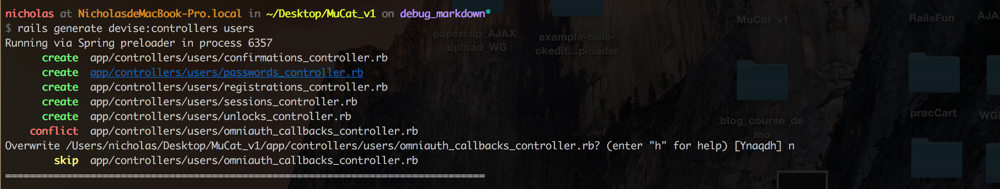

# debug markdown

# 問題1

先前創建新帳號後，進入新帳號的user show 頁面，都會噴錯，說`@image`沒有東西


## `@image`還沒資料時的解決辦法

這個比較簡單，用`present?`就能解了
- [rails API - present?](http://api.rubyonrails.org/classes/Object.html#method-i-present-3F)
- `present?`與`exist?`的差別：[comment1：What is the difference between using .exists?, and .present? in Ruby? - Stack Overflow](http://stackoverflow.com/a/13186788)
  - 非常清楚的實例：[comment2：What is the difference between using .exists?, and .present? in Ruby? - Stack Overflow](http://stackoverflow.com/a/30192978)
- [Ruby on Rails: Difference between .nil?, .empty?, .blank?, .present?](https://railsless.blogspot.tw/2011/08/difference-between-nil-empty-blank.html)
  - 圖表：[comment3：A concise explanation of nil v. empty v. blank in Ruby on Rails - Stack Overflow](http://stackoverflow.com/a/26877095)
- [2.1 blank? and present? - Active Support Core Extensions — Ruby on Rails Guides](http://guides.rubyonrails.org/active_support_core_extensions.html#blank-questionmark-and-present-questionmark)


fix `app/views/users/show.html.erb`

```
<div id="personal_img">
  <% if @image.present? %>
    <%= image_tag @image.image.url(:medium) %>
  <% end %>
</div>
```


# 問題2

先去`app/views/users/show.html.erb`把`<%= image_tag @image.image.url(:medium) %>`這行砍掉後，重整網頁，會噴沒東西給你render markdown


## 解法 step.1

跟上面的`@image.present?`相同的概念，只是這次改用`nil?`來解，先上code

fix `app/views/users/show.html.erb`

```
<%= markdown @user.paper unless @user.profile.nil? %>
```

起初是讀到這篇，才想起來先上面那張截圖的內容都是噴`nil`
- [Ruby on Rails: Difference between .nil?, .empty?, .blank?, .present?](https://railsless.blogspot.tw/2011/08/difference-between-nil-empty-blank.html)

而`nil?`是如果沒東西就會噴`true`，所以我要的情境是 **不是nil時，就render markdown語法**

透過以前看[ruby-style-guide](https://github.com/bbatsov/ruby-style-guide#no-nested-modifiers)看過`unless`的寫法
- [ Favor `unless` over `if` for negative conditions](https://github.com/bbatsov/ruby-style-guide#unless-for-negatives)

所以就寫成`<%= markdown @user.paper unless @user.profile.nil? %>`


## 解法 step.2-1

原本的情況是因為`@user.profile`為`nil`所以噴錯，後來想到的解決辦法是，註冊後跳轉到後台user的`edit view`

並且在`:paper`與`:profile`都使用`required: true`
- [comment1：HTML5 'required' validation in Ruby on Rails forms - Stack Overflow](http://stackoverflow.com/a/13542130)

```
<%= f.text_area :profile, placeholder: "introduce yourself", :required => true %>

<%= f.text_area :paper, placeholder: "The target you research", :required => true %>
```

### 反思

上面的`@image`與`@user.paper`都一直在view裡面寫`if`判斷式


然後想起以前看過Xdite的文章，擔心會有效能問題
- [對於使用 Render Partial 的一些誤解 « Blog.XDite.net](http://blog.xdite.net/posts/2011/12/04/misunderstanding-about-render/)
  - [rails API - content_tag](http://api.rubyonrails.org/classes/ActionView/Helpers/TagHelper.html#method-i-content_tag)

剛剛跟我朋友討論，這樣的寫法還好，很常這樣寫。那麼暫時不考慮重構這段程式碼


## step.2-2 登入後自訂跳轉頁面

>目標：登入後跳轉到後台user的`edit view`

參考了這篇文章，我可以在`RegistrationsController`定義`after_sign_up_path_for`
- [How To: redirect to a specific page on successful sign_in, sign_out, and or sign_up · plataformatec/devise Wiki](https://github.com/plataformatec/devise/wiki/How-To:-redirect-to-a-specific-page-on-successful-sign_in,-sign_out,-and-or-sign_up#after-sign-up)

然後再參考這篇文章
- [devise wiki - redirect back to current page after oauth signin?](https://github.com/plataformatec/devise/wiki/How-To:-redirect-to-a-specific-page-on-successful-sign-in#redirect-back-to-current-page-after-oauth-signin)

這邊給了我們一段範例code

```
class ApplicationController < ActionController::Base
  def after_sign_in_path_for(resource)
    request.env['omniauth.origin'] || stored_location_for(resource) || root_path
  end
end
```


其中的`request.env['omniauth.origin']`：在fb 的develop後台可以設定你要倒回哪個頁面

如果沒有的話

則跑`stored_location_for(resource)`：這個會回到上一次儲存的地方

如果上面兩個都沒有則回到首頁(`root_path`)

依此邏輯，我只要在`RegistrationsController`寫

```
def after_sign_up_path_for(resource)
  edit_dashboard_user_path
end
```

然後去`route.rb`的`devise_for :user`設定Registration，應該就能達到我要的目標
- [Easy registration with Devise - DevBytes](http://surajms.com/2015/09/easy-registration-with-devise/)
- [Extending Devise – Registrations Controller | KakimotOnline](https://kakimotonline.com/2014/03/30/extending-devise-registrations-controller/)

### 實作

參考這兩篇
- [devise README - Configuring controllers](https://github.com/plataformatec/devise#configuring-controllers)
- [Tool: Generate and customize controllers · plataformatec/devise Wiki](https://github.com/plataformatec/devise/wiki/Tool:-Generate-and-customize-controllers)

下指令`rails generate devise:controllers users`

這過程中有一個conflict，那是由於先前我已經自定義`app/controllers/users/omniauth_callbacks_controller.rb`

所以必須按下`n`，避免`rails generate devise:controllers users`更改我原先的設定




然後去改`app/controllers/users/registrations_controller.rb`

基本上只有要改的地方再取消註解即可

so 完整的code

```
class Users::RegistrationsController < Devise::RegistrationsController
  # The path used after sign up.
  def after_sign_up_path_for(resource)
    # super(resource)
    stored_location_for(resource) || current_user
  end
end
```

如此一來，註冊完後就能跳到個人頁面，然後去按edit button(`edit_dashboard_user_path`)進入後台編輯個人資訊

接著再去`routes.rb`設定要使用registrations_controller

fix `config/routes.rb`

```
devise_for :users, :controllers => {registrations: "users/registrations",
                                    omniauth_callbacks: "users/omniauth_callbacks"  }
```


這邊要注意的點是，一開始時我寫

```
devise_for :users, :controllers => {registrations: "registrations",
                                    omniauth_callbacks: "users/omniauth_callbacks"  }
```

一直噴錯


後來看到先前寫的`omniauth_callbacks: "users/omniauth_callbacks"`才想到，因為我的`registrations_controller.rb`是在`users`資料夾底下，所以改成`registrations: "users/registrations"`就能work了

### 修改目標

一開始是想要註冊後直接進入個人編輯頁面(`edit_dashboard_user_path`)，但是實作幾次後都不成功


於是才改成註冊後先跑到個人頁面(user show view)，再點擊edit button(`edit_dashboard_user_path`)進入後台編輯個人資訊

### 刪掉多餘的檔案

使用`rails generate devise:controllers users`會自動生成下面這些檔案
- `app/controllers/users/confirmations_controller.rb`
- `app/controllers/users/passwords_controller.rb`
- `app/controllers/users/registrations_controller.rb`
- `app/controllers/users/sessions_controller.rb`
- `app/controllers/users/unlocks_controller.rb`
- `app/controllers/users/omniauth_callbacks_controller.rb`

但到目前為止，我們只會用到`omniauth_callbacks_controller.rb`與`registrations_controller.rb`，其他的檔案留在那邊，基本上會造成我自己以後看這專案的code時不知道他們的用途為何，所以砍掉沒用到的檔案

delete
- `app/controllers/users/confirmations_controller.rb`
- `app/controllers/users/passwords_controller.rb`
- `app/controllers/users/sessions_controller.rb`
- `app/controllers/users/unlocks_controller.rb
