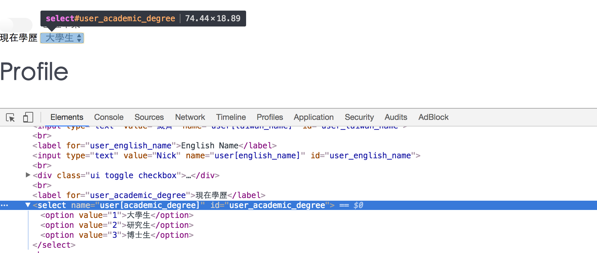

# 實驗室成員的學歷資訊


先看一下記錄在[MuCat_v1.md](./MuCat_v1.md)的`user` schema的架構
- User schema
  - 中文名字:string -> `taiwan_name:string`  -> **done**
  - 英文名字:string -> `english_name:string` -> **done**
  - 自我介紹:text -> `profile:text`          -> **done**
  - 論文題目:text -> `paper:text`            -> **done**
  - 學位:string -> `academic_degree:string`
  - 入學學年:integer -> `joined_CYCU_at_which_year:integer`
  - 現在幾年級:integer -> `has_spent_how_much_time_at_CYCU:integer`
  - 是否離開學校:boolean -> `has_graduated:boolean` -> **已設置欄位**，但是UI還沒寫


## 重整schema

最初透過`db/migrate/20161122091021_add_has_graduated_to_users.rb`建立了`has_graduated:boolean`

```
class AddHasGraduatedToUsers < ActiveRecord::Migration
  def change
    add_column :users, :has_graduated, :boolean, default: false
  end
end
```

不過與`has_graduated:boolean`相關連的卻都還沒有建
- `academic_degree:string`
- `spent_time_at_university:integer`
- `spent_time_at_university:integer`

再三考慮後，決定重整schema

首先，刪掉`User` database裡測試用的資料

 and then delete `db/migrate/20161122091021_add_has_graduated_to_users.rb`

`rails g migration AddSchoolInformationToUser`

edit `db/migrate/20170107112636_add_school_information_to_user.rb`

```
class AddSchoolInformationToUser < ActiveRecord::Migration
  def change
    add_column :users, :has_graduated,                   :boolean, default: false
    add_column :users, :academic_degree,                 :string
    add_column :users, :joined_CYCU_at_which_year,       :integer
    add_column :users, :has_spent_how_much_time_at_CYCU, :integer
  end
end
```

and then `rake db:migrate:reset`

## 建立`has_graduated:boolean`的Toggle button

基本上我打算使用semantic UI的toggle來做
- [Toggle - Checkbox | Semantic UI](http://semantic-ui.com/modules/checkbox.html#toggle)

基本上它的本質就是`input tag`的`checkbox`

整個實作非常簡單，一開始我看[Toggle - Checkbox | Semantic UI](http://semantic-ui.com/modules/checkbox.html#toggle)的code

```
<div class="ui toggle checkbox">
  <input type="checkbox" name="public">
  <label>Subscribe to weekly newsletter</label>
</div>
```

並且參考rails裡`checkbox`的寫法
- [rails API - check_box](http://api.rubyonrails.org/classes/ActionView/Helpers/FormHelper.html#method-i-check_box)
- [表單輔助方法 - Ruby on Rails 實戰聖經 | Action View - Helpers 方法](https://ihower.tw/rails/actionview-helpers.html#sec5)，搜尋「f.check_box :column_name」


and then edit `app/views/dashboard/users/edit.html.erb`

```
<%= form_for current_user, url: dashboard_user_path, method: :patch do |f| %>
  <%= f.label :taiwan_name, "Name" %>
  <%= f.text_field :taiwan_name %>

  <br>

  <%= f.label :english_name, "English Name" %>
  <%= f.text_field :english_name %>


  <br>

  <div class="ui toggle checkbox">
    <%= f.check_box(:has_graduated) %>
  </div>

  ...
<% end %>
```

但是後來重整頁面發現Toggle的效果沒出來，於是回去看semantic_ui的範例時注意到`<label>Subscribe to weekly newsletter</label>`這行

於是參考rails guide的寫法
- [1.3.1 多選方框 - 1.3 產生表單元素的輔助方法 - Action View 表單輔助方法 — Ruby on Rails 指南](http://rails.ruby.tw/form_helpers.html#產生表單元素的輔助方法)，搜尋「check_box」

and then fix `app/views/dashboard/users/edit.html.erb`

```
<div class="ui toggle checkbox">
  <%= f.check_box(:has_graduated) %>
  <%= label_tag(:has_graduated, "已經畢業") %>
</div>
```

成功在edit view 顯示Toggle的效果，但是查user的database發現`:has_graduated`欄位沒有修改成功，才想起來沒去users_controller的strong parameter加入`:has_graduated`

so fix `app/controllers/dashboard/users_controller.rb`

```
def user_params
  params.require(:user).permit(:taiwan_name, :english_name, :paper, :profile, :has_graduated)
end
```

然後再測試一次，work

現在進度：
- User schema
  - 中文名字:string -> `taiwan_name:string`  -> **done**
  - 英文名字:string -> `english_name:string` -> **done**
  - 自我介紹:text -> `profile:text`          -> **done**
  - 論文題目:text -> `paper:text`            -> **done**
  - 學位:string -> `academic_degree:string`
  - 入學學年:integer -> `joined_CYCU_at_which_year:integer`
  - 現在幾年級:integer -> `has_spent_how_much_time_at_CYCU:integer`
  - 是否離開學校:boolean -> `has_graduated:boolean` -> **done**

## 實作實驗室成員的index page

### 學歷的下拉式選單

完成了判斷是否畢業的`:has_graduated`後開始實作實驗室成員的index page。最初的筆記紀錄於[member_index.md](../features/member_index/member_index.md)

開始之前，要先在user的edit view做一個下拉選單，讓實驗室成員選擇自己是 **大學生** or **研究生** or **博士生**
- 大學生：`"college"`
- 研究生：`"master"`
- 博士生：`"Ph.D"`

為了避免strong parameter又沒過

so edit `app/controllers/dashboard/users_controller.rb`

```
def user_params
  params.require(:user).permit(:taiwan_name, :english_name, :paper, :profile,
                               :has_graduated, :academic_degree,
                               :joined_CYCU_at_which_year, :has_spent_how_much_time_at_CYCU)
end
```

並參考以前寫過的筆記：[dropdown_list.md](../features/dropdown_list/dropdown_list.md)

and then edit `app/views/dashboard/users/edit.html.erb`

```
<div class="">
  <%= f.label :academic_degree, "現在學歷" %>
  <%= f.select :academic_degree, [["大學生", "college"], ["研究生", "master"], ["博士生", "Ph.D"]], class: "ui dropdown" %>    
</div>
```

但是卻有問題，`select` tag的class卻沒有出來



後來我朋友幫我抓蟲與找到這篇
- [comment1：Ruby on Rails form_for select field with class - Stack Overflow](http://stackoverflow.com/a/4081944)

so fix `app/views/dashboard/users/edit.html.erb`

```
<%= f.select :academic_degree, [["大學生", "college"], ["研究生", "master"], ["博士生", "Ph.D"]], {}, class: "ui dropdown" %>    
```

然後發現還要再去`<scipt>`那邊設定使用`.dropdown`方法

so fix `app/views/dashboard/users/edit.html.erb`

```
<%= content_for :header do %>
  <script>
  $(function(){
    $(".ui.dropdown").dropdown()

    $('#image').change(function(){
      // paperclip AJAX upload
      ...
      ...
    })
  })

  </script>
<% end %>
```

很好，成功

現在進度：
- User schema
  - 中文名字:string -> `taiwan_name:string`  -> **done**
  - 英文名字:string -> `english_name:string` -> **done**
  - 自我介紹:text -> `profile:text`          -> **done**
  - 論文題目:text -> `paper:text`            -> **done**
  - 學位:string -> `academic_degree:string` -> **完成edit頁面下拉式選單**，準備來做index頁面的scope
  - 入學學年:integer -> `joined_CYCU_at_which_year:integer`
  - 現在幾年級:integer -> `has_spent_how_much_time_at_CYCU:integer`
  - 是否離開學校:boolean -> `has_graduated:boolean` -> **done**

### index頁面的scope

實作實驗室成員的index page。最初的筆記：[member_index.md](../features/member_index/member_index.md)

參考
- 最初的筆記：[member_index.md](../features/member_index/member_index.md)
- [scope | Rails 102](https://rocodev.gitbooks.io/rails-102/content/chapter1-mvc/m/scope.html)

簡單回憶一下scope的用途，他可以讓我們的SQL語法做串接的功能，讓你把會重複用到的SQL查詢語法，用`scope`包成一個method可以呼叫

#### 構想：user.rb

最初的寫法是在前台的`users_controller.rb`用`@users = User.all`撈出全部的user。

但由於，我希望把實驗室成員依照學位分成 **大學生**、**研究生**、**博士生**。

所以我要把`users_controller.rb`的實驗室成員拆開分成
- 大學生：`@users_college`
- 研究生：`@users_master`
- 博士生：`@users_doctor`


目標：
- 為了從User database區別出 **大學生**、**研究生**、**博士生**，這務必需要用到SQL語法做查詢的動作。
- 希望進入實驗室成員頁面時，看到的是「還在學校就讀的」成員，而不是「已經畢業的」成員

所以用`scope`做下列功能：
- 查詢「就讀的學位」

```
scope :doctor,        -> { where(:academic_degree => 'Ph.D') }
scope :master,        -> { where(:academic_degree => 'master') }
scope :college,       -> { where(:academic_degree => 'college') }
```

- 查詢「是否畢業」

```
scope :has_graduated, ->(status) { where( has_graduated: status) }
```

#### 實作：user.rb

so edit `app/models/user.rb`

```
class User < ActiveRecord::Base
  ...

  scope :doctor,        -> { where(:academic_degree => 'Ph.D') }
  scope :master,        -> { where(:academic_degree => 'master') }
  scope :college,       -> { where(:academic_degree => 'college') }
  scope :has_graduated, ->(status) { where( has_graduated: status) }


  def self.from_omniauth(auth)
    ....
  end
end

```

PS：這邊`scope :has_graduated`的寫法與最初[member_index.md](../features/member_index/member_index.md)有所不同

最初`scope :has_graduated`是寫成`scope :has_graduated, ->(status) { where("has_graduated", status) }`，經過實測後確定這樣的寫法無法work

後來讀到這篇，於是改成`->(status) where( has_graduated: status)`，如此一來就能傳不同的參數了
- [scope (ActiveRecord::NamedScope::ClassMethods) - APIdock](http://apidock.com/rails/ActiveRecord/NamedScope/ClassMethods/scope)，搜尋「where(:color => color)」

#### users_controller

修改好`user.rb`後，接著去修前台的`users_controller.rb`，讓我們可以接到
- 大學生：`@users_college`
- 研究生：`@users_master`
- 博士生：`@users_doctor`

so edit `app/controllers/users_controller.rb`

```
def index
  @users_doctor = User.doctor.has_graduated(false)
  @users_master = User.master.has_graduated(false)
  @users_college = User.college.has_graduated(false)
end
```

稍微解釋一下，我們已經在`user.rb`裡用`scope`定義了四個查詢的方法
- `doctor`
- `master`
- `college`
- `has_graduated`

使用`scope`的有一個好處，它可以讓你的`SQL`語法包成一個一個小組塊，然後讓他 **串接** 起來，舉例來說：

`@users_doctor = User.doctor.has_graduated(false)`這句的意思是

>我先用`doctor`方法撈出`User databse`裡的博士生，然後再用`has_graduated(false)`看看該學生畢業了沒有，如果沒有畢業(`has_graduated(false)`)就會顯示出來，出現在實驗室成員頁面(`views/users/index.html.erb`)

#### users的index頁面

最後我們要把學生依照不同學位撈出來，這邊很簡單就直接上code了

edit `app/views/users/index.html.erb`

```
<h1>Lab members</h1>

<div id="post_show_content" class="skinny_wrapper wrapper_padding">


  <hr>

  <h1>博士生</h1>
  <% @users_doctor.each do |user_doctor| %>
    <%= link_to user_doctor.fb_name, user_doctor %>
  <% end %>

  <hr>

  <h1>研究生</h1>
  <% @users_master.each do |user_master| %>
    <%= link_to user_master.fb_name, user_master %>
  <% end %>

  <hr>

  <h1>大學生</h1>
  <% @users_college.each do |user_college| %>
    <%= link_to user_college.fb_name, user_college %>
  <% end %>

</div>
```

成功，work。

### 畢業生頁面

為了要讓外人看到以前待過實驗室的成員，所以我在`views/users`底下開了一個畢業生頁面

create `app/views/users/graduates.html.erb`

```
<h1>This is graduates action</h1>

<div id="post_show_content" class="skinny_wrapper wrapper_padding">

  <h1>博士生</h1>
  <% @users_doctor.each do |user_doctor| %>
    <%= link_to user_doctor.fb_name, user_doctor %>
  <% end %>

  <hr>

  <h1>研究生</h1>
  <% @users_master.each do |user_master| %>
    <%= link_to user_master.fb_name, user_master %>
  <% end %>

  <hr>

  <h1>大學生</h1>
  <% @users_college.each do |user_college| %>
    <%= link_to user_college.fb_name, user_college %>
  <% end %>

  <hr>

</div>
```

然後去設定路由

fix `config/routes.rb`

```
Rails.application.routes.draw do
  devise_scope :user do
    # 下面這行，把註冊的預設網址改成http://localhost:3000/lab515/sign_up，一樣上線版要改成不同的網址
    get "/lab515/sign_up" => "devise/registrations#new", as: "new_user_registration"
    get "/lab515/sign_in" => "devise/sessions#new"

    get "/users/sign_up"  => redirect('/')     # 關掉devise原始路由設定
    get "/users/sign_in"  => redirect('/')
    get "/users/graduates"=> "users#graduates" # 顯示已畢業的實驗室成員
  end

  ...
  ...
end
```

最後去`users_controller.rb`設定`graduates action`

fix `app/controllers/users_controller.rb`

```
def graduates
  @users_doctor = User.doctor.has_graduated(true)
  @users_master = User.master.has_graduated(true)
  @users_college = User.college.has_graduated(true)
end
```

最後，給這兩個頁面，一個超連結互通有無
- 在學的實驗室成員：`app/views/users/index.html.erb`
- 已畢業的實驗室成員：`app/views/users/graduates.html.erb`

先`rake routes`查一下路由的prefix

and then edit `app/views/users/index.html.erb`

```
<%= link_to "已畢業的實驗室成員", users_graduates_path %>
```

and  edit `app/views/users/graduates.html.erb`

```
<%= link_to "還在學校的實驗室成員", users_path %>
```
