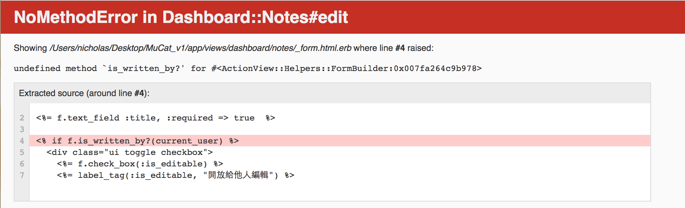

# 學習資源

>年代有點久遠的舊筆記

要在 **學習資源** 這頁面發文

學習資源的表單設計，除了原本[MuCat_v1.md](../MuCat_v1/MuCat_v1.md)的
- ~~`author:string title:string content:text other_can_edit:boolean`~~
- 改成：`author:string title:string content:text is_editable:boolean`

後來參考
- [mackenziechild GitHub - blog_course_demo/db/migrate/20150509171512_create_projects.rb](https://github.com/mackenziechild/blog_course_demo/blob/master/db/migrate/20150509171512_create_projects.rb)
- [mackenziechild GitHub - blog_course_demo/app/views/projects/show.html.erb](https://github.com/mackenziechild/blog_course_demo/blob/master/app/views/projects/show.html.erb)

應該加個`link:string`才對，這樣才能連到外部文章，這樣也比較符合我的需求


>新筆記

學習資源用`note`表示
- 後台：`new`、`edit`
- 前台：`index`、`show`
- markdown語法
- 欄位：`author:string title:string content:text is_editable:boolean link_text:string link_site:string`
- `is_editable:boolean`是開放權限，看你是否要讓其他所有實驗室成員都能夠編輯，用semantic_ui的Toggle實作
- 最後的`link_text:string link_site:string`是打算發布學習方法論那類文章，你只打算開個引言，然後導引到其他頁面時才用的。
- `link_text:string`：超連結的文字
- `link_site:string`：外部連結的網址


create `note schema`

`rails g model note`

edit `db/migrate/20170108125932_create_notes.rb`

完整的code
```
class CreateNoteTable < ActiveRecord::Migration
  def change
    create_table :notes do |t|
      t.string   :author
      t.string   :title
      t.text     :content
      t.boolean  :is_editable,   default: false
      t.string   :link_text
      t.string   :link_site
      t.timestamps
    end
  end
end
```

and then `rake db:migrate`

突然想起，忘記加上`user_id`

so `rails g migration AddUserIdToNote`

and edit `db/migrate/20170108132424_add_user_id_to_note.rb`

```
class AddUserIdToNote < ActiveRecord::Migration
  def change
    add_column :notes, :user_id, :integer
  end
end
```

# user與note之間的關聯

由於會需要
- 查看這篇筆記是誰寫的
- 這篇筆記是否開放給所有實驗室成員編輯

所以必須在`note.rb`與`user.rb`做好關聯的設定

直接上code

## note.rb

`app/models/note.rb`

```
class Note < ActiveRecord::Base
  belongs_to :author, class_name: "User", foreign_key: :user_id

  # 作者有權限編輯
  def is_written_by?(user)
    user && user == author
  end
end
```

在`note.rb`中我定義了一個`is_written_by?` method，方便我之後在`show`、`_form`的view使用

這段
```
belongs_to :author, class_name: "User", foreign_key: :user_id
```

傳統我們是寫 `belongs_to :user`，但是寫成`belongs_to :author, class_name: "User"`可以讓我們更直觀地理解到

這篇筆記屬於作者(`belongs_to :author`)，這位作者出自User model(`class_name: "User"`)

接著我們透過`foreign_key`撈出這篇筆記(`note`)屬於哪位作者(`belongs_to :author`)


這樣寫的好處，到時候會在`note`的`show`頁面用到，後面會解釋到。

## user.rb

`app/models/user.rb`

部分code
```
class User < ActiveRecord::Base
  ...

  has_many :notes   # 與note.rb建立關聯

  ...

  def self.from_omniauth(auth)
    ...
  end
end
```

# 建立筆記、編輯筆記：使用partial form

由於`dashboard/notes/new.html.erb`與`dashboard/notes/edit.html.erb`表單的內容有重複，所以決定用partial form

但是由於，表單在後台，所以我的`form_for`的路由不能用傳統的寫法，必須要像下面這篇一樣用 **指定路徑** 與 **指定HTTP Verb** 的寫法
- [JCcart wiki - Step.9 開始修scaffold - edit](https://github.com/NickWarm/jccart/wiki/Step.9-開始修scaffold#edit)

所以參考ihower的這篇
- [局部樣板Partials - Ruby on Rails 實戰聖經 | Action View - 樣板設計](https://ihower.tw/rails/actionview.html#sec6)

## 完整code

先上code再來解釋

create `app/views/dashboard/notes/_form.html.erb`

```
<h2><%= f.label :title, "Title" %></h2>
<%= f.text_field :title, :required => true  %>

<div class="ui toggle checkbox">
  <%= f.check_box(:is_editable) %>
  <%= label_tag(:is_editable, "開放給他人編輯") %>
</div>

<br>

<h2><%= f.label :content, "Content" %></h2>
<%= f.text_area :content, :required => true  %>

<h2>是否需要外部連結</h2>
<%= f.label :link_text, "超連結文字" %>
<%= f.text_field :link_text  %>
<%= f.label :link_site, "網址" %>
<%= f.text_field :link_site  %>
```

edit `app/views/dashboard/notes/new.html.erb`

```
<h1>note new action</h1>

<h1 id="page_title">New Note</h1>

<div class="skinny_wrapper wrapper_padding">
  <%= form_for @note, url: dashboard_notes_path, method: :post do |f| %>

    <%= render :partial => 'form', locals: {:f => f} %>

    <%= f.submit %>
  <% end %>

</div>
```

edit `app/views/dashboard/notes/edit.html.erb`

```
<h1>note edit action</h1>

<h1 id="page_title">Edit Note</h1>

<div class="skinny_wrapper wrapper_padding">
  <%= form_for @note, url: dashboard_note_path, method: :patch do |f| %>

    <%= render 'form', {:f => f} %>

    <%= f.submit %>
  <% end %>

</div>
```

比較上面的`new`與`edit`的view，會發現`render partial`的寫法不同，下面會進行解釋

## 解釋code


以`app/views/dashboard/notes/new.html.erb` 為例，原本的code應該如下

```
<h1>note new action</h1>

<h1 id="page_title">New Note</h1>

<div class="skinny_wrapper wrapper_padding">
  <%= form_for @note, url: dashboard_notes_path, method: :post do |f| %>

    <h2><%= f.label :title, "Title" %></h2>
    <%= f.text_field :title, :required => true  %>

    <div class="ui toggle checkbox">
      <%= f.check_box(:is_editable) %>
      <%= label_tag(:is_editable, "開放給他人編輯") %>
    </div>

    <br>

    <h2><%= f.label :content, "Content" %></h2>
    <%= f.text_area :content, :required => true  %>

    <h2>是否需要外部連結</h2>
    <%= f.label :link_text, "超連結文字" %>
    <%= f.text_field :link_text  %>
    <%= f.label :link_site, "網址" %>
    <%= f.text_field :link_site  %>

    <%= f.submit %>
  <% end %>

</div>
```

由於表單的內容會重複，所以用partial處理

create `app/views/dashboard/notes/_form.html.erb`

```
<h2><%= f.label :title, "Title" %></h2>
<%= f.text_field :title, :required => true  %>

<div class="ui toggle checkbox">
  <%= f.check_box(:is_editable) %>
  <%= label_tag(:is_editable, "開放給他人編輯") %>
</div>

<br>

<h2><%= f.label :content, "Content" %></h2>
<%= f.text_area :content, :required => true  %>

<h2>是否需要外部連結</h2>
<%= f.label :link_text, "超連結文字" %>
<%= f.text_field :link_text  %>
<%= f.label :link_site, "網址" %>
<%= f.text_field :link_site  %>
```

然後參考這篇，開始踩雷XD
- [局部樣板Partials - Ruby on Rails 實戰聖經 | Action View - 樣板設計](https://ihower.tw/rails/actionview.html#sec6)

一開始，我是先修`new`頁面，寫成

```
<h1>note new action</h1>

<h1 id="page_title">New Note</h1>

<div class="skinny_wrapper wrapper_padding">
  <%= form_for @note, url: dashboard_notes_path, method: :post do |f| %>

    <%= render 'form', locals: {:f => f} %>

    <%= f.submit %>
  <% end %>

</div>
```

然後就噴了

測了幾次後發現，若是要寫`:partial`就一定要寫`:locals`，一旦落單就會噴，所以以下寫法都會噴
- `<%= render 'form', locals: {:f => f} %>`
- `<%= render :partial => 'form', {:f => f} %>`

如果要省略`:partial`與`:locals`就要一起省略，所以`<%= render :partial => 'form', locals: {:f => f} %>`可以寫成

```
<%= render 'form', {:f => f} %>
```

所以我在`new`與`edit`寫了兩個不同但是相同結果的寫法，完成。

# 設定後台notes_controller

由於先前就已經建過後台的`notes_controller.rb`，這邊也沒什麼新東西，所以直接上code

`app/controllers/dashboard/notes_controller.rb`

完整code
```
class Dashboard::NotesController < Dashboard::DashboardController
  before_action :authenticate_user!
  before_action :find_note, only: [:edit, :update]

  def new
    @note = current_user.notes.new
  end

  def create
    @note = current_user.notes.create(note_params)

    if @note.save
      redirect_to @note
    else
      render `new`
    end
  end

  def edit

  end

  def update

    if @note.update(note_params)
      redirect_to @note
    else
      render 'edit'
    end
  end

  private

  def note_params
    params.require(:note).permit(:author, :title, :content, :is_editable,
                                 :link_text, :link_site)
  end

  def find_note
    @note = Note.find(params[:id])
  end

end
```

# 前台notes_controller

`rails g controller notes`

沒什麼新東西，直接上code

`app/controllers/notes_controller.rb`

完整code
```
class NotesController < ApplicationController
  def index
    @notes = Note.all
  end

  def show
    @note = Note.find(params[:id])
  end
end

```

# 前台note的index頁面

沒什麼新東西，直接上code

`app/views/notes/index.html.erb`

完整code
```
<h1>note index view</h1>

<div id="post_show_content" class="skinny_wrapper wrapper_padding">

  <% @notes.each do |note| %>
    <%= link_to note.title, note %>
  <% end %>

</div>

<% if user_signed_in? %>
  <%= link_to "new note", new_dashboard_note_path %>
<% end %>

```

# 前台note的show頁面

接下來拆分個小節描述

## `note.rb`裡的`:author`的妙用

先講有趣的東西。前面有提到，每篇筆記，我們都需要知道作者是誰。

由於我們已經在`note.rb`用了`belongs_to :author, class_name: "User", foreign_key: :user_id`

所以可以透過這寫法撈出該篇文章的作者

```
<p><%= @note.author.fb_name %></p>
```

在這邊，我是撈出`user schema`的`fb_name`這欄位，也可以改成用`english_name`、`taiwan_name`

## 編輯權限

一篇筆記最初只有作者有編輯權限，作者也可以開放編輯權限給其他實驗室成員

於是我在`note.rb`裡定義了`is_written_by?`，最初寫成

```
<!-- 作者自己可以編輯 -->
<% if @note.is_written_by?(current_user) %>
  <%= link_to "Edit", edit_dashboard_note_path, class: "view_more" %>
<% end %>

<!-- 開放給其他實驗室成員都能編輯 -->
<% if user_signed_in? && @note.is_editable %>
  <%= link_to "其他實驗室成員可編輯", edit_dashboard_note_path, class: "view_more" %>
<% end %>
```

但是這樣寫的缺點是，如果作者本人登入時，會有兩個edit button，為了解掉這問題，我把這段改寫成

```
<!-- 作者自己可以編輯 OR 開放給其他實驗室成員都能編輯  -->
<% if @note.is_written_by?(current_user) || (user_signed_in? && @note.is_editable) %>
  <%= link_to "Edit", edit_dashboard_note_path, class: "view_more" %>
<% end %>
```

這樣就只會有一個eidt button了

# 抓蟲趣

最後一個解掉的Bug是在寫「開放權限給其他實驗室成員編輯」這邊

我在`note.rb`開了`is_editable:boolean`

然後前端用semantic_ui的Toggle，一開始寫成

`app/views/dashboard/notes/_form.html.erb`

```
<% if f.is_written_by?(current_user) %>
  <div class="ui toggle checkbox">
    <%= f.check_box(:is_editable) %>
    <%= label_tag(:is_editable, "開放給他人編輯") %>
  </div>
<% end %>
```

然後就噴了



起初，我一直把想到表單去，後來才想起來我想錯了，因為`is_written_by?`是定義在`note.rb`裡給`@note`用的method


so fix `app/views/dashboard/notes/_form.html.erb`

```
<% if @note.is_written_by?(current_user) %>
  <div class="ui toggle checkbox">
    <%= f.check_box(:is_editable) %>
    <%= label_tag(:is_editable, "開放給他人編輯") %>
  </div>
<% end %>
```

然後就解掉了。
