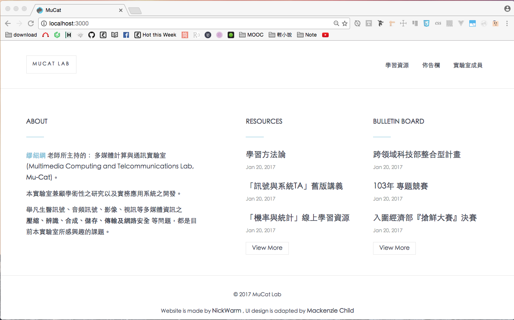

# 開始寫UI

# navbar、footbar

參考rails101s的寫法
- [rails101s/app/views/layouts/application.html.erb](https://github.com/sdlong/rails101s/blob/master/app/views/layouts/application.html.erb)
- [rails101s/app/views/common/](https://github.com/sdlong/rails101s/tree/master/app/views/common)


# 網站的icon

一般網站會有個icon，如下圖所示



參考[blog/app/views/layouts/application.html.erb](https://github.com/mackenziechild/blog/blob/master/app/views/layouts/application.html.erb)

我先在`app/assets/images`資料夾內加入`cat-1.ico`

我用的是[cat free icon](http://www.flaticon.com/free-icon/cat_141732#term=cat&page=1&position=39)這個png檔，然後再去[線上Favicon.ico製作轉檔工具](http://tw.faviconico.org)這轉檔工具把它轉成`.ico`檔

and then fix `app/views/layout/application.html.erb`

```
<head>
  <title>MuCat</title>
  ...
  ...
  <%= favicon_link_tag 'cat-1.ico' %>
</head>
```

就能在瀏覽器的分頁看到網站的icon了。
