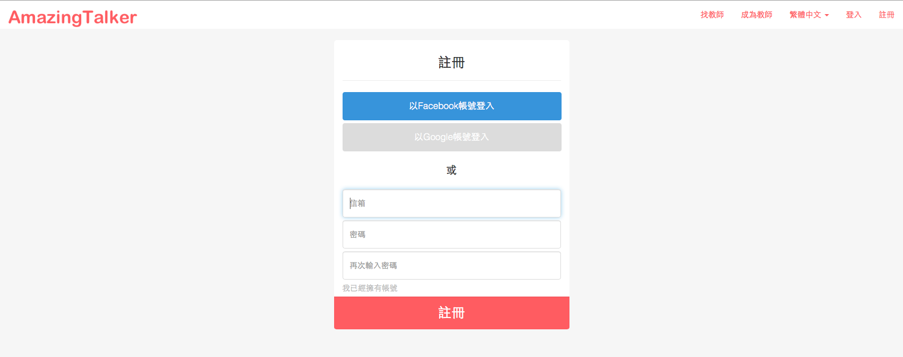
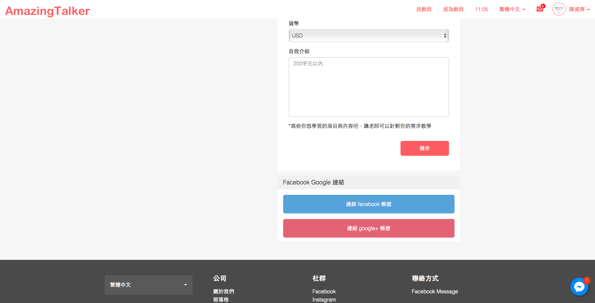
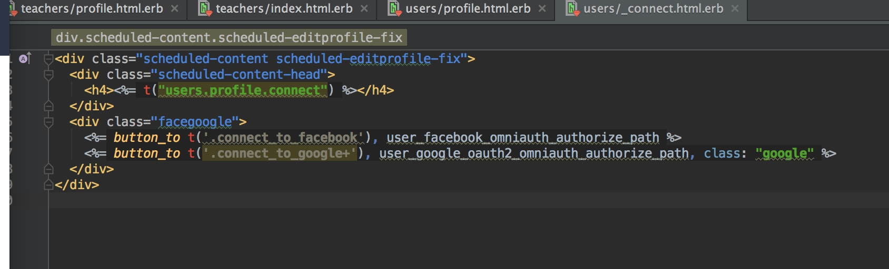
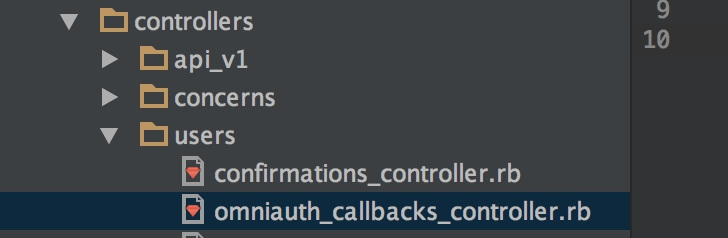
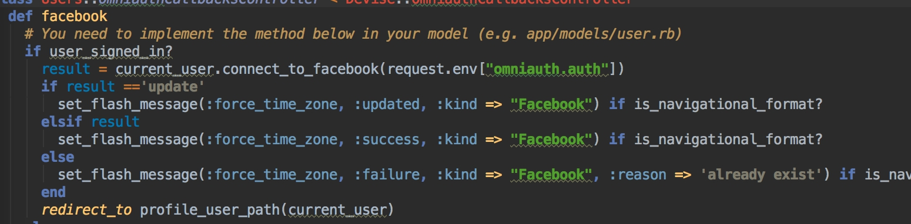

# 情境
定案版的使用者情境

>實驗室成員可以透過臉書帳號登入與註冊
>1. 在首頁有登入連結
>2. 註冊頁面是在「特殊網址」的頁面，註冊完後會跳轉到個人資訊的頁面，來編輯個人資料
>3. 註冊方式：由老師寄信給實驗室成員註冊網址，信中註明不能讓該網址外流


# 思索與探討

最初的情境：

>實驗室成員可以透過臉書帳號登入與註冊
>
>已註冊的實驗室成員，可以在首頁點一個隱藏anchor link來登入
>
>實驗室新進來的成員要進入「特定的頁面」才能註冊


實驗室的網站原始設計：


最初想在「Website is made by NickWarm , UI design is adapted by Mackenzie Child」底下加一串字

這串字的顏色設得跟背景色一樣，必須反白才看得到

後來想到，chrome有[dark reader](https://chrome.google.com/webstore/detail/dark-reader/eimadpbcbfnmbkopoojfekhnkhdbieeh)這擴充工具，如果有人用dark reader來瀏覽實驗室網站，那麼立刻破功

後來又想到，只要把實驗室網站的登入文字設成「透明」就好了，這樣無論是一般正常瀏覽，還是dark reader瀏覽，都看不到登入anchor的文字，要反白才看得到

在[CSS3 opacity property](http://www.w3schools.com/cssref/css3_pr_opacity.asp)測試這想法後，發現無法用CSS設定`opacity: 0;`，這樣會完全看不到文字，反白後也看不到它，只會看到一串空白底，這想法失敗了。

最後還是決定直接用icon，有以下兩個可以比較
- [Font Awesome Icons](http://fontawesome.io/icons/)，搜尋「user」
- [User Types - Icon | Semantic UI](http://semantic-ui.com/elements/icon.html#user-types)

個人偏好用，semantic_ui的student icon `<i class="student icon"></i>` 作為實驗室成員的登入連結

不打算跳到另一個頁面來登入，決定用[semantic_ui的modal](http://semantic-ui.com/modules/modal.html)來AJAX出登入頁面

結論的情境：
- 登入連結在footbar
- show 出登入連結的anchor
- 使用modal

---

# 實作

依序是
- 前台畫面
- 申請FB developer
- 保密臉書開發者金鑰 (sdlong體系寫法)
- 在User加入臉書登入的功能
  - 在頁面加上「臉書登入」的連結
  - 在User model加入`provider:string`、`uid:string`
  - User model使用omniauthable
- 在route中加入OmniAuth的設定
- 定義callback controller

## 前台畫面

首先，要申請facebook開發者帳號，才能實作登入系統

主要參考
- [Rails Screencast #1 - Criando autenticação com o Facebook! (Devise + Omniauth)](https://youtu.be/BeJpFQHm4A8?t=132)
  - 影片開始處已經略掉前面廢話，這篇有教你如何撈到FB的大頭貼

參考
- [Rails Screencast #1 - Criando autenticação com o Facebook! (Devise + Omniauth)，請見5:18](https://youtu.be/BeJpFQHm4A8?t=318)
  - [image_tag - rails API](http://api.rubyonrails.org/classes/ActionView/Helpers/AssetTagHelper.html#method-i-image_tag)
- [Auth Hash - omniauth-facebook FitHub](https://github.com/mkdynamic/omniauth-facebook#auth-hash)

會在footer加入這段code
```
<p>
  Hello, <%= current_user.name %>
  <% if current_user.image.present? %>
    <%= image_tag(current_user.image, size: "40") %>
  <% end %>
</p>
```

fix footer

from

```
<footer id="main_footer">
  <p class="copyright">&copy; 2016 MuCat Lab</p>
  <br>
  <p class="copyright">Website is made by <a href="#">NickWarm</a> ,
    UI design is adapted by <a href="#">Mackenzie Child</a></p>
</footer>
```

to

```
<footer id="main_footer">
  ...
  ...
  <% if !user_signed_in? %>
    <p>If your are MuCat Lab member, please login <a id="login" href="#"><i class="student icon"></i></a> </p>
  <% end %>

  <% if user_signed_in? %>
    <p>
      Welcome back, <%= current_user.name %>
      <% if current_user.image.present? %>
        <%= image_tag(current_user.image, size: "40") %>
      <% end %>
    </p>
  <% end %>

</footer>
```

然後用content_for來寫modal的AJAX，最初的概念如上所示，等到寫道modal來AJAX時會再翻修

1st的情境是錯的，由於我們用`devise + omniauth-facebook`來做臉書登入，按照`omniauth-facebook`的機制，參考[Rails Screencast #1 - Criando autenticação com o Facebook! (Devise + Omniauth) - YouTube，從18:58開始看](https://youtu.be/BeJpFQHm4A8?t=1138)，他是在登入後，「重新刷新頁面，並顯示你已經登入」

so,

2nd翻修情境：
1. 顯示「問是否是實驗室成員」
2. 開啟modal，用臉書帳號登入
3. 刷新頁面，然後`<% if user_signed_in? %> Welcome back, <%= current_user.name %>`

1st翻修的情境：
1. 顯示「問是否是實驗室成員」
2. 開啟modal，用臉書帳號登入
3. ~~成功登入，用AJAX顯示「歡迎回來...」~~
4. ~~用AJAX隱藏「問是否是實驗室成員」~~

footer應該要用partial來寫

由於使用omniauth-facebook撈出的`current_user.name`是臉書帳號的名字，為了避免老師看不懂臉書ID上的名字與本人誰是誰

所以要設計，用臉書來註冊後，跳轉到User表單，填寫
- 中文名字：`CN_name:string`
- 英文名字：`ENG_name:string`
- 個人簡介：`profile:text`，使用markdown
- 論文著作：``paper:text``，**允許留白**

除了論文著作可以空白之外，其他都要用User model validate必填。

## 申請FB developer

一開始先進入[facebook for developer](https://developers.facebook.com)，然後點選右上角的 **登入**，然後沒註冊過的就會先要你註冊

接著按右上角的 **建立應用程式**


點選應用程式密鑰顯示，輸入你的臉書密碼取得密鑰


然後應用程式網域那邊，由於我現在是用`localhost:3000`來開發，參考sdlong體系的寫法沒找到website給我填寫
- [Facebook 自動登入功能 « sdlong's Blog](http://sdlong.logdown.com/posts/207194-rails-newbie-3)
- [Rails 新手村 - FB會員登入API--PLga « 阿嘎筆記](http://paulchia.logdown.com/posts/365026)

後來我參考這篇
- [如何申請建立 Facebook APP ID 應用程式ID ？ - 香腸炒魷魚](https://sofree.cc/apply-facebook-app-id/)

進到我的MuCat專案後：設定 -> 基本資料 -> 新增平台 -> 網站，接著在網站網址輸入`http://localhost:3000/`，(注意尾端要有「/」)，然後按右下角的「儲存變更」

OK，完成FB developer端的設定。

## 保密臉書開發者金鑰 (sdlong體系寫法)

大多數的影片教學的寫法，都會讓開發者金鑰流出去，於是參考下面這些文章
- [Rails 新手村 - Facebook 自動登入功能 « sdlong's Blog](http://sdlong.logdown.com/posts/207194-rails-newbie-3)
  - [Rails 4 + SettingsLogic + Googl 製作短網址功能 « 赫謙小天地](http://hechien.logdown.com/posts/2014/03/08/rails-4-settingslogic-googl-production-short-url-functionality)
  - [Settingslogic插件 | Ruby迷](http://rubyer.me/blog/551/)
  - [binarylogic/settingslogic GitHub](https://github.com/binarylogic/settingslogic)
  - [xdite/auto-facebook - GitHub](https://github.com/xdite/auto-facebook)
- [Rails 新手村 - FB會員登入API--PLga « 阿嘎筆記](http://paulchia.logdown.com/posts/365026)
- [Rails 新手村 - google sign_in api----PLGa « 阿嘎筆記](http://paulchia.logdown.com/posts/370630)

add
```
gem 'omniauth-facebook'
gem 'settingslogic'      # 管理金鑰
```
to `Gemfile`，and then `bundle install`

create `app/models/settings.rb`

```
class Settings < Settingslogic
  source "#{Rails.root}/config/application.yml"
  namespace Rails.env
end
```

and then create `config/application.yml`

```
defaults: &defaults
  app_name: "demotest"
  facebook_app_id: "自己申請的key"
  facebook_secret: "自己申請的key"

development:
  <<: *defaults
  domain: "http://localhost:3000" # 必須要跟 facebook 上的 website 網址一樣，但是尾端不放『/』

test:
  <<: *defaults

production:
  <<: *defaults
```

and then fix `MuCat_v1/.gitignore`

```
...
...

# Ignore all logfiles and tempfiles.
/log/*
!/log/.keep
/tmp

# Ignore application.yml
/config/application.yml
```

如此一來，git 就不會把`application.yml`這個檔案放進版本管理裡面

## 在User加入臉書登入的功能

User model這邊的設定[sdlong的寫法](http://sdlong.logdown.com/posts/207194-rails-newbie-3)是用[xdite包的gem](https://github.com/xdite/auto-facebook)，我沒打算採用

參考
- [Rails 新手村 - FB會員登入API--PLga « 阿嘎筆記](http://paulchia.logdown.com/posts/365026)
- [Facebook example - OmniAuth: Overview · plataformatec/devise Wiki](https://github.com/plataformatec/devise/wiki/OmniAuth:-Overview#facebook-example)
  - [Schema (1.0 and Later) - Auth Hash Schema - omniauth/omniauth Wiki](https://github.com/omniauth/omniauth/wiki/Auth-Hash-Schema#schema-10-and-later)，搜尋「uid」
    - `uid`是一個identifier，識別我現在devise與哪一個omniauth串，在我的情境是跟臉書串
    - `provider`、`uid`、`info`、`info.name`都是 **required**

### 在頁面加上「臉書登入」的連結

一開始我們的首頁要有一個用臉書登入的連結，參考[Facebook example - OmniAuth: Overview · plataformatec/devise Wiki](https://github.com/plataformatec/devise/wiki/OmniAuth:-Overview#facebook-example)

```
<%= link_to "Sign in with Facebook", user_facebook_omniauth_authorize_path %>
```

但是由於我們用了settingslogic來避免我們的金鑰外流，參考[Rails 新手村 - FB會員登入API--PLga « 阿嘎筆記](http://paulchia.logdown.com/posts/365026)

so, fix
```
<%= link_to "Sign in with Facebook", Settings.domain + user_facebook_omniauth_authorize_path %>
```

### 在User model加入`provider:string`、`uid:string`

接著在User model加入`provider:string`、`uid:string`
- [Schema (1.0 and Later) - Auth Hash Schema - omniauth/omniauth Wiki](https://github.com/omniauth/omniauth/wiki/Auth-Hash-Schema#schema-10-and-later)，搜尋「uid」
  - `uid`是一個identifier，識別我現在devise與哪一個omniauth串，在我的情境是跟臉書串
  - `provider`是看我們用哪個來驗證，像是facebook或twitter或google
  - `provider`、`uid`、`info`、`info.name`都是 **required**

```
rails g migration AddOmniauthToUsers provider:string uid:string
rake db:migrate
```

and then fix `config/initializers/devise.rb`, add to
```
config.omniauth :facebook, "APP_ID", "APP_SECRET"
```

but because I used settingslogic, references
- [Rails 新手村 - FB會員登入API--PLga « 阿嘎筆記](http://paulchia.logdown.com/posts/365026)
- [使用facebook+devise登入 · Building Blog memo](https://telsaiori.gitbooks.io/building-blog-memo/content/facebook_login.html)

so, fix `config/initializers/devise.rb`

```
config.omniauth :facebook, Settings.facebook_app_id, Settings.facebook_secret
```

### User model使用omniauthable

接著，讓User model能夠使用omniauthable，參考
- [Rails Screencast #1 - Criando autenticação com o Facebook! (Devise + Omniauth) - YouTube，看12:46](https://youtu.be/BeJpFQHm4A8?t=766)
- [使用facebook+devise登入 · Building Blog memo](https://telsaiori.gitbooks.io/building-blog-memo/content/facebook_login.html)，搜尋「在user.rb中加入omniauthable」

會把`user.rb`設定為

```
devise :database_authenticatable, :registerable,
         :recoverable, :rememberable, :trackable, :validatable, :omniauthable
```

由於devise官方wiki在user model的配置有用到`:omniauth_providers`，所以我還是打算照官方範例設定
- [Facebook example - OmniAuth: Overview · plataformatec/devise Wiki](https://github.com/plataformatec/devise/wiki/OmniAuth:-Overview#facebook-example)，搜尋「:omniauth_providers」
- [FUSAKIGG/app/models/user.rb](https://github.com/lustan3216/FUSAKIGG/blob/master/app/models/user.rb)

fix `app/models/user.rb`

完整code
```
class User < ActiveRecord::Base
  # Include default devise modules. Others available are:
  # :confirmable, :lockable, :timeoutable and :omniauthable
  devise :database_authenticatable, :registerable,
         :recoverable, :rememberable, :trackable, :validatable,
         :omniauthable, :omniauth_providers => [:facebook]

  has_many :posts
  has_many :post_authorities
  has_many :editable_posts, through: :post_authorities, source: :post

end

```

## 在route中加入OmniAuth的設定

在route中加入OmniAuth的設定，讓我們能使用omniauth_callback

參考[Rails Screencast #1 - Criando autenticação com o Facebook! (Devise + Omniauth) - YouTube，看12，請看12:26](https://youtu.be/BeJpFQHm4A8?t=746)

fix `config/route.rb`

from

```
Rails.application.routes.draw do
  devise_scope :user do
    # 下面這行，把註冊的預設網址改成http://localhost:3000/lab515/sign_up，一樣上線版要改成不同的網址
    get "/lab515/sign_up" => "devise/registrations#new", as: "new_user_registration"
  end
                                 # 第一層：發表文章、編輯文章
  resources :learningnotes       # 學習資源
  resources :posts               # 實驗室公告
  resources :honors              # 榮譽榜
  resources :professorworks      # 教授的著作

  devise_for :users              # 登入系統，實驗室成員資料，只能登入不能註冊
  devise_for :managers

  ...
end
```

to

```
Rails.application.routes.draw do
  devise_scope :user do
    # 下面這行，把註冊的預設網址改成http://localhost:3000/lab515/sign_up，一樣上線版要改成不同的網址
    get "/lab515/sign_up" => "devise/registrations#new", as: "new_user_registration"
  end
                                 # 第一層：發表文章、編輯文章
  resources :learningnotes       # 學習資源
  resources :posts               # 實驗室公告
  resources :honors              # 榮譽榜
  resources :professorworks      # 教授的著作

  devise_for :users, :controllers => { omniauth_callbacks: "users/omniauth_callbacks" }
                                 # 登入系統，實驗室成員資料，只能登入不能註冊
  devise_for :managers

end
```

## 定義callback controller

and then create `app/controllers/users/omniauth_callbacks_controller.rb`

```
class Users::OmniauthCallbacksController < Devise::OmniauthCallbacksController
  def facebook
    @user = User.from_omniauth(request.env["omniauth.auth"])
  end
end
```

先說`request.env["omniauth.auth"]`這段，參考自
- [Facebook example - OmniAuth: Overview · plataformatec/devise Wiki](https://github.com/plataformatec/devise/wiki/OmniAuth:-Overview#facebook-example)，搜尋「request.env["omniauth.auth"]」

他會讓我們抓`omniauth-facebook`的[Auth Hash](https://github.com/mkdynamic/omniauth-facebook#auth-hash)

由於我們是從User model使用`from_omniauth`這method

so fix `app/models/user.rb` and create `from_omniauth method`

```
class User < ActiveRecord::Base
  ...
  has_many :editable_posts, through: :post_authorities, source: :post

  def self.from_omniauth(auth)

  end
end
```

先到這邊，第一個疑惑可能是，為何要用`self`。依序看這幾篇就能懂了
- [instance method / class method | 邁向 Rails 高級新手](https://airsonwayne.gitbooks.io/rocodev-practice-series/content/chapter3-ruby/instance_method__class_method.html)
- [self | 邁向 Rails 高級新手](https://airsonwayne.gitbooks.io/rocodev-practice-series/content/chapter3-ruby/self.html)
- [Ruby當中的class method和instance method差在哪？ | Motion Express](http://motion-express.com/blog/20141208-class-method-and-instance-method)

然後套到我們這邊的code，在`omniauth_callbacks_controller.rb`裡的`def facebook`，我們寫`@user = User.from_omniauth`，User model使用`from_omniauth`這個class method，所以我們理所當然要在Use model裡寫`def self.from_omniauth`來定義class method。

and then keep coding `app/models/user.rb`

```
class User < ActiveRecord::Base
  ...
  has_many :editable_posts, through: :post_authorities, source: :post

  def self.from_omniauth(auth)
    where(provider: auth.provider, uid: auth.uid).first_or_create do |user|

      user.email = auth.info.email

      user.password = Devise.friendly_token[0,20]
      user.name = auth.info.name

      user.image = auth.info.image
    end
  end
end
```

首先用`where`做條件篩選，撈[Auth Hash](https://github.com/mkdynamic/omniauth-facebook#auth-hash)看看是否有`provider`與`uid`
- [rails API - where](http://api.rubyonrails.org/classes/ActiveRecord/QueryMethods.html#method-i-where)
- [SQL WHERE - 1Keydata SQL 語法教學](http://www.1keydata.com/tw/sql/sqlwhere.html)

若是查到沒有符合條件的資料，就用`first_or_create`去建立資料
- [Ruby on Rails 實戰聖經 | ActiveRecord Query Interface - 資料表操作](https://ihower.tw/rails/activerecord-query.html)，搜尋「first_or_create」
- [first_or_create (ActiveRecord::Relation) - rails 4.2.7 - APIdock](http://apidock.com/rails/ActiveRecord/Relation/first_or_create)
- [first_or_create (ActiveRecord::Relation) - rails 3.2.1 - APIdock](http://apidock.com/rails/v3.2.1/ActiveRecord/Relation/first_or_create)，這個版本比較好有清楚範例解釋
- [15.1 first_or_create - rails Guide 3.2.8: Active Record Query Interface](http://guides.rubyonrails.org/v3.2.8/active_record_querying.html#first_or_create)

- PS一下，`first_or_create`這方法很....微妙，查rails api最新的第五版找不到，在APIdock上可以找到4.2.7，估狗得到的資料都只有舊版的rails guide有寫，而且還是 rails 3 的玩意.....，一開始我是完全沒打算直接寫筆記記錄這段，跟我朋友討論他拿 rails 5 測，結果居然有這方法！！！所以，先寫完這段教學，再來討論為何我不打算這樣寫吧。

and then `app/controllers/users/omniauth_callbacks_controller.rb`

```
class Users::OmniauthCallbacksController < Devise::OmniauthCallbacksController
  def facebook
    @user = User.from_omniauth(request.env["omniauth.auth"])

    if @user.persisted?
      sign_in_and_redirect @user, event: :authentication  # 這邊是可以客制的
      set_flash_message(:notice, :success, kind: "Facebook") if is_navigational_format?
    else
      session["devise.facebook_data"] = request.env["omniauth.auth"]
      redirect_to new_user_registration_url
    end
  end

  def failure
    redirect_to root_path
  end
end
```

先問user是否存在(persisted?)，存在的話就登入然後 ~~轉到user的頁面~~ 轉到當下瀏覽的頁面(`sign_in_and_redirect @user`)
- [rails API - persisted?](http://api.rubyonrails.org/classes/ActiveRecord/Persistence.html#method-i-persisted-3F)
- [Rails Screencast #1 - Criando autenticação com o Facebook! (Devise + Omniauth)，請看5:20](https://youtu.be/BeJpFQHm4A8?t=320)，一開始在`index.html.erb`定義「Hello....」
- [Rails Screencast #1 - Criando autenticação com o Facebook! (Devise + Omniauth)，請看19:02](https://youtu.be/BeJpFQHm4A8?t=1142)，實作後用臉書帳號登入，進到`index.html.erb`
- [redirect back to current page after oauth signin? - devise wiki](https://github.com/plataformatec/devise/wiki/How-To:-redirect-to-a-specific-page-on-successful-sign-in#redirect-back-to-current-page-after-oauth-signin)
  - 官方API有寫，用`sign_in_and_redirect @user`讓你登入後回到當下瀏覽的頁面

`event: :authentication`這是[ Warden callbacks](http://stackoverflow.com/a/13389324)，可用可不用。
- [after_authentication - warden Wiki](https://github.com/hassox/warden/wiki/Callbacks#after_authentication)
- PS：目前看到的範例都有在用，但老實說，沒有去定義Warden callback的話，我覺得實在沒必要寫這行code
- Warden是個[驗證機制](https://github.com/hassox/warden/wiki/Overview)，[與rails整合的實作](https://github.com/hassox/warden/wiki/Rails-Integration)就是devise

---

# ALPHA Camp體系的臉書登入寫法

好了，現在繼續寫為何我不用Facebook example的寫法，回到我的情境：

>實驗室成員可以透過臉書帳號登入與註冊
>1. 在首頁有登入連結
>2. 註冊頁面是在「特殊網址」的頁面，註冊完後會跳轉到個人資訊的頁面，來編輯個人資料
>3. 註冊方式：由老師寄信給實驗室成員註冊網址，信中註明不能讓該網址外流

若是用`first_or_create`，會先查User model李有沒有`provider`、`uid`，若是沒有就會建一筆新的臉書登入資料。可是這樣寫的話，就變成非實驗室成員一按臉書登入，然後立刻就擁有實驗室成員的帳號資格，這不是我要的情境。

於是改參考ihower在ALPHA Camp教的寫法
- [Devise « HEROGWP's Blog](http://herogwp.logdown.com/posts/2016/10/21/devise)
- [Rails User 建立-1 (Devise + Omniauth-facebook + facebook api) - 我在ALPHACamp 56天 ~ 史蒂芬.陳的碎碎念](http://stevenchentw.blogspot.tw/2016/04/rails-devise-omniauth-facebook-facebook.html)
  - [Ruby on Rails 實戰聖經 | 實作 Web APIs](https://ihower.tw/rails/web-api.html)
  - [Build an API in your Rails app now!](https://labs.kollegorna.se/blog/2015/04/build-an-api-now/)
- [FUSAKIGG/app/controllers/users/omniauth_callbacks_controller.rb](https://github.com/lustan3216/FUSAKIGG/blob/master/app/controllers/users/omniauth_callbacks_controller.rb)
  - [FUSAKIGG/app/models/user.rb](https://github.com/lustan3216/FUSAKIGG/blob/master/app/models/user.rb)


其實ALPHA Camp的寫法主要差異在於
- `user.rb`定義的 `self.from_omniauth` method與OmniAuth官方的Facebook example不同
- 直接使用`.gitignore`來隱藏擁有FB developer密碼的`facebook.yml`檔案

# 範例一

我們先看[Devise « HEROGWP's Blog](http://herogwp.logdown.com/posts/2016/10/21/devise)

首先，在User model加入兩個欄位：`fb_uid:string`、`fb_token:string`，並且讓`fub_uid`可以用WHERE來搜索到
- [JCcart - Step.3 註冊系統與產品圖片](https://github.com/NickWarm/jccart/wiki/Step.3-註冊系統與產品圖片)

`rails g migration AddOmniauthToUsers`


```
class AddOmniauthToUsers < ActiveRecord::Migration
  def change
    #新增facebook api回傳的資料, uid token 一定要有欄位紀錄

    add_column :users, :fb_uid, :string
    add_column :users, :fb_token, :string

    add_index :users, :fb_uid
  end
end
```

然後`rake db:migrate`

### Case 1: Find existing user by facebook uid

fix `app/models/user.rb`

```
class User < ActiveRecord::Base
  ...
  has_many :editable_posts, through: :post_authorities, source: :post

  def self.from_omniauth(auth)

    # Case 1: Find existing user by facebook uid
    user = User.find_by_fb_uid( auth.uid )
    if user
       user.fb_token = auth.credentials.token
       #user.fb_raw_data = auth

       user.save!
      return user
    end

  end
end
```

首先第一個會遇到不懂得，應該是`find_by_fb_uid`，請見[rails Guide - 15 动态查询方法](http://guides.ruby-china.org/active_record_querying.html#动态查询方法)

由於我們在User model裡定義了`fb_uid:string`這欄位，所以我們有`find_by_fb_uid`這method可以找相符合的`fb_uid`，於是我們去查找`auth.uid`
- [Auth Hash - omniauth-facebook](https://github.com/mkdynamic/omniauth-facebook#auth-hash)

如果找到與Auth Hash相匹配的uid，就從User model中撈出該user的資料，然後user的`fb_token`欄位存成Auth Hash擁有資格(credentials)的token，然後儲存(`user.save!`)
- [Auth Hash - omniauth-facebook](https://github.com/mkdynamic/omniauth-facebook#auth-hash)
- [Auth Hash Schema](https://github.com/omniauth/omniauth/wiki/Auth-Hash-Schema#schema-10-and-later)

### Case 2: Find existing user by email

keep coding `app/models/user.rb`

```
class User < ActiveRecord::Base
  ...
  has_many :editable_posts, through: :post_authorities, source: :post

  def self.from_omniauth(auth)

    # Case 1: Find existing user by facebook uid
    user = User.find_by_fb_uid( auth.uid )
    if user
       ...
       ...
    end

    # Case 2: Find existing user by email
    existing_user = User.find_by_email( auth.info.email )
    if existing_user
      existing_user.fb_uid = auth.uid
      existing_user.fb_token = auth.credentials.token
      #existing_user.fb_raw_data = auth

      existing_user.save!
      return existing_user
    end

  end
end
```

**case 1** 是用`fb_uid`找有沒有相匹配的user，**case 2** 是用`email`找。後面其餘的都一樣就不解釋了。

### Case 3: Create new password

keep coding `app/models/user.rb`

```
class User < ActiveRecord::Base
  ...
  has_many :editable_posts, through: :post_authorities, source: :post

  def self.from_omniauth(auth)

    # Case 1: Find existing user by facebook uid
    user = User.find_by_fb_uid( auth.uid )
    if user
       ...
       ...
    end

    # Case 2: Find existing user by email
    existing_user = User.find_by_email( auth.info.email )
    if existing_user
      ...
      ...
    end

    # Case 3: Create new password

    user = User.new
    user.fb_uid = auth.uid
    user.fb_token = auth.credentials.token
    user.email = auth.info.email
    user.password = Devise.friendly_token[0,20]
    #user.fb_raw_data = auth

    user.save!
    return user

  end
end
```

如果用`fb_uid`或`email`都找不到資料，那麼就創建一筆新資料

透過`Devise.friendly_token`隨機產生一組密碼
- [How To: Automatically generate password for users (simpler registration) - devise wiki](https://github.com/plataformatec/devise/wiki/How-To:-Automatically-generate-password-for-users-(simpler-registration))

相同的寫法請見[Facebook example - devise wiki](https://github.com/plataformatec/devise/wiki/OmniAuth:-Overview#facebook-example)，請搜尋「user.password = Devise.friendly_token[0,20]」

PS:

這邊有個奇怪的小插曲，參考以下兩個專案
- [rails-exercise-ac8/app/models/user.rb](https://github.com/ihower/rails-exercise-ac8/blob/master/app/models/user.rb)，搜尋「user.password」
  - [rails-exercise-ac8/db/schema.rb](https://github.com/ihower/rails-exercise-ac8/blob/master/db/schema.rb)，搜尋「password」
- [FUSAKIGG/app/models/user.rb](https://github.com/lustan3216/FUSAKIGG/blob/master/app/models/user.rb)，搜尋「user.password」
  - [FUSAKIGG/db/schema.rb](https://github.com/lustan3216/FUSAKIGG/blob/master/db/schema.rb)搜尋「password」

都有`user.password`的寫法，可是我們去`schema.rb`的User model卻沒看到`password`這欄位，只看到`encrypted_password`.....?

估狗後發現，的確有人也是這寫法，預估schema的user model也沒password欄位吧
- [Change devise user password in rails console](http://blog.cloud-mes.com/2013/01/23/change-devise-user-password-in-rails-console/)

恩....這時只能先忽略不管它了XD

## 不使用settingslogic的寫法

然後補充一下，不使用settingslogic的寫法

create `config/facebook.yml`

```
development:

  app_id: "申請facebook app 拿到的 app ID"

  secret: "申請facebook app 拿到的 app secret"
```

fix `config/initializers/devise.rb`
- ref：[FUSAKIGG/config/initializers/devise.rb](https://github.com/lustan3216/FUSAKIGG/blob/master/config/initializers/devise.rb)

```
fb_config = Rails.application.config_for(:facebook)
config.omniauth :facebook, fb_config["app_id"], fb_config["secret"],
                :scope => 'public_profile, email', :info_fields => 'email, name'
```

and then add to `.gitignore`
```
# Ignore facebook app config
/config/facebook.yml
```

# 範例二

看完[Devise « HEROGWP's Blog](http://herogwp.logdown.com/posts/2016/10/21/devise)之後，再看[Rails User 建立-1 (Devise + Omniauth-facebook + facebook api) - 我在ALPHACamp 56天 ~ 史蒂芬.陳的碎碎念](http://stevenchentw.blogspot.tw/2016/04/rails-devise-omniauth-facebook-facebook.html)這篇

在Facebook API之前的就輕鬆寫意了。由於我現在沒有要串API，所以Facebook API那邊就跳過，然後這篇也就不用看了。

最後來看我朋友的範例
- [FUSAKIGG/app/controllers/users/omniauth_callbacks_controller.rb](https://github.com/lustan3216/FUSAKIGG/blob/master/app/controllers/users/omniauth_callbacks_controller.rb)
  - [FUSAKIGG/app/models/user.rb](https://github.com/lustan3216/FUSAKIGG/blob/master/app/models/user.rb)


除了直接用臉書登入之外，也有用傳統帳號登入後，再用開通臉書帳號登入

具體情境如下：

>你用信箱與密碼的傳統註冊方式



>然後進到個人頁面去設定，讓你的帳號連結到FB



由於臨摹的FUSAKKIG沒把上面的情境寫好寫滿，所以直接跟我朋友要code

連結到臉書的code




點下去後會去



因為一般帳號已經登入了，所以會進到



這邊補充兩個connect_to_FB button的寫法所需要的知識
- [rails API - button_to](http://api.rubyonrails.org/classes/ActionView/Helpers/UrlHelper.html#method-i-button_to)
- [Rails I18n 實作技巧 - p5-1 - HackMD](https://hackmd.io/p/HJarJWGd#/5/1)
- [I18n | 邁向 Rails 高級新手](https://airsonwayne.gitbooks.io/rocodev-practice-series/content/chapter2-rails/i18n.html)
- [簡介 i18n - openhome.cc](http://openhome.cc/Gossip/Rails/i18n.html)
- [Ruby on Rails 實戰聖經 | 多國語系及時區](https://ihower.tw/rails/i18n.html)
- [I18n | Rails 实践](https://rails-practice.com/content/Chapter_6/6.4.html)
- [Rails - I18n | Timezone - JT's Blog](http://rt-tong.com/blog/2016/09/01/rails-i18n-timezone/)

現在開始詳述我朋友的寫法

他的`button_to`連到的路由是傳統臉書登入寫法用的`user_facebook_omniauth_authorize_path`
- [Facebook example - devise Wiki](https://github.com/plataformatec/devise/wiki/OmniAuth:-Overview#facebook-example)，搜尋「user_facebook_omniauth_authorize_path」

然後會連到callback controller：[FUSAKIGG/app/controllers/users/omniauth_callbacks_controller.rb](https://github.com/lustan3216/FUSAKIGG/blob/master/app/controllers/users/omniauth_callbacks_controller.rb)

由於這個情境是使用者已經登入了，所以會進到`if user_signed_in?`這個block裡面去

```
class Users::OmniauthCallbacksController < Devise::OmniauthCallbacksController
  def facebook
    if user_signed_in?
      result = current_user.connect_to_facebook(request.env["omniauth.auth"])
      if result =='update'
        set_flash_message(:notice, :updated, :kind => "Facebook") if is_navigational_format?
      elsif result
        set_flash_message(:notice, :success, :kind => "Facebook") if is_navigational_format?
      else
        set_flash_message(:notice, :failure, :kind => "Facebook", :reason => 'already exist') if is_navigational_format?
      end
      redirect_to :back
    else
      ...
      ...
    end
  end
```

這邊的`result`是透過 `connect_to_facebook` method來撈的裡面，他定義在User model裡面：[FUSAKIGG/app/models/user.rb](https://github.com/lustan3216/FUSAKIGG/blob/master/app/models/user.rb)

```
def connect_to_facebook(auth)
  #   檢查這個帳戶是不是有被關聯過
  # user = User.find_by_fb_uid(auth.uid)

  if User.find_by_fb_uid(auth.uid).id != id
    return false                              # 代表還沒連結過臉書
  else
    self.fb_uid = auth.uid
    self.fb_token = auth.credentials.token
    self.fb_raw_data = auth
    save!
    if fb_uid.nil?
      return true
    elsif fb_uid == auth.uid
      return 'update'
    end
  end
end
```

這邊的情境是傳統信箱與新密碼登入，所以這邊會跳到 **Case 2**，

# 最後採取的辦法

跟我朋友討論，我想要弄
- 登入按鈕所有人都看得到
- 但是只有實驗室成員能登入

在stackoverflow有找到一個解法，但是實際的例子不多，所以沒繼續下去
- [ruby on rails - Devise/OmniAuth: different logic for for registration and login - Stack Overflow](http://stackoverflow.com/questions/29544963/devise-omniauth-different-logic-for-for-registration-and-login)


我朋友說我原本的想法很奇怪XD。他覺得，有登入連結卻無法自由註冊，這很不合邏輯。要就全部都能註冊登入，不然就完全不公開登入註冊頁面。

後來想想也對，於是改成不公開登入註冊頁面，要進入特定頁面才看得到登入註冊按鈕


結論：
- 登入註冊頁面不公開
  - 按照這情境，連modal都不用寫了
- 後台與登入頁面寫入`robots.txt`

---
robots.txt
- [實戰設計robots.txt與標籤 | iThome](http://www.ithome.com.tw/node/35591)，這篇非常清楚
- [會員與登入系統要點：devise / robots.txt - Rails - Rails Fun!! Ruby & Rails 中文論壇](http://railsfun.tw/t/devise-robots-txt/376)
  - robots.txt位在：[jccart/robots.txt at master · NickWarm/jccart](https://github.com/NickWarm/jccart/blob/master/public/robots.txt)
  - [Step.5 後台的controller · NickWarm/jccart Wiki](https://github.com/NickWarm/jccart/wiki/Step.5-%E5%BE%8C%E5%8F%B0%E7%9A%84controller)
  - [RailsFun.tw 新手教學 day3 HD - YouTube，觀看1:06:10](https://youtu.be/MVMrVl0Pj80?t=3970)
    - 可參考[RailsFun.tw 新手教學 day3 HD « tienshunlo's Blog](http://tienshunlo-blog.logdown.com/posts/711616-railsfuntw-day3-novice-teaching-hd)，搜尋「robots.txt」
- [給 Rails Developer 的基本SEO - 好麻煩部落格](http://gogojimmy.net/2013/09/26/basic-seo-for-rails-developer/)，搜尋「robots.txt」
  - [Make /robots.txt aware of the Rails environment - Gist](https://gist.github.com/timcheadle/3761844#make-robotstxt-aware-of-the-rails-environment)
    - 要注意看到這篇Gist的[留言](https://gist.github.com/timcheadle/3761844#gistcomment-1180870)，因為發文者似乎寫錯了
- [有關robots.txt的大小事](https://sibevin.github.io/posts/2015-02-09-164401-robots-txt)
  - [Rails - robots.txt Customized By Environment Automatically - TIMBABWE](http://www.timbabwe.com/2011/08/rails-robots-txt-customized-by-environment-automatically/)，這篇在說開發環境下的robots.txt設定


我朋友SEO是用sitemap，就在此先備份
- [【Rails】使用Gem生成sitemap | J's Blog](http://achillessatan.github.io/2016/01/28/2016012802/)
- [Home · kjvarga/sitemap_generator Wiki](https://github.com/kjvarga/sitemap_generator/wiki)
